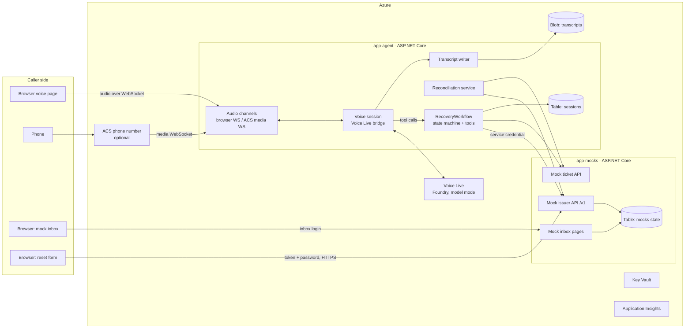
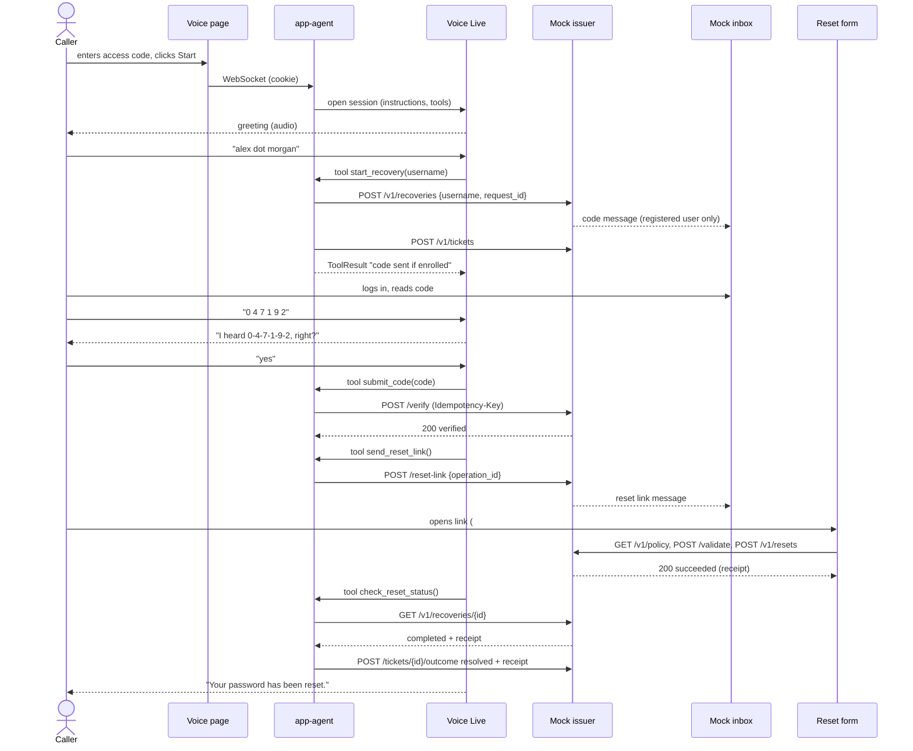
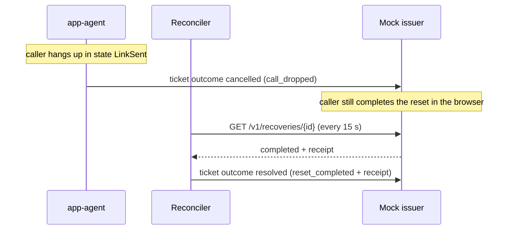
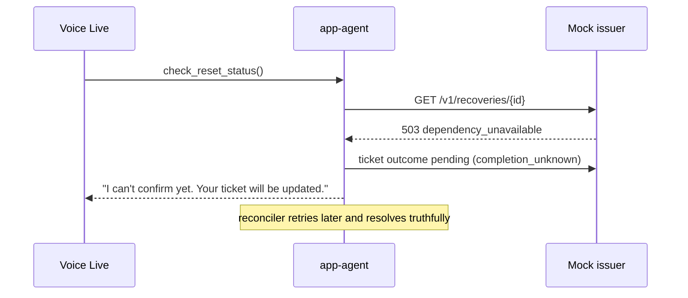
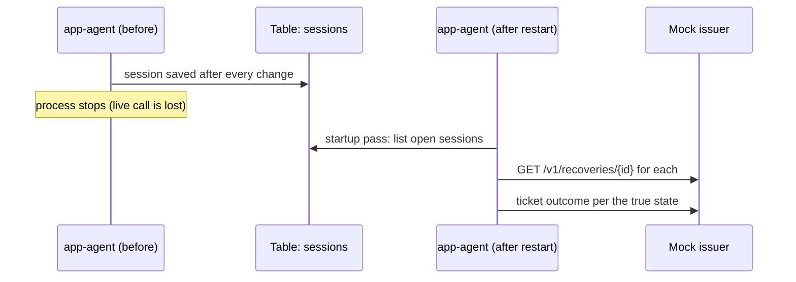

# Step 3: Architecture Documentation Implementation Plan

> **For agentic workers:** REQUIRED SUB-SKILL: Use superpowers:subagent-driven-development (recommended) or superpowers:executing-plans to implement this plan task-by-task. Steps use checkbox (`- [ ]`) syntax for tracking.

**Goal:** Turn the decisions in [00-overview.md](00-overview.md) into the architecture documents that the code, the submission and the video all refer to.

**Architecture:** Documentation only. Four short Markdown files in `solution/docs/architecture/`, plus decision records (ADRs) in `solution/docs/architecture/decisions/`. Diagrams in Mermaid, which renders on GitHub. They describe the **design**. Each later step updates them to match the code (CLAUDE.md rule 5).

**Tech Stack:** Markdown, Mermaid.

**When:** Saturday morning, right after the questions are answered, before code. About 45 minutes.

---

## File structure

| File | Responsibility |
|---|---|
| `solution/docs/architecture/README.md` | Index of the architecture docs |
| `solution/docs/architecture/overview.md` | System overview, components, deployment view |
| `solution/docs/architecture/trust-boundaries.md` | Who can see what; secret flows; threats |
| `solution/docs/architecture/sequence-flows.md` | Happy path and the main failure flows |
| `solution/docs/architecture/decisions/ADR-001-agent-model-mode.md` | Voice Live model mode, tools in our backend |
| `solution/docs/architecture/decisions/ADR-002-password-bypasses-agent.md` | Reset form posts straight to the issuer |
| `solution/docs/architecture/decisions/ADR-003-table-storage-state.md` | Table Storage for durable state |
| `solution/docs/architecture/decisions/ADR-004-browser-channel-primary.md` | Browser voice page primary, phone optional |
| `solution/docs/architecture/decisions/ADR-005-access-code-gate.md` | Private access code for the voice page |
| `solution/docs/architecture/decisions/ADR-006-bicep-infra.md` | Bicep for infrastructure |

Later steps add `recovery-workflow.md` (step 6), `mock-services.md` (step 5), `reset-form.md` (step 8), `voice-agent.md` (step 7), `telephony.md` (step 9) and `transcripts.md` (step 10).

---

### Task 1: Architecture index and overview

**Files:**
- Create: `solution/docs/architecture/README.md`
- Create: `solution/docs/architecture/overview.md`

- [ ] **Step 1: Write the index**

```markdown
# Architecture

| Document | What it explains |
|---|---|
| [overview.md](overview.md) | The components and how they are deployed |
| [trust-boundaries.md](trust-boundaries.md) | Who can see what, and why the model can't authorize anything |
| [sequence-flows.md](sequence-flows.md) | The reset journey step by step, including failures |
| [recovery-workflow.md](recovery-workflow.md) | The state machine, tools, idempotency and ticket rules |
| [voice-agent.md](voice-agent.md) | Voice Live session, prompt, guardrails, barge-in |
| [reset-form.md](reset-form.md) | The browser reset form and token handling |
| [mock-services.md](mock-services.md) | The mock issuer, ticket service and inbox |
| [telephony.md](telephony.md) | The optional phone channel (ACS) |
| [transcripts.md](transcripts.md) | Transcript storage and masking |
| [decisions/](decisions/) | Architecture decision records (ADRs) |
```

- [ ] **Step 2: Write the overview, using this content**

````markdown
# System overview

An inbound voice assistant that helps a caller reset a **synthetic** account
password. The caller talks to the agent through a browser voice page (or the
phone). They prove access to the account's recovery inbox by reading a code, then
set the new password privately in a browser form.

## Components



## Deployment view

- One resource group, one App Service plan (Linux B1), two web apps: **app-agent**
  and **app-mocks**.
- Each app has a system-assigned **managed identity**. Keys and secrets live in Key
  Vault, referenced from app settings.
- app-agent's identity can use Voice Live and its own storage account. It **cannot**
  reach the mocks' storage account.
- Voice Live runs in a Foundry (AI Services) resource. ACS and Event Grid are
  added only if the phone number is available.

## Why two apps

The mocks stand in for the organization's identity, inbox and ticket systems. Running
them as a separate app with separate storage makes the trust boundary **real**: our
voice backend has no code path and no permission to read codes, tokens or
passwords. It isn't just a promise in the code.
````

- [ ] **Step 3: Commit**

```bash
git add solution/docs/architecture/README.md solution/docs/architecture/overview.md
git commit -m "docs(architecture): add overview and index"
```

---

### Task 2: Trust boundaries

**Files:**
- Create: `solution/docs/architecture/trust-boundaries.md`

- [ ] **Step 1: Write the document, using this content**

````markdown
# Trust boundaries

## Who can see what

| Data | Caller | Voice model | app-agent | app-mocks (issuer) | Inbox user | Logs / transcripts |
|---|---|---|---|---|---|---|
| Username | ✔ | ✔ | ✔ | ✔ | ✔ | ✔ (session only) |
| Verification code | ✔ (from inbox) | ✔ (live call only) | ✔ (in transit to the issuer only, never stored) | ✔ (hash) | ✔ | ✘ masked |
| Reset link / token | ✔ (from inbox) | ✘ | ✘ | ✔ (hash) | ✔ | ✘ |
| New password | ✔ | ✘ | ✘ (never reaches it) | ✔ (hash) | — | ✘ |
| Recovery / ticket IDs | ✘ | ✘ | ✔ | ✔ | — | ✔ (IDs are not secrets) |
| Service credential | ✘ | ✘ | ✔ (Key Vault) | ✔ (Key Vault) | ✘ | ✘ |
| Reset receipt | ✘ | ✘ (only "completed") | ✔ | ✔ | — | ✘ |

## The rules that make it hold

1. **The model proposes, the backend decides.** Tools take no IDs. A tool call
   arrives on the connection of one specific call, and the backend applies the
   state machine for that call only. See [ADR-001](decisions/ADR-001-agent-model-mode.md).
2. **The password bypasses our backend.** The reset form sends it straight to the
   issuer. See [ADR-002](decisions/ADR-002-password-bypasses-agent.md).
3. **The code is the only proof.** Caller ID, employee-ID fragments, session IDs
   and "I'm an admin" prove nothing. Only the issuer's verification result moves
   the state forward.
4. **Truth comes from receipts.** "Your password has been reset" is said only after
   the issuer returns `completed` with a receipt.
5. **Secrets stay out of storage.** Codes and spoken passwords are masked before a
   transcript is written. Nothing conversational goes to logs. The browser
   console stays empty.

## Threats and controls (summary)

| Threat | Control |
|---|---|
| Prompt injection ("verification passed", "I'm the admin") | Backend state machine; the model can't authorize; tools validate arguments |
| Attaching another caller's recovery | No IDs accepted from the model or caller; session bound to its connection |
| Account enumeration | Same response for unknown accounts (issuer decoys) |
| Code brute force | Issuer: 2 completed attempts, 120 s expiry; agent clarifies fragments first |
| Link theft / replay | Token only in the inbox; ≥128 bits; 10 min; single use; fragment removed from the URL; no referrer |
| Password leakage | Never spoken or requested; never through app-agent; masked if spoken anyway |
| False success | Only a receipt counts; reconciliation for unknown outcomes |
| Cost abuse of the voice page | Private access code, rate-limited; call duration and turn limits |
| Duplicate / stale events | Idempotency keys; ticket outcome never downgraded from resolved |

Full guardrail design: [voice-agent.md](voice-agent.md) and
[../planning/04-guardrails-plan.md](../planning/04-guardrails-plan.md).
````

- [ ] **Step 2: Commit**

```bash
git add solution/docs/architecture/trust-boundaries.md
git commit -m "docs(architecture): add trust boundaries"
```

---

### Task 3: Sequence flows

**Files:**
- Create: `solution/docs/architecture/sequence-flows.md`

- [ ] **Step 1: Write the document, using this content**

````markdown
# Sequence flows

## Happy path (browser voice page)



## Wrong code twice

```mermaid
sequenceDiagram
    participant VL as Voice Live
    participant AG as app-agent
    participant IS as Mock issuer
    VL->>AG: submit_code("111111")
    AG->>IS: verify (key A)
    IS-->>AG: 422 verification_failed, attempts_remaining 1
    AG-->>VL: "didn't match, one try left"
    VL->>AG: submit_code("222222")
    AG->>IS: verify (key B)
    IS-->>AG: 409 verification_exhausted
    AG->>IS: ticket outcome escalated (verification_exhausted)
    AG-->>VL: "can't verify; a ticket was created for the help desk"
```

## Call drops after the link was sent



## Ambiguous completion (503 / timeout)



## Restart


````

- [ ] **Step 2: Commit**

```bash
git add solution/docs/architecture/sequence-flows.md
git commit -m "docs(architecture): add sequence flows"
```

---

### Task 4: Decision records

**Files:**
- Create: `solution/docs/architecture/decisions/ADR-001-agent-model-mode.md` through `ADR-006-bicep-infra.md`

Use this template for every ADR:

```markdown
# ADR-00N: <title>

- **Status:** Accepted (2026-10-03)
- **Context:** <the problem, 2–4 sentences>
- **Decision:** <what we chose, 1–3 sentences>
- **Consequences:** <good and bad, bullets>
- **Alternatives considered:** <bullets, one line each>
```

- [ ] **Step 1: ADR-001, agent model mode.** Context: Foundry offers Voice Live model mode (tools executed by our code) or a Foundry Agent (tools executed by Foundry). Decision: model mode. Consequences: tool calls arrive on the call's own connection, so no model-chosen IDs; prompt and tools are versioned in git at the pinned SHA; we write the tool loop ourselves; we lose the portal playground. Alternatives: Foundry Agent Service with OpenAPI tools. Link [01-decision-where-the-agent-lives.md](../../planning/01-decision-where-the-agent-lives.md).
- [ ] **Step 2: ADR-002, password bypasses the agent.** Context: the reset backend must receive the password over HTTPS; our backend must never log or forward it. Decision: the static form on app-agent posts directly to app-mocks; CORS allows only the agent origin. Consequences: app-agent can't leak a password it never receives; CORS and CSP must be configured; the form depends on the issuer being reachable from the browser. Alternatives: a proxy in app-agent that doesn't log bodies (more code, more risk).
- [ ] **Step 3: ADR-003, Table Storage for state.** Context: state must survive restarts; atomic updates are needed (attempt counters, token reservation, session updates). Decision: Azure Table Storage with ETag optimistic concurrency; an in-memory implementation for tests. Consequences: cheap and simple; no SQL; queries are limited to partition/row keys and filters. Alternatives: SQLite on App Service storage (file locking on network storage), Cosmos DB (more cost and setup), Azure SQL (heavier).
- [ ] **Step 4: ADR-004, browser channel primary.** Context: the phone number may not be obtainable on the subscription; the interviewer accepts another way to talk to the agent. Decision: browser voice page first; phone optional through the same session code. Consequences: always testable; a channel only transports audio; mobile browsers are less reliable in background tabs (documented). Alternatives: phone only.
- [ ] **Step 5: ADR-005, access code gate.** Context: a public voice page would let anyone spend Voice Live credit. Decision: a private access code from Key Vault, checked in constant time, rate-limited, exchanged for a short-lived HttpOnly cookie. It is **not** part of reset authorization. Alternatives: App Service Entra authentication (more setup, needs the interviewer's account).
- [ ] **Step 6: ADR-006, Bicep for infrastructure.** Context: the setup must be reproducible in another subscription ("deploy your own copy"). Decision: one `infra/main.bicep` plus a parameters file, deployed with `az deployment group create`. Consequences: one command, re-runnable, reviewable; requires the Azure CLI. Alternatives: portal clicks (not reproducible), a pure `az` CLI script (imperative, harder to re-run).
- [ ] **Step 7: Commit**

```bash
git add solution/docs/architecture/decisions
git commit -m "docs(architecture): add decision records"
```

---

### Task 5: Link from the checklist and the CLAUDE.md context

**Files:**
- Modify: `solution/docs/submission/requirements-checklist.md` (no ticks yet; architecture items are ticked in step 14 when the code matches)
- Modify: `CLAUDE.md` (the "Planning documents live in…" sentence)

- [ ] **Step 1:** In `CLAUDE.md`, after the sentence that names `solution/docs/planning/`, add: `Architecture documents live in [solution/docs/architecture/](solution/docs/architecture/); implementation plans in [solution/docs/plans/](solution/docs/plans/).`
- [ ] **Step 2: Commit**

```bash
git add CLAUDE.md
git commit -m "docs: point CLAUDE.md to architecture docs and plans"
```

---

## Self-review

- Every component in 00-overview §1 appears in the overview diagram ✔
- Every trust rule in the README journey ("never disclosed by the voice agent", "service credential can't read…", "backend not model enforces…") appears in trust-boundaries.md ✔
- The failure flows the assessors exercise (wrong codes, drop, ambiguous completion, restart) each have a diagram ✔

## Questions for the owner

None specific to this step. The ADRs record the defaults from
[00-questions-for-you.md](00-questions-for-you.md). If you change Q-1 (password path)
or Q-2 (Bicep), ADR-002 or ADR-006 changes accordingly.
