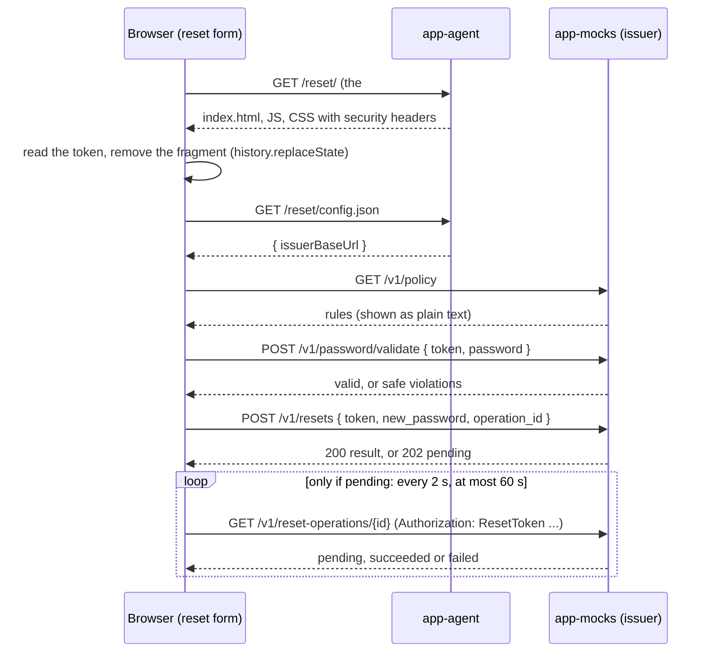

# Step 8: Browser Reset Form Implementation Plan

> **For agentic workers:** REQUIRED SUB-SKILL: Use superpowers:subagent-driven-development (recommended) or superpowers:executing-plans to implement this plan task-by-task. Steps use checkbox (`- [ ]`) syntax for tracking.

**Goal:** Build the small HTTPS page where the caller types the new synthetic password privately. The page reads the one-time token from the link, sends the password only to the mock issuer, and shows an honest result.

**Architecture:** The page is a set of static files that app-agent serves under `/reset/`. Its JavaScript calls app-mocks (the issuer) **directly**, so the password never reaches app-agent. app-agent adds strict security headers to everything under `/reset` and serves one tiny non-secret document, `GET /reset/config.json`, that tells the page where the issuer is. Browser tests run the real page files under the real CSP inside Chromium (Playwright), with the issuer faked by request routing, so they need no server and no Azure.

**Tech Stack:** HTML, CSS, vanilla JavaScript (ES modules, no libraries); ASP.NET Core (.NET 10) minimal APIs and middleware; xUnit v3, `WebApplicationFactory`; Microsoft.Playwright for .NET (Chromium).

---

## Before you start

**Prerequisites:** steps 5 (mock services), 6 (backend core) and 7 (voice page) are done. This plan relies on:

- `solution/src/VoiceReset.Agent/Configuration/IssuerOptions.cs` with a string property `BaseUrl`, bound from the `Issuer` section (`Issuer__BaseUrl`).
- `solution/src/VoiceReset.Agent/Program.cs` ending with `public partial class Program;` (needed by `WebApplicationFactory`).
- `solution/tests/VoiceReset.Agent.Tests` using xUnit v3 (`xunit.v3` package) and `Microsoft.AspNetCore.Mvc.Testing`.
- app-mocks CORS allowing the app-agent origin for the browser routes.

Task 0 checks each of these and gives the fix if one is missing.

**Where to run commands:** every command runs in PowerShell from the `solution/` folder.

**Rules from CLAUDE.md that matter most here:**

- The password appears only in the two HTTPS POST bodies to the issuer (`/v1/password/validate`, `/v1/resets`). It never appears in URLs, the console, storage, logs, or app-agent.
- The token is never logged, stored, or put in a URL that we generate.
- The browser console stays clean: no `console.*` calls, no errors, no warnings, no CSP violations, no missing favicon.
- Commit messages are plain. No AI attribution, no `Co-Authored-By` lines.

## Design decisions (and why)

1. **How the page learns the issuer URL: `GET /reset/config.json`.** It returns `{ "issuerBaseUrl": "https://..." }` from the existing `Issuer__BaseUrl` setting. Alternatives that were rejected:
   - Hard-coding the URL in JavaScript breaks the "no hard-coded addresses" rule and the deploy-your-own-copy story.
   - Rendering the URL into the HTML on the server would turn the static page into a template. It is more code, and the page would no longer be a plain file.
   - A same-origin proxy on app-agent would send the password through app-agent, which breaks our strongest trust-boundary claim.
   - The issuer URL is not a secret: it already appears in the page's CSP header (`connect-src`). One same-origin GET costs nothing and is easy to explain.
2. **Headers are set with `Response.OnStarting` in a tiny middleware for paths under `/reset`.** `OnStarting` runs just before headers are sent, so our values win even if static files or an endpoint set their own (for example `Cache-Control`). The CSP string is built **once at startup** from `IssuerOptions.BaseUrl`.
3. **Browser tests do not need deployed apps.** The Playwright tests serve the real files from `wwwroot/reset` (copied to the test output) under the exact CSP that production uses (`ResetPageSecurityHeaders.BuildContentSecurityPolicy`), and fake the issuer with Playwright routing. This lets us test every branch (202 polling, network failure, 409, 410, 429, 503) quickly and without secrets. One extra **live** test (trait `E2E`) runs against the deployed apps only when you give it a fresh reset link in an environment variable. Otherwise it is skipped.
4. **The password fields have no `name` attribute, and the form has `method="post"`.** Even if the JavaScript fails and a native submit somehow happens, the browser serializes nothing, and it never builds a GET URL with the password in it. CSP `form-action 'none'` blocks native submission anyway.
5. **Password fields are cleared on every submission that reaches the issuer** (also after a policy rejection). The password then lives only in one local variable of the running submission. Retries of the *same* attempt happen inside that submission, so they still have it.
6. **One `operation_id` per submission attempt** (`crypto.randomUUID()`). A network error or `503` on `POST /v1/resets` is retried **once** with the same ID (safe, because the issuer deduplicates). A policy-rejected attempt ends the attempt; the next submit gets a new ID.
7. **After an uncertain outcome ("still processing" or "can't confirm") the form does not allow another submission.** The agent and the reconciler find out the truth. If the caller really needs to retry, they can open the inbox link again (it still works if it was not used).
8. **A hidden, empty username field** is in the form, because Chrome logs a verbose DOM message for password forms without one. The page does not know the username, so the field stays empty.

## File structure

| File | Responsibility |
|---|---|
| Create `solution/src/VoiceReset.Agent/Reset/ResetPageSecurityHeaders.cs` | Builds the CSP from the issuer URL; middleware that adds the four security headers under `/reset` |
| Create `solution/src/VoiceReset.Agent/Reset/ResetFormEndpoints.cs` | `GET /reset/config.json` → `{ issuerBaseUrl }` |
| Modify `solution/src/VoiceReset.Agent/Program.cs` | Wire the middleware, static files, and the config endpoint |
| Create `solution/src/VoiceReset.Agent/wwwroot/reset/index.html` | The page markup (no inline script or style) |
| Create `solution/src/VoiceReset.Agent/wwwroot/reset/css/reset.css` | Styles |
| Create `solution/src/VoiceReset.Agent/wwwroot/reset/favicon.svg` | Favicon (avoids a 404 in the console) |
| Create `solution/src/VoiceReset.Agent/wwwroot/reset/js/token.js` | Read `#token=` and remove the fragment from the address bar |
| Create `solution/src/VoiceReset.Agent/wwwroot/reset/js/issuer.js` | `fetch` wrapper for the four issuer routes the browser may use |
| Create `solution/src/VoiceReset.Agent/wwwroot/reset/js/messages.js` | Every text the page shows for an outcome (pure functions and constants) |
| Create `solution/src/VoiceReset.Agent/wwwroot/reset/js/main.js` | Page wiring: start-up, policy, submit, retry, polling, results |
| Create `solution/tests/VoiceReset.Agent.Tests/Reset/ResetFormAppFactory.cs` | Test host with a known issuer URL and service credential |
| Create `solution/tests/VoiceReset.Agent.Tests/Reset/ResetPageSecurityHeadersTests.cs` | CSP builder unit tests |
| Create `solution/tests/VoiceReset.Agent.Tests/Reset/ResetFormEndpointTests.cs` | Headers, config endpoint, page served without the access code |
| Create `solution/tests/VoiceReset.Agent.Tests/Reset/ResetPageContentTests.cs` | Static rules: no inline script/style, no console/storage/HTML injection in JS |
| Create `solution/tests/VoiceReset.E2E.Tests/VoiceReset.E2E.Tests.csproj` | New test project for browser tests |
| Create `solution/tests/VoiceReset.E2E.Tests/BrowserFixture.cs` | Installs (if needed) and launches Chromium |
| Create `solution/tests/VoiceReset.E2E.Tests/ConsoleWatcher.cs` | Collects console messages, page errors and failed requests |
| Create `solution/tests/VoiceReset.E2E.Tests/FakeResetSite.cs` | Serves the real page files under the real CSP, fakes the issuer |
| Create `solution/tests/VoiceReset.E2E.Tests/FakeIssuer.cs` | Test data and ready-made issuer responses |
| Create `solution/tests/VoiceReset.E2E.Tests/ResetPageSession.cs` | One browser context + page + console watcher per test |
| Create `solution/tests/VoiceReset.E2E.Tests/ResetFormStartupTests.cs` | Token, fragment removal, policy, no-token, toggle |
| Create `solution/tests/VoiceReset.E2E.Tests/ResetFormSubmitTests.cs` | Validate, reset, polling, retries, error messages |
| Create `solution/tests/VoiceReset.E2E.Tests/LiveResetFormTests.cs` | Optional live run against the deployed apps (trait `E2E`) |
| Modify `solution/VoiceReset.slnx`, `solution/Directory.Packages.props` | Add the E2E project and the Playwright package |
| Create `solution/docs/architecture/reset-form.md` | Flow, trust boundary, token handling, headers, limitations |
| Modify `solution/docs/submission/requirements-checklist.md` | Tick verified items |

---

### Task 0: Check the prerequisites

**Files:** read only (fixes only if something is missing).

- [ ] **Step 1: Check `IssuerOptions.BaseUrl`**

Run:
```powershell
Select-String -Path src/VoiceReset.Agent/Configuration/IssuerOptions.cs -Pattern "BaseUrl"
```
Expected: one line such as `public string BaseUrl { get; set; } = "";` (or `required string BaseUrl`).

If the property is a `Uri` instead of a `string`, keep it and, in Tasks 1 and 2, use `.BaseUrl.ToString()` where this plan uses `.BaseUrl`. If the file is missing, step 6 is not done: stop and finish step 6 first.

- [ ] **Step 2: Check that `Program` is visible to tests**

Run:
```powershell
Select-String -Path src/VoiceReset.Agent/Program.cs -Pattern "public partial class Program"
```
Expected: one match. If there is none, add this as the last line of `Program.cs`:
```csharp
public partial class Program;
```

- [ ] **Step 3: Check the test framework**

Run:
```powershell
Select-String -Path Directory.Packages.props -Pattern "xunit|Mvc.Testing|Microsoft.NET.Test.Sdk"
```
Expected: lines for `xunit.v3`, `xunit.runner.visualstudio`, `Microsoft.NET.Test.Sdk` and `Microsoft.AspNetCore.Mvc.Testing`. This plan uses xUnit v3 APIs (`Assert.SkipWhen`, `ValueTask InitializeAsync`, `TestContext.Current`). If the repository uses xUnit v2 instead, see question 1 at the end of this plan.

- [ ] **Step 4: Check how static files are served**

Run:
```powershell
Select-String -Path src/VoiceReset.Agent/Program.cs -Pattern "UseDefaultFiles|UseStaticFiles|MapStaticAssets"
```
Expected: `app.UseDefaultFiles();` and `app.UseStaticFiles();` (from step 7). If you see only `MapStaticAssets()`, you will add `UseDefaultFiles()` and `UseStaticFiles()` in Task 2: `MapStaticAssets` does not serve `/reset/` as `/reset/index.html`.

- [ ] **Step 5: Check the mocks' CORS policy for the browser routes**

Run:
```powershell
Select-String -Path src/VoiceReset.Mocks/*.cs, src/VoiceReset.Mocks/*/*.cs -Pattern "AddCors|WithOrigins|WithHeaders|RequireCors|UseCors"
```
Expected: a policy with the origin from `Mocks:AllowedCorsOrigin`, methods `GET` and `POST`, and headers `Content-Type` and `Authorization`. It must apply to `GET /v1/policy`, `POST /v1/password/validate`, `POST /v1/resets` and `GET /v1/reset-operations/{id}`, and must **not** allow credentials (cookies).

If it is missing or lacks `Authorization`, fix it in `src/VoiceReset.Mocks/Program.cs` (this belongs to step 5, but the form cannot work without it):
```csharp
// After the builder is created:
var allowedOrigin = builder.Configuration["Mocks:AllowedCorsOrigin"]
    ?? throw new InvalidOperationException("Mocks:AllowedCorsOrigin is required.");
builder.Services.AddCors(options => options.AddPolicy("ResetForm", policy => policy
    .WithOrigins(allowedOrigin)
    .WithMethods("GET", "POST")
    .WithHeaders("Content-Type", "Authorization")));

// After `var app = builder.Build();`, before the endpoints are mapped:
app.UseCors();

// On each of the four browser routes, add:
//   .RequireCors("ResetForm")
```
Then run `dotnet test --project tests/VoiceReset.Mocks.Tests` (expected: `Failed: 0`) and commit:
```powershell
git add src/VoiceReset.Mocks/Program.cs
git commit -m "Allow the reset form origin to call the browser issuer routes"
```

- [ ] **Step 6: Check that the whole solution builds and tests pass before you change anything**

Run:
```powershell
dotnet build VoiceReset.slnx
dotnet test VoiceReset.slnx
```
Expected: `Build succeeded.` with `0 Warning(s)` and `0 Error(s)`, and every test run ends with `Failed: 0`.

---

### Task 1: CSP builder

**Files:**
- Create: `solution/src/VoiceReset.Agent/Reset/ResetPageSecurityHeaders.cs`
- Test: `solution/tests/VoiceReset.Agent.Tests/Reset/ResetPageSecurityHeadersTests.cs`

- [ ] **Step 1: Write the failing tests**

Create `tests/VoiceReset.Agent.Tests/Reset/ResetPageSecurityHeadersTests.cs`:
```csharp
using VoiceReset.Agent.Reset;
using Xunit;

namespace VoiceReset.Agent.Tests.Reset;

public sealed class ResetPageSecurityHeadersTests
{
    [Fact]
    public void Csp_allows_only_our_own_files_and_the_issuer_origin()
    {
        var csp = ResetPageSecurityHeaders.BuildContentSecurityPolicy("https://mocks.example.test/");

        Assert.Equal(
            "default-src 'none'; script-src 'self'; style-src 'self'; img-src 'self' data:; " +
            "connect-src 'self' https://mocks.example.test; form-action 'none'; base-uri 'none'; " +
            "frame-ancestors 'none'",
            csp);
    }

    [Theory]
    [InlineData("https://mocks.example.test", "https://mocks.example.test")]
    [InlineData("https://Mocks.Example.test:8443/api/", "https://mocks.example.test:8443")]
    public void Csp_uses_only_the_origin_of_the_issuer_url(string baseUrl, string expectedOrigin)
    {
        var csp = ResetPageSecurityHeaders.BuildContentSecurityPolicy(baseUrl);

        Assert.Contains($"connect-src 'self' {expectedOrigin};", csp);
    }

    [Theory]
    [InlineData("")]
    [InlineData("not a url")]
    [InlineData("/relative/path")]
    [InlineData("ftp://mocks.example.test")]
    public void Csp_rejects_an_issuer_url_that_is_not_absolute_http(string baseUrl)
    {
        Assert.Throws<ArgumentException>(() => ResetPageSecurityHeaders.BuildContentSecurityPolicy(baseUrl));
    }
}
```

- [ ] **Step 2: Run the tests to see them fail**

Run:
```powershell
dotnet test --project tests/VoiceReset.Agent.Tests --filter-class "*.ResetPageSecurityHeadersTests"
```
Expected: build error `CS0246: The type or namespace name 'Reset' does not exist in the namespace 'VoiceReset.Agent'` (or `'ResetPageSecurityHeaders' could not be found`).

- [ ] **Step 3: Write the implementation**

Create `src/VoiceReset.Agent/Reset/ResetPageSecurityHeaders.cs`:
```csharp
using Microsoft.Extensions.Options;
using VoiceReset.Agent.Configuration;

namespace VoiceReset.Agent.Reset;

/// <summary>
/// Security headers for everything under /reset: the reset form page, its files and config.json.
/// The page may load only its own files, and may call only our own origin and the issuer.
/// </summary>
public static class ResetPageSecurityHeaders
{
    public static string BuildContentSecurityPolicy(string issuerBaseUrl)
    {
        if (!Uri.TryCreate(issuerBaseUrl, UriKind.Absolute, out var uri)
            || (uri.Scheme != Uri.UriSchemeHttps && uri.Scheme != Uri.UriSchemeHttp))
        {
            throw new ArgumentException("The issuer base URL must be an absolute http(s) URL.", nameof(issuerBaseUrl));
        }

        // Only the origin (scheme, host, port): a CSP source must not carry the path.
        var issuerOrigin = uri.GetLeftPart(UriPartial.Authority);

        return string.Join("; ",
            "default-src 'none'",
            "script-src 'self'",
            "style-src 'self'",
            "img-src 'self' data:",
            $"connect-src 'self' {issuerOrigin}",
            "form-action 'none'",
            "base-uri 'none'",
            "frame-ancestors 'none'");
    }

    /// <summary>
    /// Adds the security headers to every response whose path starts with /reset.
    /// Call it before UseDefaultFiles and UseStaticFiles.
    /// </summary>
    public static WebApplication UseResetPageSecurityHeaders(this WebApplication app)
    {
        // Built once at startup. The issuer URL comes from configuration (Issuer__BaseUrl),
        // so a wrong value stops the app at startup instead of breaking the page later.
        var issuerBaseUrl = app.Services.GetRequiredService<IOptions<IssuerOptions>>().Value.BaseUrl;
        var contentSecurityPolicy = BuildContentSecurityPolicy(issuerBaseUrl);

        app.Use((context, next) =>
        {
            if (context.Request.Path.StartsWithSegments("/reset"))
            {
                // OnStarting runs just before the headers are sent, so these values win
                // even if static files or an endpoint set their own.
                context.Response.OnStarting(() =>
                {
                    var headers = context.Response.Headers;
                    headers["Content-Security-Policy"] = contentSecurityPolicy;
                    headers["Referrer-Policy"] = "no-referrer";
                    headers["Cache-Control"] = "no-store";
                    headers["X-Content-Type-Options"] = "nosniff";
                    return Task.CompletedTask;
                });
            }

            return next(context);
        });

        return app;
    }
}
```

- [ ] **Step 4: Run the tests to see them pass**

Run:
```powershell
dotnet test --project tests/VoiceReset.Agent.Tests --filter-class "*.ResetPageSecurityHeadersTests"
```
Expected: `Passed!  - Failed: 0, Passed: 7, Skipped: 0, Total: 7`.

- [ ] **Step 5: Commit**

```powershell
git add src/VoiceReset.Agent/Reset/ResetPageSecurityHeaders.cs tests/VoiceReset.Agent.Tests/Reset/ResetPageSecurityHeadersTests.cs
git commit -m "Add the content security policy builder for the reset form"
```

---

### Task 2: Config endpoint, header middleware, and wiring

**Files:**
- Create: `solution/src/VoiceReset.Agent/Reset/ResetFormEndpoints.cs`
- Modify: `solution/src/VoiceReset.Agent/Program.cs`
- Test: `solution/tests/VoiceReset.Agent.Tests/Reset/ResetFormAppFactory.cs`, `solution/tests/VoiceReset.Agent.Tests/Reset/ResetFormEndpointTests.cs`

- [ ] **Step 1: Write the test host**

Create `tests/VoiceReset.Agent.Tests/Reset/ResetFormAppFactory.cs`:
```csharp
using Microsoft.AspNetCore.Hosting;
using Microsoft.AspNetCore.Mvc.Testing;
using Microsoft.Extensions.Configuration;

namespace VoiceReset.Agent.Tests.Reset;

/// <summary>
/// Test host for the reset form routes, with a known issuer URL and a known service credential
/// (so tests can prove the credential never reaches the browser).
/// </summary>
public sealed class ResetFormAppFactory : WebApplicationFactory<Program>
{
    public const string IssuerBaseUrl = "https://mocks.example.test/";
    public const string ServiceCredential = "test-service-credential-never-in-browser";

    protected override void ConfigureWebHost(IWebHostBuilder builder)
    {
        builder.UseEnvironment("Testing");
        builder.ConfigureAppConfiguration((_, configuration) => configuration.AddInMemoryCollection(
            new Dictionary<string, string?>
            {
                ["Issuer:BaseUrl"] = IssuerBaseUrl,
                ["Issuer:ServiceCredential"] = ServiceCredential,
                // Required by step 7 (ValidateOnStart); values are test-only.
                ["VoiceLive:Endpoint"] = "https://voicelive.test/",
                ["Access:Code"] = "test-access-code",
                ["Access:AllowedOrigin"] = "https://localhost",
            }));
    }
}
```

> **Note:** if step 6 or 7 already created a shared test factory (for example one that replaces Table Storage and Voice Live with fakes, or sets other required settings), make `ResetFormAppFactory` derive from that factory instead of `WebApplicationFactory<Program>`. Keep the two settings above, and call `base.ConfigureWebHost(builder);` first.

- [ ] **Step 2: Write the failing tests**

Create `tests/VoiceReset.Agent.Tests/Reset/ResetFormEndpointTests.cs`:
```csharp
using System.Net;
using VoiceReset.Agent.Reset;
using Xunit;

namespace VoiceReset.Agent.Tests.Reset;

public sealed class ResetFormEndpointTests(ResetFormAppFactory factory) : IClassFixture<ResetFormAppFactory>
{
    private static CancellationToken Cancel => TestContext.Current.CancellationToken;

    [Fact]
    public async Task Config_returns_only_the_issuer_base_url_without_the_access_code()
    {
        var response = await factory.CreateClient().GetAsync("/reset/config.json", Cancel);

        Assert.Equal(HttpStatusCode.OK, response.StatusCode);
        var body = await response.Content.ReadAsStringAsync(Cancel);
        Assert.Equal("""{"issuerBaseUrl":"https://mocks.example.test"}""", body);
        Assert.DoesNotContain(ResetFormAppFactory.ServiceCredential, body);
    }

    [Theory]
    [InlineData("/reset/config.json")]
    public async Task Reset_paths_get_the_security_headers(string path)
    {
        var response = await factory.CreateClient().GetAsync(path, Cancel);

        Assert.Equal(HttpStatusCode.OK, response.StatusCode);
        Assert.Equal(
            ResetPageSecurityHeaders.BuildContentSecurityPolicy(ResetFormAppFactory.IssuerBaseUrl),
            Header(response, "Content-Security-Policy"));
        Assert.Equal("no-referrer", Header(response, "Referrer-Policy"));
        Assert.Equal("no-store", Header(response, "Cache-Control"));
        Assert.Equal("nosniff", Header(response, "X-Content-Type-Options"));
    }

    private static string? Header(HttpResponseMessage response, string name) =>
        response.Headers.TryGetValues(name, out var values) || response.Content.Headers.TryGetValues(name, out values)
            ? string.Join(", ", values)
            : null;
}
```

- [ ] **Step 3: Run the tests to see them fail**

Run:
```powershell
dotnet test --project tests/VoiceReset.Agent.Tests --filter-class "*.ResetFormEndpointTests"
```
Expected: 2 failures, each `Assert.Equal() Failure` with expected `OK` and actual `NotFound`.

- [ ] **Step 4: Write the config endpoint**

Create `src/VoiceReset.Agent/Reset/ResetFormEndpoints.cs`:
```csharp
using Microsoft.Extensions.Options;
using VoiceReset.Agent.Configuration;

namespace VoiceReset.Agent.Reset;

/// <summary>The only settings the static reset page needs: where the issuer is. Not a secret.</summary>
public sealed record ResetFormConfig(string IssuerBaseUrl);

public static class ResetFormEndpoints
{
    public static IEndpointRouteBuilder MapResetFormConfig(this IEndpointRouteBuilder app)
    {
        // The reset form is authorized by its one-time token, never by the voice page access code.
        app.MapGet("/reset/config.json", (IOptions<IssuerOptions> issuer) =>
                TypedResults.Ok(new ResetFormConfig(issuer.Value.BaseUrl.TrimEnd('/'))))
            .AllowAnonymous();

        return app;
    }
}
```

- [ ] **Step 5: Wire it into `Program.cs`**

In `src/VoiceReset.Agent/Program.cs`:

1. Add at the top, next to the other `using` lines:
```csharp
using VoiceReset.Agent.Reset;
```
2. Directly after `var app = builder.Build();` (and before any `UseDefaultFiles`, `UseStaticFiles` or access-code middleware), the pipeline must start like this. If `UseDefaultFiles`/`UseStaticFiles` already exist further down, **move** them here instead of adding them twice:
```csharp
app.UseResetPageSecurityHeaders(); // must come before the static files
app.UseDefaultFiles();             // serves /reset/ as /reset/index.html
app.UseStaticFiles();
```
3. Next to the other endpoint mappings (before `app.Run();`):
```csharp
app.MapResetFormConfig();
```

If the step 7 access-code gate is a middleware that checks paths, make sure it lets `/reset` through. The reset form must never require the access code (CLAUDE.md). The test in Step 2 sends no cookie, so it proves this.

- [ ] **Step 6: Run the tests to see them pass**

Run:
```powershell
dotnet test --project tests/VoiceReset.Agent.Tests --filter-namespace "VoiceReset.Agent.Tests.Reset"
```
Expected: `Passed!  - Failed: 0, Passed: 9, Skipped: 0, Total: 9`.

- [ ] **Step 7: Run the whole agent test project (nothing else broke)**

Run:
```powershell
dotnet test --project tests/VoiceReset.Agent.Tests
```
Expected: `Failed: 0`.

- [ ] **Step 8: Commit**

```powershell
git add src/VoiceReset.Agent/Reset/ResetFormEndpoints.cs src/VoiceReset.Agent/Program.cs tests/VoiceReset.Agent.Tests/Reset/ResetFormAppFactory.cs tests/VoiceReset.Agent.Tests/Reset/ResetFormEndpointTests.cs
git commit -m "Serve reset form config and security headers under /reset"
```

---

### Task 3: Page markup, styles, and favicon

**Files:**
- Create: `solution/src/VoiceReset.Agent/wwwroot/reset/index.html`
- Create: `solution/src/VoiceReset.Agent/wwwroot/reset/css/reset.css`
- Create: `solution/src/VoiceReset.Agent/wwwroot/reset/favicon.svg`
- Modify: `solution/tests/VoiceReset.Agent.Tests/Reset/ResetFormEndpointTests.cs`

- [ ] **Step 1: Extend the tests**

In `tests/VoiceReset.Agent.Tests/Reset/ResetFormEndpointTests.cs`, replace the attributes of `Reset_paths_get_the_security_headers` with:
```csharp
    [Theory]
    [InlineData("/reset/config.json")]
    [InlineData("/reset/")]
    [InlineData("/reset/css/reset.css")]
    [InlineData("/reset/favicon.svg")]
```
and add this test to the class:
```csharp
    [Fact]
    public async Task Reset_page_is_served_as_html_without_the_access_code()
    {
        var response = await factory.CreateClient().GetAsync("/reset/", Cancel);

        Assert.Equal(HttpStatusCode.OK, response.StatusCode);
        Assert.Equal("text/html", response.Content.Headers.ContentType?.MediaType);
    }
```

- [ ] **Step 2: Run the tests to see them fail**

Run:
```powershell
dotnet test --project tests/VoiceReset.Agent.Tests --filter-class "*.ResetFormEndpointTests"
```
Expected: 4 failures with expected `OK`, actual `NotFound` (`/reset/` twice, `css/reset.css`, `favicon.svg`).

- [ ] **Step 3: Create the page**

Create `src/VoiceReset.Agent/wwwroot/reset/index.html`:
```html
<!doctype html>
<html lang="en">
<head>
  <meta charset="utf-8">
  <meta name="viewport" content="width=device-width, initial-scale=1">
  <meta name="referrer" content="no-referrer">
  <title>Reset your password</title>
  <link rel="icon" href="/reset/favicon.svg" type="image/svg+xml">
  <link rel="stylesheet" href="/reset/css/reset.css">
  <script type="module" src="/reset/js/main.js"></script>
</head>
<body>
  <main>
    <h1>Reset your password</h1>

    <noscript>
      <p class="notice">This page needs JavaScript to reset your password.</p>
    </noscript>

    <p id="no-token" class="notice" data-testid="no-token" hidden>
      This page only works with the reset link we sent you.
      Open the link from your recovery inbox.
    </p>

    <section id="policy" data-testid="policy" aria-labelledby="policy-title" hidden>
      <h2 id="policy-title">Password rules</h2>
      <ul id="policy-rules" data-testid="policy-rules"></ul>
      <p id="policy-unavailable" data-testid="policy-unavailable" hidden>
        We could not load the password rules. You can still choose a password:
        it is checked when you submit it.
      </p>
    </section>

    <div id="error-summary" class="error-summary" data-testid="error-summary"
         role="alert" aria-live="assertive" aria-labelledby="error-summary-title" tabindex="-1" hidden>
      <h2 id="error-summary-title">Please check the following</h2>
      <ul id="error-list" data-testid="error-list"></ul>
    </div>

    <form id="reset-form" data-testid="reset-form" method="post" novalidate hidden>
      <!-- Browsers expect a username field in a password form. The page does not know the
           username, so this field stays hidden and empty. -->
      <input id="username" type="text" autocomplete="username" tabindex="-1" aria-hidden="true" hidden>

      <!-- The password fields have no name attribute on purpose: a native form submission
           could never carry the password anywhere. -->
      <div class="field">
        <label for="new-password">New password</label>
        <input id="new-password" data-testid="new-password" type="password"
               autocomplete="new-password" autocapitalize="off" spellcheck="false"
               aria-describedby="policy-rules">
      </div>

      <div class="field">
        <label for="confirm-password">Confirm new password</label>
        <input id="confirm-password" data-testid="confirm-password" type="password"
               autocomplete="new-password" autocapitalize="off" spellcheck="false">
      </div>

      <div class="actions">
        <button id="toggle-visibility" data-testid="toggle-visibility" class="secondary" type="button"
                aria-pressed="false" aria-controls="new-password confirm-password">Show passwords</button>
        <button id="submit-button" data-testid="submit-button" type="submit">Change password</button>
      </div>
    </form>

    <p id="status-message" class="status" data-testid="status-message" role="status" aria-live="polite"></p>

    <section id="result" class="result" data-testid="result" aria-labelledby="result-title" tabindex="-1" hidden>
      <h2 id="result-title" data-testid="result-title"></h2>
      <p id="result-text" data-testid="result-text"></p>
      <p id="result-reason" class="reason" data-testid="result-reason" hidden></p>
    </section>
  </main>
</body>
</html>
```

- [ ] **Step 4: Create the styles**

Create `src/VoiceReset.Agent/wwwroot/reset/css/reset.css`:
```css
:root {
  color-scheme: light;
  --text: #1b1b1b;
  --muted: #4a4a4a;
  --accent: #1f5fae;
  --error: #b00020;
  --ok: #1e7a34;
  --border: #767676;
  --focus: #ffbf47;
  font-family: system-ui, -apple-system, "Segoe UI", Roboto, sans-serif;
}

/* Elements with the hidden attribute must stay hidden, whatever their display style is. */
[hidden] {
  display: none !important;
}

body {
  margin: 0;
  color: var(--text);
  background: #f4f5f7;
  line-height: 1.5;
}

main {
  max-width: 32rem;
  margin: 2rem auto;
  padding: 1.5rem;
  background: #ffffff;
  border-radius: 8px;
  box-shadow: 0 1px 4px rgb(0 0 0 / 12%);
}

h1 {
  font-size: 1.5rem;
  margin-top: 0;
}

h2 {
  font-size: 1.1rem;
}

.field {
  margin-bottom: 1rem;
}

label {
  display: block;
  font-weight: 600;
  margin-bottom: 0.25rem;
}

input {
  box-sizing: border-box;
  width: 100%;
  padding: 0.6rem;
  font-size: 1rem;
  border: 1px solid var(--border);
  border-radius: 4px;
}

input[aria-invalid="true"] {
  border: 2px solid var(--error);
}

.actions {
  display: flex;
  flex-wrap: wrap;
  gap: 0.5rem;
}

button {
  font-size: 1rem;
  padding: 0.6rem 1rem;
  border-radius: 4px;
  border: 1px solid var(--accent);
  background: var(--accent);
  color: #ffffff;
  cursor: pointer;
}

button.secondary {
  background: #ffffff;
  color: var(--accent);
}

button:disabled {
  opacity: 0.6;
  cursor: progress;
}

:focus-visible {
  outline: 3px solid var(--focus);
  outline-offset: 2px;
}

.notice {
  padding: 0.75rem 1rem;
  background: #eef3fb;
  border-left: 4px solid var(--accent);
}

.error-summary {
  padding: 0.75rem 1rem;
  margin-bottom: 1rem;
  border: 2px solid var(--error);
  border-radius: 4px;
}

.error-summary h2 {
  margin-top: 0;
  color: var(--error);
}

.status {
  min-height: 1.5em;
  color: var(--muted);
}

.result {
  padding-left: 1rem;
  border-left: 4px solid var(--error);
}

.result[data-outcome="succeeded"] {
  border-left-color: var(--ok);
}

.reason {
  color: var(--muted);
  font-size: 0.9rem;
}
```

- [ ] **Step 5: Create the favicon**

Create `src/VoiceReset.Agent/wwwroot/reset/favicon.svg`:
```xml
<svg xmlns="http://www.w3.org/2000/svg" viewBox="0 0 32 32"><rect width="32" height="32" rx="6" fill="#1f5fae"/><path d="M11 15v-4a5 5 0 0 1 10 0v4" fill="none" stroke="#ffffff" stroke-width="2.5"/><rect x="8" y="15" width="16" height="11" rx="2" fill="#ffffff"/></svg>
```

- [ ] **Step 6: Run the tests to see them pass**

Run:
```powershell
dotnet test --project tests/VoiceReset.Agent.Tests --filter-namespace "VoiceReset.Agent.Tests.Reset"
```
Expected: `Passed!  - Failed: 0, Passed: 13, Skipped: 0, Total: 13`.

- [ ] **Step 7: Commit**

```powershell
git add src/VoiceReset.Agent/wwwroot/reset tests/VoiceReset.Agent.Tests/Reset/ResetFormEndpointTests.cs
git commit -m "Add reset form page markup, styles and favicon"
```

---

### Task 4: Browser test project and start-up tests

**Files:**
- Create: `solution/tests/VoiceReset.E2E.Tests/VoiceReset.E2E.Tests.csproj`
- Create: `solution/tests/VoiceReset.E2E.Tests/BrowserFixture.cs`
- Create: `solution/tests/VoiceReset.E2E.Tests/ConsoleWatcher.cs`
- Create: `solution/tests/VoiceReset.E2E.Tests/FakeResetSite.cs`
- Create: `solution/tests/VoiceReset.E2E.Tests/FakeIssuer.cs`
- Create: `solution/tests/VoiceReset.E2E.Tests/ResetPageSession.cs`
- Create: `solution/tests/VoiceReset.E2E.Tests/ResetFormStartupTests.cs`
- Modify: `solution/VoiceReset.slnx`, `solution/Directory.Packages.props`

- [ ] **Step 1: Create the project file**

Create `tests/VoiceReset.E2E.Tests/VoiceReset.E2E.Tests.csproj`. The test framework packages must match `tests/VoiceReset.Agent.Tests/VoiceReset.Agent.Tests.csproj`. If that file lists different test packages, copy its list.
```xml
<Project Sdk="Microsoft.NET.Sdk">

  <PropertyGroup>
    <TargetFramework>net10.0</TargetFramework>
    <OutputType>Exe</OutputType>
    <IsPackable>false</IsPackable>
    <IsTestProject>true</IsTestProject>
  </PropertyGroup>

  <ItemGroup>
    <PackageReference Include="Microsoft.NET.Test.Sdk" />
    <PackageReference Include="xunit.v3" />
    <PackageReference Include="xunit.runner.visualstudio" />
  </ItemGroup>

  <ItemGroup>
    <!-- Only for ResetPageSecurityHeaders.BuildContentSecurityPolicy, so the browser tests run
         the page under exactly the production CSP. -->
    <ProjectReference Include="..\..\src\VoiceReset.Agent\VoiceReset.Agent.csproj" />
  </ItemGroup>

  <ItemGroup>
    <!-- The real reset page files, copied next to the tests and served by FakeResetSite. -->
    <Content Include="..\..\src\VoiceReset.Agent\wwwroot\reset\**\*" LinkBase="reset" CopyToOutputDirectory="PreserveNewest" />
  </ItemGroup>

</Project>
```

- [ ] **Step 2: Add Playwright and add the project to the solution**

Run:
```powershell
dotnet add tests/VoiceReset.E2E.Tests/VoiceReset.E2E.Tests.csproj package Microsoft.Playwright
dotnet sln VoiceReset.slnx add tests/VoiceReset.E2E.Tests/VoiceReset.E2E.Tests.csproj
```
Expected: `info : PackageReference for package 'Microsoft.Playwright' version '<latest>' added to file '...VoiceReset.E2E.Tests.csproj'.` Because central package management is on, the version goes into `Directory.Packages.props` as a new `<PackageVersion Include="Microsoft.Playwright" Version="..." />` line. Then: `Project ... added to the solution.`

- [ ] **Step 3: Create the browser fixture**

Create `tests/VoiceReset.E2E.Tests/BrowserFixture.cs`:
```csharp
using Microsoft.Playwright;
using Xunit;

namespace VoiceReset.E2E.Tests;

/// <summary>
/// One Chromium per test class. The first run downloads Chromium (about 150 MB) into the
/// user's Playwright cache; later runs find it there and start immediately.
/// </summary>
public sealed class BrowserFixture : IAsyncLifetime
{
    private IPlaywright? _playwright;
    private IBrowser? _browser;

    public async ValueTask InitializeAsync()
    {
        var exitCode = Microsoft.Playwright.Program.Main(["install", "chromium"]);
        if (exitCode != 0)
        {
            throw new InvalidOperationException($"Playwright could not install Chromium (exit code {exitCode}).");
        }

        _playwright = await Microsoft.Playwright.Playwright.CreateAsync();
        _browser = await _playwright.Chromium.LaunchAsync();
    }

    public Task<IBrowserContext> NewContextAsync() =>
        (_browser ?? throw new InvalidOperationException("The browser is not started.")).NewContextAsync();

    public async ValueTask DisposeAsync()
    {
        if (_browser is not null)
        {
            await _browser.DisposeAsync();
        }

        _playwright?.Dispose();
    }
}
```

- [ ] **Step 4: Create the console watcher**

Create `tests/VoiceReset.E2E.Tests/ConsoleWatcher.cs`:
```csharp
using System.Collections.Concurrent;
using Microsoft.Playwright;
using Xunit;

namespace VoiceReset.E2E.Tests;

/// <summary>
/// Records everything that would show up in the browser console: console messages of any
/// level (including CSP violations and "Failed to load resource"), uncaught page errors,
/// and failed network requests.
/// </summary>
public sealed class ConsoleWatcher
{
    private readonly ConcurrentQueue<string> _messages = new();

    public ConsoleWatcher(IPage page)
    {
        page.Console += (_, message) => _messages.Enqueue($"console.{message.Type}: {message.Text}");
        page.PageError += (_, error) => _messages.Enqueue($"page error: {error}");
        page.RequestFailed += (_, request) =>
            _messages.Enqueue($"request failed: {request.Method} {new Uri(request.Url).AbsolutePath}");
    }

    /// <summary>The console must be completely empty.</summary>
    public void AssertClean() => Assert.Empty(_messages);

    /// <summary>
    /// For tests where the issuer answers with an error status or the network fails on purpose:
    /// the browser itself logs "Failed to load resource" for those requests, and the page cannot
    /// prevent that. Anything else (page errors, CSP violations, warnings) is still a failure.
    /// </summary>
    public void AssertNothingButFailedRequests() =>
        Assert.All(_messages, message => Assert.True(
            message.StartsWith("console.error: Failed to load resource", StringComparison.Ordinal)
            || message.StartsWith("request failed: ", StringComparison.Ordinal),
            message));
}
```

- [ ] **Step 5: Create the fake site**

Create `tests/VoiceReset.E2E.Tests/FakeResetSite.cs`:
```csharp
using System.Collections.Concurrent;
using System.Text.Json;
using Microsoft.Playwright;
using VoiceReset.Agent.Reset;

namespace VoiceReset.E2E.Tests;

/// <summary>One request the page sent to the fake issuer.</summary>
public sealed record IssuerRequest(string Method, string Path, JsonElement? Body, string? Authorization)
{
    public string? BodyString(string property) =>
        Body is { } body && body.TryGetProperty(property, out var value) ? value.GetString() : null;
}

/// <summary>What the fake issuer answers with.</summary>
public sealed record FakeResponse(int Status, object Body);

/// <summary>
/// Serves the real reset page files under the real CSP, and fakes the issuer, all inside the
/// browser through Playwright routing. No server and no network are involved.
/// </summary>
public sealed class FakeResetSite
{
    public const string AgentOrigin = "http://localhost:5199";
    public const string IssuerOrigin = "https://mocks.example.test";
    public const string ResetPageUrl = AgentOrigin + "/reset/";

    private readonly List<(string Key, Func<IssuerRequest, FakeResponse?> Handler)> _handlers = [];

    public FakeResetSite() => On("GET /v1/policy", FakeIssuer.Policy());

    public ConcurrentQueue<IssuerRequest> IssuerRequests { get; } = new();

    /// <summary>
    /// Answers requests whose "METHOD /path" starts with <paramref name="key"/>. The newest
    /// registration wins. A handler that returns null drops the connection (a network failure).
    /// </summary>
    public void On(string key, Func<IssuerRequest, FakeResponse?> handler) => _handlers.Insert(0, (key, handler));

    public void On(string key, FakeResponse response) => On(key, _ => response);

    public IssuerRequest[] RequestsTo(string key) =>
        IssuerRequests.Where(request => $"{request.Method} {request.Path}".StartsWith(key, StringComparison.Ordinal)).ToArray();

    public async Task AttachAsync(IPage page)
    {
        await page.RouteAsync(AgentOrigin + "/**", ServeAgentAsync);
        await page.RouteAsync(IssuerOrigin + "/**", ServeIssuerAsync);
    }

    private static async Task ServeAgentAsync(IRoute route)
    {
        var path = new Uri(route.Request.Url).AbsolutePath;
        var headers = new Dictionary<string, string>
        {
            ["Content-Security-Policy"] = ResetPageSecurityHeaders.BuildContentSecurityPolicy(IssuerOrigin),
            ["Referrer-Policy"] = "no-referrer",
            ["Cache-Control"] = "no-store",
            ["X-Content-Type-Options"] = "nosniff",
        };

        if (path == "/reset/config.json")
        {
            await route.FulfillAsync(new()
            {
                Status = 200,
                ContentType = "application/json",
                Body = JsonSerializer.Serialize(new { issuerBaseUrl = IssuerOrigin }),
                Headers = headers,
            });
            return;
        }

        var relativePath = path == "/reset/" ? "index.html"
            : path.StartsWith("/reset/", StringComparison.Ordinal) ? path["/reset/".Length..]
            : "";
        var file = Path.Combine(AppContext.BaseDirectory, "reset", relativePath);
        if (relativePath == "" || !File.Exists(file))
        {
            await route.FulfillAsync(new() { Status = 404, Headers = headers });
            return;
        }

        await route.FulfillAsync(new()
        {
            Status = 200,
            ContentType = ContentTypeOf(file),
            BodyBytes = File.ReadAllBytes(file),
            Headers = headers,
        });
    }

    private async Task ServeIssuerAsync(IRoute route)
    {
        var request = route.Request;
        var cors = new Dictionary<string, string>
        {
            ["Access-Control-Allow-Origin"] = AgentOrigin,
            ["Access-Control-Allow-Methods"] = "GET, POST",
            ["Access-Control-Allow-Headers"] = "Content-Type, Authorization",
        };

        if (request.Method == "OPTIONS")
        {
            await route.FulfillAsync(new() { Status = 204, Headers = cors });
            return;
        }

        var issuerRequest = new IssuerRequest(
            request.Method,
            new Uri(request.Url).AbsolutePath,
            request.PostData is { } json ? JsonSerializer.Deserialize<JsonElement>(json) : null,
            await request.HeaderValueAsync("authorization"));
        IssuerRequests.Enqueue(issuerRequest);

        var key = $"{issuerRequest.Method} {issuerRequest.Path}";
        var handler = _handlers.FirstOrDefault(entry => key.StartsWith(entry.Key, StringComparison.Ordinal)).Handler;
        var response = handler is null ? FakeIssuer.Error(404, "not_found") : handler(issuerRequest);

        if (response is null)
        {
            await route.AbortAsync();
            return;
        }

        await route.FulfillAsync(new()
        {
            Status = response.Status,
            ContentType = "application/json",
            Body = JsonSerializer.Serialize(response.Body),
            Headers = cors,
        });
    }

    private static string ContentTypeOf(string file) => Path.GetExtension(file) switch
    {
        ".html" => "text/html",
        ".js" => "text/javascript",
        ".css" => "text/css",
        ".svg" => "image/svg+xml",
        _ => "application/octet-stream",
    };
}
```

- [ ] **Step 6: Create the test data and issuer responses**

Create `tests/VoiceReset.E2E.Tests/FakeIssuer.cs`:
```csharp
namespace VoiceReset.E2E.Tests;

/// <summary>Synthetic test values. None of them is a real secret.</summary>
public static class TestData
{
    public const string Token = "abc+def/ghi=";
    public const string EncodedToken = "abc%2Bdef%2Fghi%3D";
    public const string Password = "Synthetic-Pass-2026!";
    public const string LinkWithToken = FakeResetSite.ResetPageUrl + "#token=" + EncodedToken;
}

/// <summary>Issuer responses shaped like the mock contract.</summary>
public static class FakeIssuer
{
    public static FakeResponse Policy() => new(200, new
    {
        policy_version = "test-1",
        rules = new[]
        {
            new { code = "min_length", description = "At least 12 characters." },
            new { code = "character_mix", description = "Upper and lower case letters, a digit and a symbol." },
        },
    });

    public static FakeResponse Valid() =>
        new(200, new { valid = true, policy_version = "test-1", violations = Array.Empty<object>() });

    public static FakeResponse Invalid(string code, string description) =>
        new(200, new { valid = false, policy_version = "test-1", violations = new[] { new { code, description } } });

    public static FakeResponse PolicyViolation(string code, string description) => new(422, new
    {
        error = new { code = "policy_violation", message = "The password does not meet the policy." },
        violations = new[] { new { code, description } },
    });

    public static FakeResponse Operation(
        int httpStatus, string operationId, string status, string? unlock = null, string? reason = null) =>
        new(httpStatus, new
        {
            operation_id = operationId,
            status,
            reset_receipt = status == "succeeded" ? "rcpt_test_only" : null,
            unlock_status = unlock,
            reason_code = reason,
        });

    public static FakeResponse Error(int httpStatus, string code) =>
        new(httpStatus, new { error = new { code, message = "Fixed test message." } });
}
```

- [ ] **Step 7: Create the page session helper**

Create `tests/VoiceReset.E2E.Tests/ResetPageSession.cs`:
```csharp
using Microsoft.Playwright;

namespace VoiceReset.E2E.Tests;

/// <summary>A fresh browser context and page for one test, with its console watched from the start.</summary>
public sealed class ResetPageSession(IBrowserContext context, IPage page, ConsoleWatcher console, IResponse? response)
    : IAsyncDisposable
{
    public IPage Page { get; } = page;
    public ConsoleWatcher Console { get; } = console;
    public IResponse? Response { get; } = response;

    public static async Task<ResetPageSession> OpenAsync(BrowserFixture browser, string url, FakeResetSite? site = null)
    {
        var context = await browser.NewContextAsync();
        var page = await context.NewPageAsync();
        var console = new ConsoleWatcher(page);
        if (site is not null)
        {
            await site.AttachAsync(page);
        }

        var response = await page.GotoAsync(url);
        return new ResetPageSession(context, page, console, response);
    }

    /// <summary>Fills both password fields through their labels (like a person) and submits.</summary>
    public async Task SubmitAsync(string password, string? confirmation = null)
    {
        await Page.GetByLabel("New password", new() { Exact = true }).FillAsync(password);
        await Page.GetByLabel("Confirm new password", new() { Exact = true }).FillAsync(confirmation ?? password);
        await Page.GetByRole(AriaRole.Button, new() { Name = "Change password" }).ClickAsync();
    }

    public Task<string> AddressBarAsync() => Page.EvaluateAsync<string>("location.href");

    public ValueTask DisposeAsync() => context.DisposeAsync();
}
```

- [ ] **Step 8: Write the failing start-up tests**

Create `tests/VoiceReset.E2E.Tests/ResetFormStartupTests.cs`:
```csharp
using Microsoft.Playwright;
using Xunit;
using static Microsoft.Playwright.Assertions;

namespace VoiceReset.E2E.Tests;

[Trait("Category", "Browser")]
public sealed class ResetFormStartupTests(BrowserFixture browser) : IClassFixture<BrowserFixture>
{
    [Fact]
    public async Task Reads_the_token_removes_it_from_the_address_bar_and_shows_the_policy()
    {
        var site = new FakeResetSite();
        await using var session = await ResetPageSession.OpenAsync(browser, TestData.LinkWithToken, site);

        await Expect(session.Page.GetByTestId("policy-rules").Locator("li")).ToHaveCountAsync(2);
        await Expect(session.Page.GetByTestId("policy-rules")).ToContainTextAsync("At least 12 characters.");
        await Expect(session.Page.GetByTestId("reset-form")).ToBeVisibleAsync();
        Assert.Equal(FakeResetSite.ResetPageUrl, await session.AddressBarAsync());
        Assert.Equal(0, await session.Page.EvaluateAsync<int>("localStorage.length + sessionStorage.length"));
        session.Console.AssertClean();
    }

    [Fact]
    public async Task Without_a_token_the_page_asks_for_the_inbox_link_and_calls_nothing()
    {
        var site = new FakeResetSite();
        await using var session = await ResetPageSession.OpenAsync(browser, FakeResetSite.ResetPageUrl + "#something=else", site);

        await Expect(session.Page.GetByTestId("no-token")).ToContainTextAsync("Open the link from your recovery inbox.");
        await Expect(session.Page.GetByTestId("reset-form")).ToBeHiddenAsync();
        Assert.Equal(FakeResetSite.ResetPageUrl, await session.AddressBarAsync());
        Assert.Empty(site.IssuerRequests);
        session.Console.AssertClean();
    }

    [Fact]
    public async Task When_the_policy_cannot_be_loaded_the_form_still_works()
    {
        var site = new FakeResetSite();
        site.On("GET /v1/policy", FakeIssuer.Error(503, "dependency_unavailable"));
        await using var session = await ResetPageSession.OpenAsync(browser, TestData.LinkWithToken, site);

        await Expect(session.Page.GetByTestId("policy-unavailable")).ToBeVisibleAsync();
        await Expect(session.Page.GetByTestId("reset-form")).ToBeVisibleAsync();
        session.Console.AssertNothingButFailedRequests();
    }

    [Fact]
    public async Task Show_passwords_button_switches_both_fields()
    {
        var site = new FakeResetSite();
        await using var session = await ResetPageSession.OpenAsync(browser, TestData.LinkWithToken, site);
        var toggle = session.Page.GetByRole(AriaRole.Button, new() { Name = "Show passwords" });

        await toggle.ClickAsync();
        await Expect(session.Page.GetByTestId("new-password")).ToHaveAttributeAsync("type", "text");
        await Expect(session.Page.GetByTestId("confirm-password")).ToHaveAttributeAsync("type", "text");
        await Expect(toggle).ToHaveAttributeAsync("aria-pressed", "true");

        await toggle.ClickAsync();
        await Expect(session.Page.GetByTestId("new-password")).ToHaveAttributeAsync("type", "password");
        await Expect(toggle).ToHaveAttributeAsync("aria-pressed", "false");
        session.Console.AssertClean();
    }
}
```

- [ ] **Step 9: Run the tests to see them fail**

The first run downloads Chromium (about 150 MB from Microsoft's Playwright CDN into `%LOCALAPPDATA%\ms-playwright`). **Ask the owner before the first run** if this has not been approved yet.

Run:
```powershell
dotnet test --project tests/VoiceReset.E2E.Tests --filter-trait "Category=Browser"
```
Expected: `Failed: 4`. The JavaScript does not exist yet, so the form never appears: you see `Locator expected to be visible` / `ToHaveCountAsync` timeouts, and the console contains `Failed to load resource: the server responded with a status of 404` for `/reset/js/main.js`.

- [ ] **Step 10: Commit the test harness**

```powershell
git add tests/VoiceReset.E2E.Tests VoiceReset.slnx Directory.Packages.props
git commit -m "Add browser test project for the reset form"
```

---

### Task 5: Token, issuer client, messages, and page start-up

**Files:**
- Create: `solution/src/VoiceReset.Agent/wwwroot/reset/js/token.js`
- Create: `solution/src/VoiceReset.Agent/wwwroot/reset/js/issuer.js`
- Create: `solution/src/VoiceReset.Agent/wwwroot/reset/js/messages.js`
- Create: `solution/src/VoiceReset.Agent/wwwroot/reset/js/main.js` (first version: start-up only)
- Test: `solution/tests/VoiceReset.Agent.Tests/Reset/ResetPageContentTests.cs`, `solution/tests/VoiceReset.Agent.Tests/Reset/ResetFormEndpointTests.cs`

> **Important:** the content test in this task fails if any file under `wwwroot/reset/js` contains `console.`, `localStorage`, `sessionStorage`, `innerHTML`, `outerHTML`, `insertAdjacentHTML`, `document.write` or `eval(`. That includes **comments**, so never write those words in comments.

- [ ] **Step 1: Write the failing content tests**

Create `tests/VoiceReset.Agent.Tests/Reset/ResetPageContentTests.cs`:
```csharp
using System.Text.RegularExpressions;
using Microsoft.AspNetCore.Hosting;
using Microsoft.Extensions.DependencyInjection;
using Xunit;

namespace VoiceReset.Agent.Tests.Reset;

/// <summary>
/// Cheap static checks that keep the page compatible with the strict CSP and the clean
/// console rule. The browser tests check the behaviour; these catch mistakes early.
/// </summary>
public sealed class ResetPageContentTests(ResetFormAppFactory factory) : IClassFixture<ResetFormAppFactory>
{
    private static readonly string[] ForbiddenInScripts =
        ["console.", "localStorage", "sessionStorage", "innerHTML", "outerHTML", "insertAdjacentHTML", "document.write", "eval("];

    private string ResetFolder =>
        Path.Combine(factory.Services.GetRequiredService<IWebHostEnvironment>().WebRootPath, "reset");

    [Fact]
    public void Html_has_no_inline_script_style_or_event_handlers()
    {
        var html = File.ReadAllText(Path.Combine(ResetFolder, "index.html"));

        Assert.DoesNotMatch(@"<script(?![^>]*\ssrc=)", html);
        Assert.DoesNotContain("<style", html);
        Assert.DoesNotMatch(@"\sstyle\s*=", html);
        Assert.DoesNotMatch(@"\son[a-z]+\s*=", html);
        Assert.Equal(2, Regex.Matches(html, "autocomplete=\"new-password\"").Count);
    }

    [Fact]
    public void Scripts_never_use_the_console_browser_storage_or_html_injection()
    {
        var scripts = Directory.GetFiles(Path.Combine(ResetFolder, "js"), "*.js");

        Assert.NotEmpty(scripts);
        foreach (var script in scripts)
        {
            var code = File.ReadAllText(script);
            foreach (var forbidden in ForbiddenInScripts)
            {
                Assert.False(
                    code.Contains(forbidden, StringComparison.Ordinal),
                    $"{Path.GetFileName(script)} contains '{forbidden}'.");
            }
        }
    }
}
```

Also, in `tests/VoiceReset.Agent.Tests/Reset/ResetFormEndpointTests.cs`, add one more line to the attributes of `Reset_paths_get_the_security_headers`:
```csharp
    [InlineData("/reset/js/main.js")]
```

- [ ] **Step 2: Run the tests to see them fail**

Run:
```powershell
dotnet test --project tests/VoiceReset.Agent.Tests --filter-namespace "VoiceReset.Agent.Tests.Reset"
```
Expected: 2 failures: `Scripts_never_use_...` fails with `DirectoryNotFoundException` (no `js` folder yet), and the headers test for `/reset/js/main.js` fails with `NotFound`.

- [ ] **Step 3: Create `token.js`**

Create `src/VoiceReset.Agent/wwwroot/reset/js/token.js`:
```js
// Reads the one-time reset token from the link (#token=...) and removes the fragment from
// the address bar, so the token does not stay in the history, in bookmarks or on screen.
// Browsers never send the fragment to a server, so the token never reaches app-agent.

export function takeTokenFromAddressBar() {
  const fragment = window.location.hash;
  if (fragment !== "") {
    window.history.replaceState(null, "", window.location.pathname);
  }
  return parseToken(fragment);
}

export function parseToken(fragment) {
  // URLSearchParams also undoes the URL encoding (for example %2B becomes +).
  const token = new URLSearchParams(fragment.replace(/^#/, "")).get("token");
  return token !== null && token.trim() !== "" ? token : null;
}
```

- [ ] **Step 4: Create `issuer.js`**

Create `src/VoiceReset.Agent/wwwroot/reset/js/issuer.js`:
```js
// The four issuer routes the browser may call (mock contract: policy and the "B" routes).
// Every call returns { status, body }. Status 0 means the request did not complete
// (network error or timeout): the page must then treat the result as unknown.

const REQUEST_TIMEOUT_MS = 15000;

export function createIssuerClient(baseUrl) {
  async function send(method, path, { json, resetToken } = {}) {
    const headers = {};
    if (json !== undefined) {
      headers["Content-Type"] = "application/json";
    }
    if (resetToken !== undefined) {
      headers.Authorization = `ResetToken ${resetToken}`;
    }

    try {
      const response = await fetch(baseUrl + path, {
        method,
        headers,
        body: json === undefined ? undefined : JSON.stringify(json),
        cache: "no-store",
        credentials: "omit",
        redirect: "error",
        referrerPolicy: "no-referrer",
        signal: AbortSignal.timeout(REQUEST_TIMEOUT_MS),
      });
      const body = await response.json().catch(() => null);
      return { status: response.status, body };
    } catch {
      return { status: 0, body: null };
    }
  }

  return {
    getPolicy: () => send("GET", "/v1/policy"),
    validatePassword: (token, password) =>
      send("POST", "/v1/password/validate", { json: { token, password } }),
    submitReset: (token, newPassword, operationId) =>
      send("POST", "/v1/resets", {
        json: { token, new_password: newPassword, operation_id: operationId },
      }),
    getResetOperation: (token, operationId) =>
      send("GET", `/v1/reset-operations/${encodeURIComponent(operationId)}`, { resetToken: token }),
  };
}
```

- [ ] **Step 5: Create `messages.js`**

Create `src/VoiceReset.Agent/wwwroot/reset/js/messages.js`:
```js
// Every text the page shows for an outcome. All texts are fixed and honest. The only
// issuer-supplied texts that are shown are the safe policy descriptions, and the page
// always inserts them as plain text (textContent).

const SAFE_CODE = /^[a-z0-9_]{1,64}$/;

export const PAGE_UNAVAILABLE = {
  outcome: "unavailable",
  title: "This page is not available right now",
  text: "Please open the link from your recovery inbox again in a minute, or tell the agent.",
};

export const BROWSER_NOT_SUPPORTED = {
  outcome: "unsupported",
  title: "Please use a newer browser",
  text: "This page needs a current version of Edge, Chrome, Firefox or Safari. Open the link from your recovery inbox in a newer browser.",
};

export const STILL_PROCESSING = {
  outcome: "pending-timeout",
  title: "Your reset is still being processed",
  text: "Please don't submit again. Your help desk ticket will be updated when it finishes, and the agent can check the status for you.",
};

export const CANNOT_CONFIRM = {
  outcome: "unknown",
  title: "We can't confirm the result",
  text: "We could not confirm whether your password was changed. Please don't submit again for a minute; the agent can check the status for you.",
};

// Result of POST /v1/resets or GET /v1/reset-operations/{id}. Null means "not finished yet".
export function describeOperation(operation) {
  if (operation?.status === "succeeded") {
    const unlocked = operation.unlock_status === "unlocked" ? " Your account was also unlocked." : "";
    return {
      outcome: "succeeded",
      title: "Your password has been changed",
      text: `Your new password is active.${unlocked} You can go back to your call; the agent can confirm the result too.`,
    };
  }
  if (operation?.status === "failed") {
    return {
      outcome: "failed",
      title: "Your password was not changed",
      text: "The reset did not complete, so your password was not changed. Please tell the agent; your help desk ticket will be updated.",
      reason: SAFE_CODE.test(operation.reason_code ?? "") ? operation.reason_code : undefined,
    };
  }
  return null;
}

// Error statuses. "final" means the link cannot be used any more on this page.
export function describeProblem(status, body) {
  const code = body?.error?.code;
  switch (status) {
    case 401:
      return { final: true, text: "This reset link is not valid. Please ask the agent to send you a new link." };
    case 409:
      return code === "token_used"
        ? { final: true, text: "This reset link has already been used. If you did not finish a reset, please tell the agent." }
        : { final: true, text: "This reset link can no longer be used. Please tell the agent." };
    case 410:
      return { final: true, text: "This reset link has expired. Links are valid for 10 minutes. Please ask the agent to send you a new link." };
    case 429:
      return { final: false, text: "Too many attempts. Please wait a minute, then try again." };
    case 503:
      return { final: false, text: "The password service is temporarily unavailable. Please wait a minute, then try again." };
    case 0:
      return { final: false, text: "We could not reach the password service. Please check your connection, then try again." };
    default:
      return { final: false, text: "Something went wrong. Please try again in a minute, or tell the agent." };
  }
}

// Safe policy reasons from a validation result or a 422 policy_violation error.
export function violationTexts(body) {
  const violations = Array.isArray(body?.violations) ? body.violations : [];
  const texts = violations
    .map((violation) => violation?.description)
    .filter((description) => typeof description === "string" && description.trim() !== "");
  return texts.length > 0 ? texts : ["This password does not meet the password rules."];
}
```

- [ ] **Step 6: Create the first version of `main.js` (start-up only)**

Create `src/VoiceReset.Agent/wwwroot/reset/js/main.js`. This version reads the token, loads the config and the policy, and wires the toggle. Submitting does nothing yet; Task 6 replaces this file with the full version.
```js
// Reset form page logic: plain ES module, no dependencies.
import { takeTokenFromAddressBar } from "./token.js";
import { createIssuerClient } from "./issuer.js";
import { BROWSER_NOT_SUPPORTED, PAGE_UNAVAILABLE } from "./messages.js";

// Read the token before anything else happens, and remove it from the address bar.
// It is kept only in this module variable.
let token = takeTokenFromAddressBar();
let issuer = null;

const byId = (id) => document.getElementById(id);
const noToken = byId("no-token");
const policySection = byId("policy");
const policyRules = byId("policy-rules");
const policyUnavailable = byId("policy-unavailable");
const form = byId("reset-form");
const newPassword = byId("new-password");
const confirmPassword = byId("confirm-password");
const toggleButton = byId("toggle-visibility");
const result = byId("result");

// The form must never be submitted natively (the CSP blocks it too).
form.addEventListener("submit", (event) => {
  event.preventDefault();
});
toggleButton.addEventListener("click", () => {
  setPasswordVisibility(toggleButton.getAttribute("aria-pressed") !== "true");
});

start().catch(() => showResult(PAGE_UNAVAILABLE));

async function start() {
  if (token === null) {
    noToken.hidden = false;
    return;
  }
  if (!browserIsSupported()) {
    showResult(BROWSER_NOT_SUPPORTED);
    return;
  }
  const issuerBaseUrl = await loadIssuerBaseUrl();
  if (issuerBaseUrl === null) {
    showResult(PAGE_UNAVAILABLE);
    return;
  }
  issuer = createIssuerClient(issuerBaseUrl);
  policySection.hidden = false;
  form.hidden = false;
  await showPolicy();
}

function browserIsSupported() {
  return typeof crypto.randomUUID === "function" && typeof AbortSignal.timeout === "function";
}

async function loadIssuerBaseUrl() {
  try {
    const response = await fetch("/reset/config.json", { cache: "no-store", credentials: "omit" });
    if (!response.ok) {
      return null;
    }
    const config = await response.json();
    return typeof config?.issuerBaseUrl === "string" ? config.issuerBaseUrl : null;
  } catch {
    return null;
  }
}

async function showPolicy() {
  const { status, body } = await issuer.getPolicy();
  const rules = status === 200 && Array.isArray(body?.rules) ? body.rules : [];
  for (const rule of rules) {
    if (typeof rule?.description !== "string") {
      continue;
    }
    const item = document.createElement("li");
    item.textContent = rule.description; // policy text is data: never inserted as HTML
    if (typeof rule.code === "string") {
      item.dataset.ruleCode = rule.code;
    }
    policyRules.append(item);
  }
  policyUnavailable.hidden = policyRules.children.length > 0;
}

function setPasswordVisibility(show) {
  for (const input of [newPassword, confirmPassword]) {
    input.type = show ? "text" : "password";
  }
  toggleButton.setAttribute("aria-pressed", String(show));
}

function showResult({ outcome, title, text, reason }) {
  token = null; // the page is finished with the link
  form.hidden = true;
  policySection.hidden = true;
  result.dataset.outcome = outcome;
  byId("result-title").textContent = title;
  byId("result-text").textContent = text;
  const reasonLine = byId("result-reason");
  reasonLine.textContent = reason ? `Reference: ${reason}` : "";
  reasonLine.hidden = !reason;
  result.hidden = false;
  result.focus();
}
```

- [ ] **Step 7: Run the .NET tests to see them pass**

Run:
```powershell
dotnet test --project tests/VoiceReset.Agent.Tests --filter-namespace "VoiceReset.Agent.Tests.Reset"
```
Expected: `Passed!  - Failed: 0, Passed: 16, Skipped: 0, Total: 16`.

- [ ] **Step 8: Run the browser start-up tests to see them pass**

Run:
```powershell
dotnet test --project tests/VoiceReset.E2E.Tests --filter-trait "Category=Browser"
```
Expected: `Passed!  - Failed: 0, Passed: 4, Skipped: 0, Total: 4`.

If `Reads_the_token_...` fails on `AssertClean` with a message about a username field or autocomplete, check that the hidden `username` input from Task 3 is inside the form.

- [ ] **Step 9: Commit**

```powershell
git add src/VoiceReset.Agent/wwwroot/reset/js tests/VoiceReset.Agent.Tests/Reset
git commit -m "Read the reset token, remove it from the address bar and show the policy"
```

---

### Task 6: Submit, retry, polling, and honest results

**Files:**
- Create: `solution/tests/VoiceReset.E2E.Tests/ResetFormSubmitTests.cs`
- Modify (replace): `solution/src/VoiceReset.Agent/wwwroot/reset/js/main.js`

- [ ] **Step 1: Write the failing submit tests**

Create `tests/VoiceReset.E2E.Tests/ResetFormSubmitTests.cs`:
```csharp
using Microsoft.Playwright;
using Xunit;
using static Microsoft.Playwright.Assertions;

namespace VoiceReset.E2E.Tests;

[Trait("Category", "Browser")]
public sealed class ResetFormSubmitTests(BrowserFixture browser) : IClassFixture<BrowserFixture>
{
    private const string Validate = "POST /v1/password/validate";
    private const string Resets = "POST /v1/resets";
    private const string StatusReads = "GET /v1/reset-operations/";

    [Fact]
    public async Task Valid_password_is_validated_then_reset_and_success_is_shown()
    {
        var site = new FakeResetSite();
        site.On(Validate, FakeIssuer.Valid());
        site.On(Resets, request => FakeIssuer.Operation(200, request.BodyString("operation_id")!, "succeeded", unlock: "unlocked"));
        await using var session = await OpenFormAsync(site);

        await session.SubmitAsync(TestData.Password);

        await Expect(session.Page.GetByTestId("result")).ToHaveAttributeAsync("data-outcome", "succeeded");
        await Expect(session.Page.GetByTestId("result-text")).ToContainTextAsync("Your account was also unlocked.");

        var validate = Assert.Single(site.RequestsTo(Validate));
        Assert.Equal(TestData.Token, validate.BodyString("token"));
        Assert.Equal(TestData.Password, validate.BodyString("password"));
        var reset = Assert.Single(site.RequestsTo(Resets));
        Assert.Equal(TestData.Token, reset.BodyString("token"));
        Assert.Equal(TestData.Password, reset.BodyString("new_password"));
        Assert.True(Guid.TryParse(reset.BodyString("operation_id"), out _));

        // The password went only into those two request bodies: no URL, no other request, not left in the page.
        Assert.Equal(2, site.IssuerRequests.Count(request => request.Body is not null));
        Assert.All(site.IssuerRequests, request => Assert.DoesNotContain(TestData.Password, request.Path));
        Assert.DoesNotContain(TestData.Password, await session.AddressBarAsync());
        Assert.DoesNotContain(TestData.Password, await session.Page.ContentAsync());
        Assert.Equal("", await session.Page.GetByTestId("new-password").InputValueAsync());
        Assert.Equal("", await session.Page.GetByTestId("confirm-password").InputValueAsync());
        session.Console.AssertClean();
    }

    [Fact]
    public async Task Different_confirmation_is_caught_in_the_browser_and_nothing_is_sent()
    {
        var site = new FakeResetSite();
        await using var session = await OpenFormAsync(site);

        await session.SubmitAsync(TestData.Password, "Different-Pass-2026!");

        await Expect(session.Page.GetByTestId("error-list")).ToContainTextAsync("The two passwords do not match.");
        await Expect(session.Page.GetByTestId("confirm-password")).ToHaveAttributeAsync("aria-invalid", "true");
        Assert.Empty(site.RequestsTo(Validate));
        session.Console.AssertClean();
    }

    [Fact]
    public async Task Policy_violations_from_validation_are_shown_and_no_reset_is_sent()
    {
        var site = new FakeResetSite();
        site.On(Validate, FakeIssuer.Invalid("min_length", "At least 12 characters."));
        await using var session = await OpenFormAsync(site);

        await session.SubmitAsync("short");

        await Expect(session.Page.GetByTestId("error-list")).ToContainTextAsync("At least 12 characters.");
        await Expect(session.Page.GetByTestId("reset-form")).ToBeVisibleAsync();
        await Expect(session.Page.GetByTestId("submit-button")).ToBeEnabledAsync();
        Assert.Equal("", await session.Page.GetByTestId("new-password").InputValueAsync());
        Assert.Empty(site.RequestsTo(Resets));
        session.Console.AssertClean();
    }

    [Fact]
    public async Task A_server_policy_rejection_ends_the_attempt_and_the_next_attempt_gets_a_new_operation_id()
    {
        var site = new FakeResetSite();
        site.On(Validate, FakeIssuer.Valid());
        var resetCalls = 0;
        site.On(Resets, request => ++resetCalls == 1
            ? FakeIssuer.PolicyViolation("recently_used", "Choose a password you have not used before.")
            : FakeIssuer.Operation(200, request.BodyString("operation_id")!, "succeeded", unlock: "not_required"));
        await using var session = await OpenFormAsync(site);

        await session.SubmitAsync(TestData.Password);
        await Expect(session.Page.GetByTestId("error-list")).ToContainTextAsync("Choose a password you have not used before.");
        await session.SubmitAsync("Another-Synthetic-2026!");
        await Expect(session.Page.GetByTestId("result")).ToHaveAttributeAsync("data-outcome", "succeeded");

        var operationIds = site.RequestsTo(Resets).Select(request => request.BodyString("operation_id")).ToArray();
        Assert.Equal(2, operationIds.Length);
        Assert.NotEqual(operationIds[0], operationIds[1]);
        session.Console.AssertNothingButFailedRequests(); // the 422 is logged by the browser itself
    }

    [Fact]
    public async Task A_pending_reset_is_polled_with_the_reset_token_until_it_succeeds()
    {
        var site = new FakeResetSite();
        site.On(Validate, FakeIssuer.Valid());
        site.On(Resets, request => FakeIssuer.Operation(202, request.BodyString("operation_id")!, "pending"));
        var polls = 0;
        site.On(StatusReads, request => ++polls < 2
            ? FakeIssuer.Operation(200, request.Path.Split('/')[^1], "pending")
            : FakeIssuer.Operation(200, request.Path.Split('/')[^1], "succeeded", unlock: "not_required"));
        await using var session = await OpenFormAsync(site);

        await session.SubmitAsync(TestData.Password);

        await Expect(session.Page.GetByTestId("result"))
            .ToHaveAttributeAsync("data-outcome", "succeeded", new() { Timeout = 15_000 });
        var operationId = Assert.Single(site.RequestsTo(Resets)).BodyString("operation_id");
        var reads = site.RequestsTo(StatusReads);
        Assert.Equal(2, reads.Length);
        Assert.All(reads, read =>
        {
            Assert.Equal($"/v1/reset-operations/{operationId}", read.Path);
            Assert.Equal($"ResetToken {TestData.Token}", read.Authorization);
            Assert.Null(read.Body);
        });
        session.Console.AssertClean();
    }

    [Fact]
    public async Task A_network_failure_is_retried_once_with_the_same_operation_id()
    {
        var site = new FakeResetSite();
        site.On(Validate, FakeIssuer.Valid());
        var attempts = 0;
        site.On(Resets, request => ++attempts == 1
            ? null
            : FakeIssuer.Operation(200, request.BodyString("operation_id")!, "succeeded", unlock: "not_required"));
        await using var session = await OpenFormAsync(site);

        await session.SubmitAsync(TestData.Password);

        await Expect(session.Page.GetByTestId("result"))
            .ToHaveAttributeAsync("data-outcome", "succeeded", new() { Timeout = 10_000 });
        var operationIds = site.RequestsTo(Resets).Select(request => request.BodyString("operation_id")).ToArray();
        Assert.Equal(2, operationIds.Length);
        Assert.Equal(operationIds[0], operationIds[1]);
        session.Console.AssertNothingButFailedRequests();
    }

    [Fact]
    public async Task Two_network_failures_end_with_an_honest_cannot_confirm_message()
    {
        var site = new FakeResetSite();
        site.On(Validate, FakeIssuer.Valid());
        site.On(Resets, _ => null);
        await using var session = await OpenFormAsync(site);

        await session.SubmitAsync(TestData.Password);

        await Expect(session.Page.GetByTestId("result"))
            .ToHaveAttributeAsync("data-outcome", "unknown", new() { Timeout = 10_000 });
        await Expect(session.Page.GetByTestId("result-text")).ToContainTextAsync("Please don't submit again for a minute");
        await Expect(session.Page.GetByTestId("reset-form")).ToBeHiddenAsync();
        var operationIds = site.RequestsTo(Resets).Select(request => request.BodyString("operation_id")).Distinct().ToArray();
        Assert.Single(operationIds);
        Assert.Equal(2, site.RequestsTo(Resets).Length);
        session.Console.AssertNothingButFailedRequests();
    }

    [Fact]
    public async Task A_failed_operation_is_reported_as_not_changed_with_its_reason()
    {
        var site = new FakeResetSite();
        site.On(Validate, FakeIssuer.Valid());
        site.On(Resets, request => FakeIssuer.Operation(200, request.BodyString("operation_id")!, "failed", reason: "dependency_unavailable"));
        await using var session = await OpenFormAsync(site);

        await session.SubmitAsync(TestData.Password);

        await Expect(session.Page.GetByTestId("result")).ToHaveAttributeAsync("data-outcome", "failed");
        await Expect(session.Page.GetByTestId("result-text")).ToContainTextAsync("your password was not changed");
        await Expect(session.Page.GetByTestId("result-reason")).ToContainTextAsync("dependency_unavailable");
        session.Console.AssertClean();
    }

    [Theory]
    [InlineData(401, "invalid_token", "This reset link is not valid.")]
    [InlineData(409, "token_used", "This reset link has already been used.")]
    [InlineData(410, "link_expired", "This reset link has expired.")]
    public async Task Link_problems_end_the_form_with_a_clear_message(int status, string code, string expectedText)
    {
        var site = new FakeResetSite();
        site.On(Validate, FakeIssuer.Error(status, code));
        await using var session = await OpenFormAsync(site);

        await session.SubmitAsync(TestData.Password);

        await Expect(session.Page.GetByTestId("result")).ToHaveAttributeAsync("data-outcome", "link-problem");
        await Expect(session.Page.GetByTestId("result-text")).ToContainTextAsync(expectedText);
        await Expect(session.Page.GetByTestId("reset-form")).ToBeHiddenAsync();
        Assert.Empty(site.RequestsTo(Resets));
        session.Console.AssertNothingButFailedRequests();
    }

    [Theory]
    [InlineData(429, "throttled", "Too many attempts.")]
    [InlineData(503, "dependency_unavailable", "temporarily unavailable")]
    public async Task Temporary_problems_keep_the_form_open(int status, string code, string expectedText)
    {
        var site = new FakeResetSite();
        site.On(Validate, FakeIssuer.Error(status, code));
        await using var session = await OpenFormAsync(site);

        await session.SubmitAsync(TestData.Password);

        await Expect(session.Page.GetByTestId("error-list")).ToContainTextAsync(expectedText);
        await Expect(session.Page.GetByTestId("reset-form")).ToBeVisibleAsync();
        await Expect(session.Page.GetByTestId("submit-button")).ToBeEnabledAsync();
        Assert.Empty(site.RequestsTo(Resets));
        session.Console.AssertNothingButFailedRequests();
    }

    private async Task<ResetPageSession> OpenFormAsync(FakeResetSite site)
    {
        var session = await ResetPageSession.OpenAsync(browser, TestData.LinkWithToken, site);
        await Expect(session.Page.GetByTestId("reset-form")).ToBeVisibleAsync();
        return session;
    }
}
```

- [ ] **Step 2: Run the tests to see them fail**

Run:
```powershell
dotnet test --project tests/VoiceReset.E2E.Tests --filter-class "*.ResetFormSubmitTests"
```
Expected: `Failed: 13`. The first version of `main.js` ignores submit, so every test times out waiting for `data-outcome` or the error list.

- [ ] **Step 3: Replace `main.js` with the full version**

Replace the whole content of `src/VoiceReset.Agent/wwwroot/reset/js/main.js` with:
```js
// Reset form page logic: plain ES module, no dependencies.
// Rules: the token is kept only in a module variable. The password exists only while one
// submission runs, and is sent only in the two POST bodies to the issuer. The page never
// writes anything to the developer tools.
import { takeTokenFromAddressBar } from "./token.js";
import { createIssuerClient } from "./issuer.js";
import {
  BROWSER_NOT_SUPPORTED,
  CANNOT_CONFIRM,
  PAGE_UNAVAILABLE,
  STILL_PROCESSING,
  describeOperation,
  describeProblem,
  violationTexts,
} from "./messages.js";

const POLL_INTERVAL_MS = 2000;
const POLL_LIMIT_MS = 60000;
const RETRY_DELAY_MS = 2000;

// Read the token before anything else happens, and remove it from the address bar.
let token = takeTokenFromAddressBar();
let issuer = null;
let busy = false;

const byId = (id) => document.getElementById(id);
const noToken = byId("no-token");
const policySection = byId("policy");
const policyRules = byId("policy-rules");
const policyUnavailable = byId("policy-unavailable");
const errorSummary = byId("error-summary");
const errorList = byId("error-list");
const form = byId("reset-form");
const newPassword = byId("new-password");
const confirmPassword = byId("confirm-password");
const toggleButton = byId("toggle-visibility");
const submitButton = byId("submit-button");
const statusMessage = byId("status-message");
const result = byId("result");

// The form must never be submitted natively (the CSP blocks it too).
form.addEventListener("submit", (event) => {
  event.preventDefault();
  submit().catch(() => showResult(CANNOT_CONFIRM));
});
toggleButton.addEventListener("click", () => {
  setPasswordVisibility(toggleButton.getAttribute("aria-pressed") !== "true");
});

start().catch(() => showResult(PAGE_UNAVAILABLE));

async function start() {
  if (token === null) {
    noToken.hidden = false;
    return;
  }
  if (!browserIsSupported()) {
    showResult(BROWSER_NOT_SUPPORTED);
    return;
  }
  const issuerBaseUrl = await loadIssuerBaseUrl();
  if (issuerBaseUrl === null) {
    showResult(PAGE_UNAVAILABLE);
    return;
  }
  issuer = createIssuerClient(issuerBaseUrl);
  policySection.hidden = false;
  form.hidden = false;
  await showPolicy();
}

function browserIsSupported() {
  return typeof crypto.randomUUID === "function" && typeof AbortSignal.timeout === "function";
}

async function loadIssuerBaseUrl() {
  try {
    const response = await fetch("/reset/config.json", { cache: "no-store", credentials: "omit" });
    if (!response.ok) {
      return null;
    }
    const config = await response.json();
    return typeof config?.issuerBaseUrl === "string" ? config.issuerBaseUrl : null;
  } catch {
    return null;
  }
}

async function showPolicy() {
  const { status, body } = await issuer.getPolicy();
  const rules = status === 200 && Array.isArray(body?.rules) ? body.rules : [];
  for (const rule of rules) {
    if (typeof rule?.description !== "string") {
      continue;
    }
    const item = document.createElement("li");
    item.textContent = rule.description; // policy text is data: never inserted as HTML
    if (typeof rule.code === "string") {
      item.dataset.ruleCode = rule.code;
    }
    policyRules.append(item);
  }
  policyUnavailable.hidden = policyRules.children.length > 0;
}

async function submit() {
  if (busy || token === null || issuer === null) {
    return;
  }
  const password = newPassword.value;
  const hints = checkHints(password, confirmPassword.value);
  if (hints.length > 0) {
    showErrors(hints);
    return;
  }
  clearErrors();
  // From here on the password exists only in this local variable.
  clearPasswordFields();
  setBusy(true, "Checking your new password...");
  try {
    await validateAndReset(password);
  } finally {
    setBusy(false, "");
  }
}

// Client-side checks are only hints. The issuer enforces the real policy.
function checkHints(password, confirmation) {
  if (password === "") {
    return [{ field: newPassword, text: "Enter a new password." }];
  }
  if (password !== confirmation) {
    return [{ field: confirmPassword, text: "The two passwords do not match." }];
  }
  return [];
}

async function validateAndReset(password) {
  const validation = await issuer.validatePassword(token, password);
  if (validation.status !== 200) {
    showProblem(validation);
    return;
  }
  if (validation.body?.valid !== true) {
    showPolicyViolations(validation.body);
    return;
  }

  // One operation ID per submission attempt. A retry of this same attempt reuses it;
  // the next attempt (for example after a policy rejection) gets a new one.
  const operationId = crypto.randomUUID();
  setBusy(true, "Changing your password...");
  let reset = await issuer.submitReset(token, password, operationId);
  if (reset.status === 0 || reset.status === 503) {
    // We don't know whether the issuer accepted it. An identical retry is safe: the issuer
    // returns the recorded result and never resets twice.
    await sleep(RETRY_DELAY_MS);
    reset = await issuer.submitReset(token, password, operationId);
  }
  await handleReset(reset, operationId);
}

async function handleReset(reset, operationId) {
  if (reset.status === 200 || reset.status === 202) {
    showResult(describeOperation(reset.body) ?? (await pollOperation(operationId)));
    return;
  }
  if (reset.status === 422) {
    showPolicyViolations(reset.body);
    return;
  }
  if ([401, 409, 410, 429].includes(reset.status)) {
    showProblem(reset);
    return;
  }
  // Still no answer after the retry, or an unexpected status: we must not guess.
  showResult(CANNOT_CONFIRM);
}

async function pollOperation(operationId) {
  setBusy(true, "Your reset is being processed...");
  const deadline = Date.now() + POLL_LIMIT_MS;
  while (Date.now() < deadline) {
    await sleep(POLL_INTERVAL_MS);
    const { status, body } = await issuer.getResetOperation(token, operationId);
    const finished = status === 200 ? describeOperation(body) : null;
    if (finished !== null) {
      return finished;
    }
    // Pending, a temporary 404, 429, 503 or a network error: keep checking until the limit.
  }
  return STILL_PROCESSING;
}

function showProblem(response) {
  const problem = describeProblem(response.status, response.body);
  if (problem.final) {
    showResult({ outcome: "link-problem", title: "This link can't be used", text: problem.text });
  } else {
    showErrors([{ text: problem.text }]);
  }
}

function showPolicyViolations(body) {
  showErrors(violationTexts(body).map((text) => ({ field: newPassword, text })));
}

function showErrors(errors) {
  clearErrors();
  for (const error of errors) {
    const item = document.createElement("li");
    item.textContent = error.text;
    errorList.append(item);
    if (error.field) {
      error.field.setAttribute("aria-invalid", "true");
    }
  }
  errorSummary.hidden = false;
  errorSummary.focus();
}

function clearErrors() {
  errorList.replaceChildren();
  errorSummary.hidden = true;
  for (const input of [newPassword, confirmPassword]) {
    input.removeAttribute("aria-invalid");
  }
}

function clearPasswordFields() {
  newPassword.value = "";
  confirmPassword.value = "";
  setPasswordVisibility(false);
}

function setPasswordVisibility(show) {
  for (const input of [newPassword, confirmPassword]) {
    input.type = show ? "text" : "password";
  }
  toggleButton.setAttribute("aria-pressed", String(show));
}

function setBusy(isBusy, message) {
  busy = isBusy;
  submitButton.disabled = isBusy;
  toggleButton.disabled = isBusy;
  statusMessage.textContent = message;
}

function showResult({ outcome, title, text, reason }) {
  token = null; // the page is finished with the link
  form.hidden = true;
  policySection.hidden = true;
  clearErrors();
  result.dataset.outcome = outcome;
  byId("result-title").textContent = title;
  byId("result-text").textContent = text;
  const reasonLine = byId("result-reason");
  reasonLine.textContent = reason ? `Reference: ${reason}` : "";
  reasonLine.hidden = !reason;
  result.hidden = false;
  result.focus();
}

function sleep(milliseconds) {
  return new Promise((resolve) => setTimeout(resolve, milliseconds));
}
```

- [ ] **Step 4: Run all browser tests to see them pass**

Run:
```powershell
dotnet test --project tests/VoiceReset.E2E.Tests --filter-trait "Category=Browser"
```
Expected: `Passed!  - Failed: 0, Passed: 17, Skipped: 0, Total: 17`. The run takes roughly 30 to 60 seconds because of the 2-second retry and polling delays.

- [ ] **Step 5: Run the static content tests again (the new `main.js` must still follow the rules)**

Run:
```powershell
dotnet test --project tests/VoiceReset.Agent.Tests --filter-class "*.ResetPageContentTests"
```
Expected: `Passed!  - Failed: 0, Passed: 2, Skipped: 0, Total: 2`.

- [ ] **Step 6: Commit**

```powershell
git add src/VoiceReset.Agent/wwwroot/reset/js/main.js tests/VoiceReset.E2E.Tests/ResetFormSubmitTests.cs
git commit -m "Validate and reset the password from the reset form with honest results"
```

---

### Task 7: Optional live test against the deployed apps

**Files:**
- Create: `solution/tests/VoiceReset.E2E.Tests/LiveResetFormTests.cs`

This test runs only when `VOICERESET_E2E_RESET_LINK` holds a **fresh, unused** reset link copied from the mock inbox. It uses the link up (links are single-use). Without the variable, it is reported as skipped.

- [ ] **Step 1: Write the test**

Create `tests/VoiceReset.E2E.Tests/LiveResetFormTests.cs`:
```csharp
using Microsoft.Playwright;
using Xunit;
using static Microsoft.Playwright.Assertions;

namespace VoiceReset.E2E.Tests;

/// <summary>
/// Runs the reset form against the deployed app-agent and app-mocks. Needs a fresh reset
/// link in VOICERESET_E2E_RESET_LINK (from the mock inbox, after a real recovery); the test
/// uses it up. The link is synthetic and expires after 10 minutes.
/// </summary>
[Trait("Category", "E2E")]
public sealed class LiveResetFormTests(BrowserFixture browser) : IClassFixture<BrowserFixture>
{
    private static readonly string? ResetLink = Environment.GetEnvironmentVariable("VOICERESET_E2E_RESET_LINK");

    [Fact]
    public async Task A_fresh_reset_link_completes_against_the_deployed_mocks()
    {
        Assert.SkipWhen(
            string.IsNullOrWhiteSpace(ResetLink),
            "Set VOICERESET_E2E_RESET_LINK to a fresh, unused reset link from the mock inbox.");

        await using var session = await ResetPageSession.OpenAsync(browser, ResetLink!);

        Assert.NotNull(session.Response);
        Assert.Contains("form-action 'none'", await session.Response.HeaderValueAsync("content-security-policy"));
        Assert.Equal("no-referrer", await session.Response.HeaderValueAsync("referrer-policy"));
        Assert.Equal("no-store", await session.Response.HeaderValueAsync("cache-control"));
        Assert.DoesNotContain("#", await session.AddressBarAsync());
        await Expect(session.Page.GetByTestId("policy-rules").Locator("li").First).ToBeVisibleAsync();

        // A synthetic password, new on every run: 23 characters with upper and lower case, digits and symbols.
        var password = "Vr!" + Guid.NewGuid().ToString("N")[..16] + "Aa9#";
        await session.SubmitAsync(password);

        await Expect(session.Page.GetByTestId("result"))
            .ToHaveAttributeAsync("data-outcome", "succeeded", new() { Timeout = 70_000 });
        session.Console.AssertClean();
    }
}
```

- [ ] **Step 2: Check that it is skipped without the variable**

Run:
```powershell
dotnet test --project tests/VoiceReset.E2E.Tests
```
Expected: `Passed!  - Failed: 0, Passed: 17, Skipped: 1, Total: 18`.

- [ ] **Step 3: Commit**

```powershell
git add tests/VoiceReset.E2E.Tests/LiveResetFormTests.cs
git commit -m "Add optional live browser test for the reset form"
```

---

### Task 8: Architecture documentation

**Files:**
- Create: `solution/docs/architecture/reset-form.md`

- [ ] **Step 1: Write the document**

Create `docs/architecture/reset-form.md`:

````markdown
# Reset form

The reset form is the page the caller opens from the reset link in their mock recovery
inbox. The caller types the new password there, privately, in the browser. The voice
agent never sees it.

## Where it lives

| Part | File |
|---|---|
| Page | `src/VoiceReset.Agent/wwwroot/reset/index.html` |
| Styles and icon | `wwwroot/reset/css/reset.css`, `wwwroot/reset/favicon.svg` |
| Page logic | `wwwroot/reset/js/main.js` (wiring), `token.js` (reads and removes the token), `issuer.js` (calls to the issuer), `messages.js` (every text the page shows) |
| Security headers | `src/VoiceReset.Agent/Reset/ResetPageSecurityHeaders.cs` |
| Config endpoint | `src/VoiceReset.Agent/Reset/ResetFormEndpoints.cs` (`GET /reset/config.json`) |

app-agent only serves these static files and one small JSON document. The page's
JavaScript talks to app-mocks (the issuer) directly. There is no proxy.

## Flow



## Trust boundary: who sees what

| Component | Reset token | New password |
|---|---|---|
| Browser (the page) | Yes, in one module variable, until the page shows a result | Yes, only while one submission runs |
| app-agent | **No.** Browsers never send the URL fragment to a server, and the page never sends the token to app-agent. | **No.** The page never sends it to app-agent. |
| app-mocks (issuer) | Yes: validate, reset, and status read | Yes, only in the bodies of `POST /v1/password/validate` and `POST /v1/resets`, over HTTPS |
| Voice agent, model, transcripts, logs | No | No |

The voice agent learns the outcome only from the issuer, through its own
service-credential calls (`GET /v1/recoveries/{id}`). It never learns it from the browser.

## Token handling

- The issuer delivers the link as `<reset_base_url>#token=<URL-encoded token>`.
- On load, `token.js` reads the fragment, decodes it, and immediately calls
  `history.replaceState(null, "", location.pathname)`, so the address bar, history and
  bookmarks no longer contain it.
- The token is kept only in a JavaScript variable: never in `localStorage`,
  `sessionStorage`, cookies or the DOM.
- With no token, the page says "Open the link from your recovery inbox." and calls nothing.
- After a final result the page drops its reference to the token.
- If the caller reloads the page, the token is gone. They can open the inbox link again,
  which still works if it is unused and not expired.

## Password handling

- Two `type="password"` fields with `autocomplete="new-password"`, `spellcheck="false"` and
  `autocapitalize="off"` (so "show passwords" does not send the text to a spellchecker).
- The fields have **no `name` attribute**, and the form has `method="post"`. A native form
  submission could never carry the password anywhere. The CSP `form-action 'none'` blocks
  native submission anyway.
- Client-side checks (empty, confirmation matches) are hints only. The issuer enforces the
  policy, both in `/v1/password/validate` and again in `/v1/resets`.
- When a submission reaches the issuer, the page reads the password into one local
  variable and clears both fields straight away. JavaScript cannot wipe a string from
  memory; the page only drops every reference to it.
- The password is never written to the address bar, the developer tools, browser storage,
  or any request other than the two POST bodies. The browser tests check this.

## Submissions, operation IDs and retries

| Situation | What the page does |
|---|---|
| New submission | New `operation_id` from `crypto.randomUUID()` |
| No response or `503` from `POST /v1/resets` | Waits 2 s and retries **once with the same `operation_id`**. The issuer returns the recorded result and never resets twice. |
| Still no response after the retry | "We can't confirm the result. Please don't submit again for a minute; the agent can check the status for you." The form stays closed. |
| `422 policy_violation` | Shows the safe reasons. The attempt is over; the next submission gets a **new** `operation_id`. |
| `202 pending` | Polls `GET /v1/reset-operations/{id}` with `Authorization: ResetToken <token>` every 2 s, for at most 60 s. Then: "still being processed, your help desk ticket will be updated." |

## What the page shows

The result section has a `data-outcome` attribute, so browser automation can read the
state without parsing text.

| Issuer answer | `data-outcome` | Message (short) |
|---|---|---|
| `succeeded` | `succeeded` | Password changed (plus "account unlocked" when `unlock_status` is `unlocked`) |
| `failed` | `failed` | Password not changed; tell the agent. Shows the safe reason code. |
| Pending after 60 s | `pending-timeout` | Still processing; don't submit again |
| No answer after the retry | `unknown` | Can't confirm; don't submit again for a minute |
| `401` | `link-problem` | Link not valid; ask for a new one |
| `409 token_used` | `link-problem` | Link already used |
| `410 link_expired` | `link-problem` | Link expired (10 minutes) |
| `429`, `503` (validation) | (form stays open) | Wait a minute and try again |
| Policy violations | (form stays open) | The issuer's safe descriptions, as plain text |
| No token | (no result) | Open the link from your recovery inbox |

## Security headers

app-agent adds these headers to every response under `/reset` (the page, its files, and
`config.json`). The middleware sets them in `Response.OnStarting`, so they win over
anything else. The CSP is built once at startup from `Issuer__BaseUrl`.

| Header | Value | Why |
|---|---|---|
| `Content-Security-Policy` | `default-src 'none'; script-src 'self'; style-src 'self'; img-src 'self' data:; connect-src 'self' <issuer origin>; form-action 'none'; base-uri 'none'; frame-ancestors 'none'` | Only our own files run; the page can talk only to us and the issuer; no inline script; no native form posts; no framing (clickjacking) |
| `Referrer-Policy` | `no-referrer` | No referrer leaks to the issuer or anywhere else (the page also sets it per request) |
| `Cache-Control` | `no-store` | The page and its config are never cached |
| `X-Content-Type-Options` | `nosniff` | Files are only used as their declared type |

There are no third-party scripts, fonts, CDNs or analytics, and the CSP would block them.

## Why `config.json`

The page must know the issuer URL without hard-coding it. `GET /reset/config.json`
returns `{ "issuerBaseUrl": "..." }` from the existing `Issuer__BaseUrl` setting. It is
not a secret: the same origin is already in the CSP header. Other options were rejected:
a hard-coded URL breaks "deploy your own copy", a server-rendered template adds code,
and a proxy on app-agent would send the password through app-agent.

## Automation and accessibility

- Every field has a visible `<label>`, so tests (and screen readers) find fields by label.
- Stable `id` and `data-testid` attributes: `reset-form`, `new-password`,
  `confirm-password`, `toggle-visibility`, `submit-button`, `policy-rules`,
  `error-summary`, `error-list`, `status-message`, `result` (with `data-outcome`),
  `result-text`, `no-token`.
- The error summary has `role="alert"` and `aria-live="assertive"` and receives focus.
  Progress messages use `role="status"`.
- The "Show passwords" button uses `aria-pressed`.

## Tests

- `tests/VoiceReset.Agent.Tests/Reset`: the CSP builder, the headers on every `/reset`
  path, `config.json` (with no service credential in it), the page served without the
  access code, and static rules (no inline script or style; no console, storage or HTML
  injection in the JavaScript).
- `tests/VoiceReset.E2E.Tests` (Playwright, Chromium), trait `Browser`: the real page
  files under the real CSP, with a faked issuer. They cover fragment removal, the policy,
  hints, violations, operation IDs, polling, the retry with the same ID, every error
  message, and a clean console.
- `LiveResetFormTests`, trait `E2E`: against the deployed apps, when
  `VOICERESET_E2E_RESET_LINK` is set. Otherwise it is skipped.

Run them from `solution/`:

```powershell
dotnet test --project tests/VoiceReset.Agent.Tests --filter-namespace "VoiceReset.Agent.Tests.Reset"
dotnet test --project tests/VoiceReset.E2E.Tests --filter-trait "Category=Browser"
```

## Known limitations

- **Expected error responses appear in the developer tools.** When the issuer answers
  with an error status (for example `410` for an expired link) or the network fails, the
  browser itself logs "Failed to load resource". The page cannot prevent this. The happy
  path and the "weak password" path have none, because `/v1/password/validate` answers
  `200` for a weak password.
- JavaScript cannot wipe the password from memory; the page clears the fields and drops
  its references.
- Browser extensions and password managers on the caller's computer can read the page.
  This is outside our control.
- After "still processing" or "can't confirm", the page does not offer a new submission.
  The agent and the reconciler check the authoritative status.
- Polling stops after 60 seconds. In a background tab the browser may slow the timers.
- Browsers without `crypto.randomUUID` and `AbortSignal.timeout` (older than about 2022)
  get a "please use a newer browser" message.
- No CSP violation reporting endpoint. Violations are caught by the browser tests.
````

- [ ] **Step 2: Check the document against the code**

Read the document once more next to `main.js`, `messages.js` and `ResetPageSecurityHeaders.cs`. Every message, timing (2 s, 60 s, one retry) and header in the document must match the code. Fix the document if not.

- [ ] **Step 3: Commit**

```powershell
git add docs/architecture/reset-form.md
git commit -m "Document the reset form flow, trust boundary and headers"
```

---

### Task 9: Live verification and checklist

**Files:**
- Modify: `solution/docs/submission/requirements-checklist.md`

This task needs the apps deployed with the code from Tasks 1 to 8. If deployment (steps 4 and 13) is not ready yet, do Steps 1 and 7 now, and come back for Steps 2 to 6 when it is. **Do not tick D.4 before the live run passes.**

- [ ] **Step 1: Run every test**

Run:
```powershell
dotnet build VoiceReset.slnx
dotnet test VoiceReset.slnx
```
Expected: `Build succeeded.` with `0 Warning(s)`; every test project ends with `Failed: 0`. `VoiceReset.E2E.Tests` shows `Skipped: 1` (the live test).

- [ ] **Step 2: Deploy and find the two app addresses**

Deploy with the deploy script from step 4/13 (`./scripts/deploy.ps1`). Then:
```powershell
$agent = "https://" + (az webapp list -g rg-voicereset --query "[?starts_with(name,'app-vr-agent-') && !contains(name,'-test-')].defaultHostName | [0]" -o tsv)
$mocks = "https://" + (az webapp list -g rg-voicereset --query "[?starts_with(name,'app-vr-mocks-') && !contains(name,'-test-')].defaultHostName | [0]" -o tsv)
```

- [ ] **Step 3: Check the headers and the config on the live app**

Run:
```powershell
curl.exe -s -I "$agent/reset/"
curl.exe -s "$agent/reset/config.json"
```
Expected (the order of lines may differ):
```
HTTP/1.1 200 OK
Content-Type: text/html
Cache-Control: no-store
Content-Security-Policy: default-src 'none'; script-src 'self'; style-src 'self'; img-src 'self' data:; connect-src 'self' https://app-vr-mocks-....azurewebsites.net; form-action 'none'; base-uri 'none'; frame-ancestors 'none'
Referrer-Policy: no-referrer
X-Content-Type-Options: nosniff
```
and `{"issuerBaseUrl":"https://app-vr-mocks-....azurewebsites.net"}`, with nothing else in it.

- [ ] **Step 4: Check the mocks' CORS preflight**

Run:
```powershell
curl.exe -s -i -X OPTIONS "$mocks/v1/resets" -H "Origin: $agent" -H "Access-Control-Request-Method: POST" -H "Access-Control-Request-Headers: content-type"
curl.exe -s -i -X OPTIONS "$mocks/v1/reset-operations/x" -H "Origin: $agent" -H "Access-Control-Request-Method: GET" -H "Access-Control-Request-Headers: authorization"
```
Expected: both answers are `204` (or `200`) and contain `Access-Control-Allow-Origin:` followed by the value of `$agent`. Neither contains `Access-Control-Allow-Credentials: true`.

- [ ] **Step 5: Manual journey with the developer tools open**

Use a real recovery (voice page conversation from step 7) to get a reset link in the mock inbox. In the inbox, right-click the link and choose "Copy link address". Open a **new** tab, open the developer tools (F12), and set them up before you paste the link:
- Console: all levels including "Verbose", and "Preserve log" on.
- Network: "Preserve log" on.

Paste the link and check, in this order:
1. The address bar shows `/reset/` with no `#token=...`.
2. The console is empty.
3. Network: requests go only to the app-agent address and the app-mocks address. The document's response headers show the four security headers. No request has a `Referer` header.
4. Type a weak password such as `short` in both fields and submit. The safe reasons appear, and the fields are empty. Network: the password is only in the payload of `POST /v1/password/validate`. The console is still empty.
5. Type a valid password in both fields and submit. The success message appears. Network: the password is only in the payloads of `POST /v1/password/validate` and `POST /v1/resets`. If there are `GET /v1/reset-operations/...` requests, they carry `Authorization: ResetToken ...` and no body. The console is still empty.
6. Reload the page: it says "Open the link from your recovery inbox." The console is empty.
7. Paste the same link again in a new tab and submit a valid password: "This reset link has already been used." The console shows only the browser's own `Failed to load resource ... 409` line (the known limitation in `reset-form.md`).
8. The voice agent confirms the reset only after it reads the receipt (steps 6 and 7 behaviour).

If any check fails, fix the code (add a failing test first), redeploy, and repeat.

- [ ] **Step 6: Run the live automated test**

Get **another** fresh reset link the same way (links are single-use). Then:
```powershell
$env:VOICERESET_E2E_RESET_LINK = Read-Host "Paste the fresh reset link"
dotnet test --project tests/VoiceReset.E2E.Tests --filter-trait "Category=E2E"
Remove-Item Env:VOICERESET_E2E_RESET_LINK
```
Expected: `Passed!  - Failed: 0, Passed: 1, Skipped: 0, Total: 1`.

The link is synthetic, single-use and expires after 10 minutes. It goes into the shell only through `Read-Host`, so it does not end up in the command history. Never paste it into a file or a chat.

- [ ] **Step 7: Tick the checklist items that now have evidence**

In `docs/submission/requirements-checklist.md`, section **E. Security rules**, replace:
```markdown
- [ ] Reset form: reads `#token=`, then removes it from the address bar. No third-party analytics, no referrer leakage. (MC)
- [ ] If a backend proxy is used: it doesn't log bodies, restricts origins, and is protected against cross-site requests. (MC)
```
with:
```markdown
- [x] Reset form: reads `#token=`, then removes it from the address bar. No third-party analytics, no referrer leakage. (MC) Evidence: [reset-form.md](../architecture/reset-form.md), `ResetFormStartupTests`, `ResetFormEndpointTests`.
- [x] If a backend proxy is used: it doesn't log bodies, restricts origins, and is protected against cross-site requests. (MC) Not applicable: there is no proxy; the form calls the issuer directly, and the mocks allow only the app-agent origin ([reset-form.md](../architecture/reset-form.md)).
```

Only if Step 6 (live test) passed, in section **D. The journey**, replace:
```markdown
- [ ] **4.** The new password is entered privately in our HTTPS form and sent to the reset backend, which enforces policy. Only safe violation codes/descriptions reach the agent. (R, MC)
```
with:
```markdown
- [x] **4.** The new password is entered privately in our HTTPS form and sent to the reset backend, which enforces policy. Only safe violation codes/descriptions reach the agent. (R, MC) Evidence: [reset-form.md](../architecture/reset-form.md), `ResetFormSubmitTests`, `LiveResetFormTests`.
```

Only if `VoiceReset.Mocks.Tests` has a test proving that the password routes do not log request bodies (step 5), in section **E**, replace:
```markdown
- [ ] Browser passwords never reach model inputs, prompts, tool arguments, transcripts, analytics or logs. (R, MC)
```
with:
```markdown
- [x] Browser passwords never reach model inputs, prompts, tool arguments, transcripts, analytics or logs. (R, MC) Evidence: the password goes from the browser to the issuer only and never reaches app-agent ([reset-form.md](../architecture/reset-form.md), `ResetFormSubmitTests`); the mocks do not log bodies on password routes.
```

Leave these unticked: they also depend on the voice page and the inbox (other steps). In section **J**: "Automation-friendly, accessible pages" and "A clean browser console on every page".

- [ ] **Step 8: Commit**

```powershell
git add docs/submission/requirements-checklist.md
git commit -m "Tick reset form requirements verified by tests and a live run"
```

---

## Self-review notes

- **Spec coverage:** token from fragment, decoded, kept in a variable, fragment removed (Task 5, tests in Task 4). Friendly no-token message (Task 3/5). Policy shown (Task 5). Labels, toggle, error summary with `aria-live`, stable ids and `data-testid` (Task 3). Validate, then reset with a per-attempt `operation_id` (Task 6). 200/202/polling every 2 s up to 60 s with `ResetToken` (Task 6). Failed, 401, 409, 410, 422, 429 and 503 messages (Task 5 `messages.js`, Task 6 tests). Network error: one retry with the same ID, then an honest message (Task 6). Fields cleared, password only in two POST bodies (Task 6 test). Clean console, favicon, no inline code for the CSP (Tasks 3, 4, 5, 6). Security headers built from options at startup (Tasks 1, 2). WebApplicationFactory tests (Tasks 2, 3, 5). Playwright project with `Browser` and `E2E` traits and an environment variable (Tasks 4, 7). Docs (Task 8). Checklist (Task 9).
- **Names used across tasks:** `ResetPageSecurityHeaders.BuildContentSecurityPolicy`, `UseResetPageSecurityHeaders`, `ResetFormEndpoints.MapResetFormConfig`, `ResetFormConfig`, `ResetFormAppFactory`, `BrowserFixture.NewContextAsync`, `ConsoleWatcher.AssertClean` / `AssertNothingButFailedRequests`, `FakeResetSite.On` / `RequestsTo` / `AttachAsync`, `FakeIssuer.*`, `TestData.*`, `ResetPageSession.OpenAsync` / `SubmitAsync` / `AddressBarAsync`. JS: `takeTokenFromAddressBar`, `createIssuerClient` (`getPolicy`, `validatePassword`, `submitReset`, `getResetOperation`), `describeOperation`, `describeProblem`, `violationTexts`, `PAGE_UNAVAILABLE`, `BROWSER_NOT_SUPPORTED`, `STILL_PROCESSING`, `CANNOT_CONFIRM`.

## Questions for the owner

1. **xUnit version.** The plan assumes xUnit v3 (`Assert.SkipWhen`, `ValueTask InitializeAsync`, `TestContext.Current`), which is cached on this machine. **Recommended default:** xUnit v3 for all test projects. **Impact:** if step 5/6 chose xUnit v2, the fixture needs `Task`-returning lifetime methods, and the live test needs the `Xunit.SkippableFact` package (or a plain `[Fact(Skip = ...)]` that you remove by hand to run it).
2. **Chromium download on the first test run.** `BrowserFixture` runs `playwright install chromium`. The first time, that downloads about 150 MB into `%LOCALAPPDATA%\ms-playwright` (needs internet; no admin rights; PowerShell 7 is not needed). **Recommended default:** yes, keep the browser tests in the normal `dotnet test` run. **Impact:** the first run is slower, and an offline machine can skip them with `--filter-not-trait "Category=Browser" --filter-not-trait "Category=E2E"`.
3. **Clearing the password after a policy rejection.** The fields are cleared on every submission that reaches the issuer, so after "too short" the caller types both fields again. **Recommended default:** clear (more private, simpler). **Impact:** slightly more typing for the caller.
4. **Console noise from expected error responses.** For `401`/`409`/`410`/`429`/`503` or a network failure, the browser itself logs "Failed to load resource", and the page cannot prevent that. **Recommended default:** accept it and document it as a known limitation (done in `reset-form.md`); the happy path and the weak-password path stay completely clean. **Impact:** the clean-console rule in CLAUDE.md has this one documented exception for the reset form.
5. **Live test input.** The live test takes a fresh reset link through an environment variable that you paste with `Read-Host`. It does not drive the inbox and the voice call itself. **Recommended default:** yes; full journey automation (voice, inbox, form) belongs to step 12. **Impact:** each live run needs one manual recovery to get a link.
6. **No resubmission after an uncertain outcome.** After "still processing" or "can't confirm", the form stays closed; the agent and the reconciler find the truth. **Recommended default:** keep it closed. **Impact:** a caller who really needs to retry must open the inbox link again.
7. **Showing the failure reason code.** On a terminal failure, the page shows `Reference: dependency_unavailable` (only codes matching `[a-z0-9_]`). **Recommended default:** show it, because it helps the help desk and the agent. **Impact:** none for security; the codes are safe by contract.
8. **Live test password.** The live test generates a 23-character password with upper and lower case letters, digits and symbols. **Recommended default:** keep it. **Impact:** if the step 5 policy has a maximum length below 23, or other unusual rules, change the generator in `LiveResetFormTests`.

## Additions to 00-overview

- **Agent folder layout:** add `Reset/` to the `src/VoiceReset.Agent/` tree, holding `ResetPageSecurityHeaders.cs` (CSP and headers for `/reset`) and `ResetFormEndpoints.cs` (`GET /reset/config.json`).
- **Reset form files:** `wwwroot/reset/index.html`, `wwwroot/reset/css/reset.css`, `wwwroot/reset/favicon.svg`, `wwwroot/reset/js/{main,token,issuer,messages}.js`.
- **Configuration:** `Issuer__BaseUrl` is also used for the reset page CSP `connect-src` and is served to the browser through `GET /reset/config.json` (non-secret). No new setting.
- **Static files:** app-agent uses `UseDefaultFiles()` + `UseStaticFiles()` (not only `MapStaticAssets()`, which does not serve `/reset/` as `index.html`). The `/reset` header middleware comes before them.
- **Access gate:** the access-code gate must never cover `/reset/*` (page, files, `config.json`).
- **Repository layout:** add `tests/VoiceReset.E2E.Tests/` (Playwright for .NET, Chromium). Traits: `Category=Browser` (offline, faked issuer, runs by default) and `Category=E2E` (live, skipped unless `VOICERESET_E2E_RESET_LINK` is set).
- **Technology table:** add "Browser tests: `Microsoft.Playwright` (Chromium), routes fake the issuer; first run downloads Chromium".
- **app-mocks CORS:** the policy for the four browser routes (`GET /v1/policy`, `POST /v1/password/validate`, `POST /v1/resets`, `GET /v1/reset-operations/{id}`) allows origin `Mocks__AllowedCorsOrigin`, methods `GET, POST`, headers `Content-Type, Authorization`, and no credentials. `Authorization` is needed for the `ResetToken` status read.
- **Clean console rule (CLAUDE.md, rule 4):** note the one documented exception: the browser's own "Failed to load resource" line for expected issuer error statuses on the reset form.
