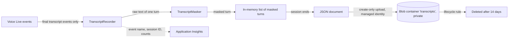

# Step 10: Conversation Transcripts in Blob Storage Implementation Plan

> **For agentic workers:** REQUIRED SUB-SKILL: Use superpowers:subagent-driven-development (recommended) or superpowers:executing-plans to implement this plan task-by-task. Steps use checkbox (`- [ ]`) syntax for tracking.

**Goal:** Every voice session (browser or phone) leaves one masked JSON transcript in the private `transcripts` Blob container. Verification codes, spoken passwords, links, tokens and e-mail addresses are masked in memory before anything is kept. A lifecycle rule deletes transcripts after 14 days.

**Architecture:** Three small classes in `src/VoiceReset.Agent/Transcripts/`, with the names fixed in [00-overview.md §8b](00-overview.md). `TranscriptMasker` is a pure function. `TranscriptRecorder` (one per session, created with `new`) masks each final transcript event the moment it arrives and keeps the turns in speaking order. `BlobTranscriptStore` writes one blob per session with a create-only condition. Step 7's Voice Live event loop feeds the recorder, and session end saves the document. After a restart, the reconciler writes a "turns lost" stub. The design comes from [transcripts-research.md](../research/transcripts-research.md). Its sketch was compiled and tested; the code in this plan was compiled again against the step 4 skeleton settings (Release build, 0 warnings, 59 tests passing).

**Tech Stack:** .NET 10 / C# 14, `Azure.AI.VoiceLive` 1.2.0 (event types only), `Azure.Storage.Blobs` 12.30.0, `Azure.Identity` 1.21.0, xUnit v3 4.0.1 on Microsoft Testing Platform, `FakeTimeProvider`.

**When:** Sunday (see the schedule in 00-overview §10). Tasks 1–8 need only the step 4 skeleton and can be done before step 7. Task 9 needs step 6 and step 7. Task 10 needs a deployment (step 13).

**Rules this step must respect** (CLAUDE.md rules 1, 4 and 5):
- Only **final** transcript events are stored. Never deltas, raw event JSON, tool-call arguments, audio, links/tokens or inbox content.
- Unmasked text is never kept, logged or written. If an upload fails, nothing is saved locally: there is no "raw" fallback.
- Blob names hold only the date and the random session GUID. No metadata, no index tags.
- Logs hold event names, the session ID, counts and status codes only. Azure SDK content logging stays off. Transcript text (masked or not) is never logged.
- Docs are written in the same change, and the checklist is ticked only with evidence.
- Commit messages are plain: no AI attribution, no `Co-Authored-By`, no "Generated with".

All commands run in PowerShell from the `solution/` folder.

---

## File structure

| File | Responsibility |
|---|---|
| `src/VoiceReset.Agent/Transcripts/TurnRole.cs` | `Caller` / `Agent` enum |
| `src/VoiceReset.Agent/Transcripts/MaskResult.cs` | Result of masking one turn |
| `src/VoiceReset.Agent/Transcripts/TranscriptMasker.cs` | Pure masking rules (passwords, codes, links, e-mails, tokens) |
| `src/VoiceReset.Agent/Transcripts/TranscriptDocument.cs` | `TranscriptTurn` + `TranscriptDocument` records and their JSON form |
| `src/VoiceReset.Agent/Transcripts/TranscriptRecorder.cs` | Per-session list of masked turns in speaking order |
| `src/VoiceReset.Agent/Transcripts/BlobTranscriptStore.cs` | Create-only upload, blob naming, lost-session stub |
| `src/VoiceReset.Agent/Transcripts/TranscriptLog.cs` | `[LoggerMessage]` events (IDs and counts only) |
| `src/VoiceReset.Agent/Transcripts/TranscriptServiceCollectionExtensions.cs` | `AddTranscripts()` DI registration |
| `src/VoiceReset.Agent/Configuration/StorageOptions.cs` | Gains `BlobEndpoint` (file owned by step 6) |
| `src/VoiceReset.Agent/Program.cs` | One line: `AddTranscripts()` |
| `src/VoiceReset.Agent/appsettings.json` | `Azure` log category at `Warning` |
| `tests/VoiceReset.Agent.Tests/Transcripts/TranscriptMaskerTests.cs` | 39 masker cases (the research's 37, adapted) |
| `tests/VoiceReset.Agent.Tests/Transcripts/TranscriptDocumentTests.cs` | Exact JSON shape |
| `tests/VoiceReset.Agent.Tests/Transcripts/TranscriptRecorderTests.cs` | Ordering, masking, password flag, event routing |
| `tests/VoiceReset.Agent.Tests/Transcripts/BlobTranscriptStoreTests.cs` | Upload conditions, 409 = success, naming, no text in logs |
| `tests/VoiceReset.Agent.Tests/Transcripts/TranscriptServiceCollectionExtensionsTests.cs` | DI wiring |
| `tests/VoiceReset.Agent.Tests/Fakes/FakeBlobContainerClient.cs` | Hand-written Azure SDK fakes (also reused by step 7 tests) |
| `tests/VoiceReset.Agent.Tests/Fakes/ListLogger.cs` | Logger that keeps entries in a list |
| `docs/architecture/transcripts.md` | What is stored, masking rules, honest limits, retention, access |
| `docs/submission/requirements-checklist.md` | Tick J "transcripts" with evidence |

No infrastructure file changes: step 4's `infra/main.bicep` already creates the private container, the 14-day lifecycle rule, and turns soft delete and versioning off. Task 10 verifies this in Azure.

**Small additions to the fixed interface** (all additive; listed again in "Additions to 00-overview" at the end):
- `MaskResult` gets a third, optional field `MaskNextCallerTurn`. The masker is pure, so it can only *report* that a caller turn ended with "my password is"; the recorder keeps that one boolean between turns.
- `TranscriptRecorder` gets `PromptVersion { get; init; }` (the schema needs it, and `Complete` has no parameter for it) and `OnVoiceLiveEvent(SessionUpdate)`, so step 7 needs one line, and "deltas are ignored" can be tested.
- `BlobTranscriptStore` also takes an `ILogger<BlobTranscriptStore>` and exposes `static BlobName(...)`.

---

## Task 1: Masker, rule 5: spoken passwords

**Files:**
- Create: `src/VoiceReset.Agent/Transcripts/TurnRole.cs`
- Create: `src/VoiceReset.Agent/Transcripts/MaskResult.cs`
- Create: `src/VoiceReset.Agent/Transcripts/TranscriptMasker.cs`
- Test: `tests/VoiceReset.Agent.Tests/Transcripts/TranscriptMaskerTests.cs`

- [ ] **Step 1: Write the failing tests (password batch + empty input)**

Create `tests/VoiceReset.Agent.Tests/Transcripts/TranscriptMaskerTests.cs`:

```csharp
using VoiceReset.Agent.Transcripts;

namespace VoiceReset.Agent.Tests.Transcripts;

public sealed class TranscriptMaskerTests
{
    private readonly TranscriptMasker _masker = new();

    [Theory]
    [InlineData("")]
    [InlineData("   ")]
    public void Mask_EmptyOrWhitespace_ReturnsEmptyText(string input)
    {
        MaskResult result = _masker.Mask(input, TurnRole.Caller);

        Assert.Equal(string.Empty, result.Text);
        Assert.Equal(0, result.MasksApplied);
    }

    // --- Rule 5: spoken passwords ----------------------------------------------

    [Theory]
    [InlineData("my password is hunter2", "my password is [PASSWORD]")]
    [InlineData("My new password is Blue Sky 99!", "My new password is [PASSWORD]")]
    [InlineData("the password's tiger lily", "the password's [PASSWORD]")]
    [InlineData("the password’s tiger lily", "the password’s [PASSWORD]")]
    [InlineData("password: correct horse", "password: [PASSWORD]")]
    [InlineData("my old password, it's summer2024", "my old password, it's [PASSWORD]")]
    [InlineData("My passcode was 1234", "My passcode was [PASSWORD]")]
    public void Mask_TextAfterPasswordPhrase_ReplacesItWithPasswordMask(string input, string expected)
    {
        MaskResult result = _masker.Mask(input, TurnRole.Caller);

        Assert.Equal(expected, result.Text);
        Assert.False(result.MaskNextCallerTurn);
    }

    [Fact]
    public void Mask_CallerTurnEndsWithPasswordPhrase_FlagsNextCallerTurn()
    {
        MaskResult result = _masker.Mask("Okay, my password is", TurnRole.Caller);

        Assert.Equal("Okay, my password is", result.Text);
        Assert.True(result.MaskNextCallerTurn);
    }

    [Fact]
    public void Mask_AgentTurnEndsWithPasswordPhrase_DoesNotFlagNextCallerTurn()
    {
        MaskResult result = _masker.Mask("I will never ask what your password is.", TurnRole.Agent);

        Assert.False(result.MaskNextCallerTurn);
    }

    [Fact]
    public void Mask_HarmlessWordsAfterPasswordPhrase_AreMaskedAnyway()
    {
        // Accepted over-masking: the masker cannot tell a password from other words.
        MaskResult result = _masker.Mask("My password is not working", TurnRole.Caller);

        Assert.Equal("My password is [PASSWORD]", result.Text);
    }
}
```

Note: `’` is the typographic apostrophe (’). Speech recognition sometimes returns it, so it gets its own case. It is written as an escape so the file stays plain ASCII.

- [ ] **Step 2: Run the tests to verify they fail**

Run: `dotnet test --filter-class "VoiceReset.Agent.Tests.Transcripts.TranscriptMaskerTests"`
Expected: build FAILS with `error CS0246: The type or namespace name 'TranscriptMasker' could not be found` (also `MaskResult`, `TurnRole`).

- [ ] **Step 3: Write the minimal implementation**

Create `src/VoiceReset.Agent/Transcripts/TurnRole.cs`:

```csharp
namespace VoiceReset.Agent.Transcripts;

/// <summary>Who spoke a transcript turn.</summary>
public enum TurnRole
{
    Caller,
    Agent,
}
```

Create `src/VoiceReset.Agent/Transcripts/MaskResult.cs`:

```csharp
namespace VoiceReset.Agent.Transcripts;

/// <summary>The result of masking one transcript turn.</summary>
/// <param name="Text">The masked text. This is the only text that may be stored.</param>
/// <param name="MasksApplied">How many values were replaced by a mask.</param>
/// <param name="MaskNextCallerTurn">
/// True when a caller turn ends right after a password phrase ("my password is"):
/// the secret probably follows in the caller's next turn, so the recorder masks
/// that whole turn.
/// </param>
public sealed record MaskResult(string Text, int MasksApplied, bool MaskNextCallerTurn = false);
```

Create `src/VoiceReset.Agent/Transcripts/TranscriptMasker.cs`:

```csharp
using System.Text.RegularExpressions;

namespace VoiceReset.Agent.Transcripts;

/// <summary>
/// Masks one transcript turn before it is stored. Pure and deterministic: no I/O,
/// no state between calls. It is a safety net, not a guarantee: it over-masks
/// numbers on purpose and cannot recognise a secret that has no known shape.
/// </summary>
public sealed partial class TranscriptMasker
{
    public const string PasswordMask = "[PASSWORD]";

    public MaskResult Mask(string text, TurnRole role)
    {
        if (string.IsNullOrWhiteSpace(text))
        {
            return new MaskResult(string.Empty, 0);
        }

        int count = 0;
        string result = text;

        bool maskNextCallerTurn = false;
        Match trigger = PasswordPhraseRegex().Match(result);
        if (trigger.Success)
        {
            int end = trigger.Index + trigger.Length;
            if (result[end..].Any(char.IsLetterOrDigit))
            {
                result = result[..end] + " " + PasswordMask;
                count++;
            }
            else
            {
                // "Okay, my password is" and then a pause: the secret comes in the
                // caller's next turn. Only a caller turn can announce that; the agent
                // saying "I never ask what your password is." must not hide the
                // caller's next answer.
                maskNextCallerTurn = role == TurnRole.Caller;
            }
        }

        return new MaskResult(result, count, maskNextCallerTurn);
    }

    // "password is", "password's", "password:", "passcode was", "password, it's" ...
    // ’ is the typographic apostrophe that speech recognition sometimes returns.
    [GeneratedRegex(
        @"\b(?:pass\s?word|pass\s?code|pass\s?phrase)" +
        @"(?:['’]s\b|\s+(?:is|was|will\s+be|would\s+be|should\s+be)\b|\s*[:=]|[\s,.?!-]+(?:it['’]s|it\s+is)\b)",
        RegexOptions.IgnoreCase)]
    private static partial Regex PasswordPhraseRegex();
}
```

Why `role` matters: the agent often says sentences like "I will never ask what your password is." If agent turns could raise the flag, the caller's next answer (for example their username) would be hidden for no reason.

- [ ] **Step 4: Run the tests to verify they pass**

Run: `dotnet test --filter-class "VoiceReset.Agent.Tests.Transcripts.TranscriptMaskerTests"`
Expected: `Test run summary: Passed!` with `total: 12`, `failed: 0`.

- [ ] **Step 5: Commit**

```powershell
git add src/VoiceReset.Agent/Transcripts tests/VoiceReset.Agent.Tests/Transcripts
git commit -m "feat(transcripts): mask spoken passwords"
```

---

## Task 2: Masker, rules 6 and 7: verification codes and number runs

**Files:**
- Modify: `src/VoiceReset.Agent/Transcripts/TranscriptMasker.cs`
- Test: `tests/VoiceReset.Agent.Tests/Transcripts/TranscriptMaskerTests.cs`

- [ ] **Step 1: Write the failing tests (codes batch + harmless-text guard)**

Add these members inside `TranscriptMaskerTests`, directly after the `_masker` field:

```csharp
    // --- Rules 6 and 7: verification codes -------------------------------------

    [Theory]
    [InlineData("The code is 047192", "The code is [CODE]")]
    [InlineData("It's 047 192.", "It's [CODE].")]
    [InlineData("zero four seven one nine two", "[CODE]")]
    [InlineData("My code is zero four seven one nine two thanks", "My code is [CODE] thanks")]
    [InlineData("I think it's 0 4 7... 1 9 2", "I think it's [CODE]")]
    [InlineData("it is oh four seven, one nine two", "it is [CODE]")]
    [InlineData("um oh four seven", "[CODE]")]
    [InlineData("so um oh four seven", "so um [CODE]")]
    [InlineData("zero four uh seven one nine two", "[CODE]")]
    [InlineData("double seven four one", "[CODE]")]
    [InlineData("forty-seven nineteen two", "[CODE]")]
    public void Mask_SpokenOrWrittenCode_ReplacesItWithCodeMask(string input, string expected)
    {
        MaskResult result = _masker.Mask(input, TurnRole.Caller);

        Assert.Equal(expected, result.Text);
        Assert.True(result.MasksApplied >= 1);
    }

    [Theory]
    [InlineData("zero four")]
    [InlineData("Seven one nine two.")]
    public void Mask_TurnWithOnlyPartOfACode_MasksWholeTurn(string input)
    {
        // The caller paused, so speech recognition split the code over two turns.
        MaskResult result = _masker.Mask(input, TurnRole.Caller);

        Assert.Equal("[CODE]", result.Text);
    }

    [Fact]
    public void Mask_AgentReadsCodeBack_MasksCode()
    {
        MaskResult result = _masker.Mask("I heard 0 4 7 1 9 2. Is that correct?", TurnRole.Agent);

        Assert.Equal("I heard [CODE]. Is that correct?", result.Text);
    }

    [Fact]
    public void Mask_SeveralCodesInOneTurn_MasksEachOne()
    {
        MaskResult result = _masker.Mask("Was it 047192 or 047 193?", TurnRole.Caller);

        Assert.Equal("Was it [CODE] or [CODE]?", result.Text);
        Assert.Equal(2, result.MasksApplied);
    }

    [Theory]
    [InlineData("I have 2 laptops")]
    [InlineData("Oh, I see.")]
    [InlineData("Oh.")]
    [InlineData("One moment please")]
    [InlineData("I tried two times")]
    [InlineData("You have 1 attempt left.")]
    [InlineData("I forgot my password")]
    [InlineData("Can you help me reset my password")]
    public void Mask_HarmlessText_LeavesTextUnchanged(string input)
    {
        MaskResult result = _masker.Mask(input, TurnRole.Caller);

        Assert.Equal(input, result.Text);
        Assert.Equal(0, result.MasksApplied);
        Assert.False(result.MaskNextCallerTurn);
    }
```

- [ ] **Step 2: Run the tests to verify the new code cases fail**

Run: `dotnet test --filter-class "VoiceReset.Agent.Tests.Transcripts.TranscriptMaskerTests"`
Expected: `total: 35`, `failed: 15` (all 11 code cases, both part-of-a-code cases, the read-back and the several-codes test). The 8 harmless cases already pass: they guard against over-masking from now on.

- [ ] **Step 3: Implement the number-run scanner**

In `TranscriptMasker.cs`, add these members directly after `public const string PasswordMask = "[PASSWORD]";`:

```csharp
    public const string CodeMask = "[CODE]";

    // Codes are 6 digits. 3 also catches half a code said over two turns,
    // while "I have 2 laptops" stays readable.
    private const int MinDigitsInRun = 3;

    // How many digits a word stands for. 0 = filler: it keeps a run going but
    // cannot start one. Words not in the table end a run.
    private static readonly Dictionary<string, int> s_numberWords = new(StringComparer.OrdinalIgnoreCase)
    {
        ["zero"] = 1, ["oh"] = 1, ["o"] = 1, ["one"] = 1, ["two"] = 1, ["three"] = 1,
        ["four"] = 1, ["five"] = 1, ["six"] = 1, ["seven"] = 1, ["eight"] = 1, ["nine"] = 1,
        ["ten"] = 2, ["eleven"] = 2, ["twelve"] = 2, ["thirteen"] = 2, ["fourteen"] = 2,
        ["fifteen"] = 2, ["sixteen"] = 2, ["seventeen"] = 2, ["eighteen"] = 2, ["nineteen"] = 2,
        ["twenty"] = 2, ["thirty"] = 2, ["forty"] = 2, ["fifty"] = 2, ["sixty"] = 2,
        ["seventy"] = 2, ["eighty"] = 2, ["ninety"] = 2, ["hundred"] = 2, ["thousand"] = 3,
        ["double"] = 1, // "double seven" = 2 digits
        ["triple"] = 2, // "triple seven" = 3 digits
        ["uh"] = 0, ["um"] = 0, ["umm"] = 0, ["er"] = 0, ["erm"] = 0, ["hmm"] = 0,
    };
```

In `Mask`, replace the last line `return new MaskResult(result, count, maskNextCallerTurn);` with:

```csharp
        result = MaskNumberRuns(result, ref count);
        return new MaskResult(result, count, maskNextCallerTurn);
```

Add these methods directly after `Mask` (before the `PasswordPhraseRegex` comment):

```csharp
    private static string MaskNumberRuns(string text, ref int count)
    {
        List<(int Start, int End)> runs = [];
        bool inRun = false;
        int runStart = 0;
        int runDigits = 0;
        int lastWordEnd = 0;
        int lastDigitEnd = 0;
        int totalDigits = 0;
        bool sawOtherWord = false;

        foreach (Match word in WordOrNumberRegex().Matches(text))
        {
            int? digits = DigitCount(word.Value);
            if (digits is null)
            {
                sawOtherWord = true;
            }

            // A run ends at a normal word, or when something other than spaces and
            // punctuation sits between two number words.
            if (inRun && (digits is null || !OnlySeparators(text, lastWordEnd, word.Index)))
            {
                if (runDigits >= MinDigitsInRun)
                {
                    runs.Add((runStart, lastDigitEnd));
                }

                inRun = false;
            }

            if (digits is null || (!inRun && digits == 0))
            {
                continue;
            }

            if (!inRun)
            {
                inRun = true;
                runStart = word.Index;
                runDigits = 0;
            }

            runDigits += digits.Value;
            totalDigits += digits.Value;
            lastWordEnd = word.Index + word.Length;
            if (digits > 0)
            {
                lastDigitEnd = lastWordEnd;
            }
        }

        if (inRun && runDigits >= MinDigitsInRun)
        {
            runs.Add((runStart, lastDigitEnd));
        }

        // A turn made only of numbers ("zero four" after a pause) is part of a code,
        // even with fewer than 3 digits.
        if (!sawOtherWord && totalDigits >= 2)
        {
            count++;
            return CodeMask;
        }

        // Replace from the end so earlier positions stay valid.
        for (int i = runs.Count - 1; i >= 0; i--)
        {
            (int start, int end) = runs[i];
            text = text[..start] + CodeMask + text[end..];
            count++;
        }

        return text;
    }

    private static int? DigitCount(string word)
    {
        if (char.IsDigit(word[0]))
        {
            return word.Length;
        }

        return s_numberWords.TryGetValue(word, out int digits) ? digits : null;
    }

    private static bool OnlySeparators(string text, int from, int to)
    {
        for (int i = from; i < to; i++)
        {
            char c = text[i];
            bool separator = char.IsWhiteSpace(c)
                || c is ',' or '.' or ';' or ':' or '-' or '/'
                    or '–' or '—' or '…'; // en dash, em dash, ellipsis
            if (!separator)
            {
                return false;
            }
        }

        return true;
    }

    [GeneratedRegex(@"\d+|[A-Za-z]+")]
    private static partial Regex WordOrNumberRegex();
```

How it works, in one sentence for the walkthrough: the scanner walks over words and digit groups, adds up how many digits each one stands for, lets spaces, punctuation and "um"/"uh" keep a run going, and replaces every run of 3 or more digits with `[CODE]`.

- [ ] **Step 4: Run the tests to verify they pass**

Run: `dotnet test --filter-class "VoiceReset.Agent.Tests.Transcripts.TranscriptMaskerTests"`
Expected: `total: 35`, `failed: 0`.

- [ ] **Step 5: Commit**

```powershell
git add src/VoiceReset.Agent/Transcripts/TranscriptMasker.cs tests/VoiceReset.Agent.Tests/Transcripts/TranscriptMaskerTests.cs
git commit -m "feat(transcripts): mask verification codes in written and spoken form"
```

---

## Task 3: Masker, rules 2 to 4: links, e-mail addresses, long tokens

**Files:**
- Modify: `src/VoiceReset.Agent/Transcripts/TranscriptMasker.cs`
- Test: `tests/VoiceReset.Agent.Tests/Transcripts/TranscriptMaskerTests.cs`

- [ ] **Step 1: Write the failing tests**

Add at the end of `TranscriptMaskerTests` (before the closing brace):

```csharp
    // --- Rules 2, 3 and 4: links, e-mail addresses, long tokens ---------------

    [Theory]
    [InlineData("Open https://reset.example.test/#token=abc123XYZ now", "Open [LINK] now")]
    [InlineData("go to www.example.test/reset", "go to [LINK]")]
    [InlineData("token Zm9vYmFyYmF6cXV4MTIzNDU2", "token [TOKEN]")]
    [InlineData("send it to jane.doe@inbox.example.test", "send it to [EMAIL]")]
    public void Mask_LinkTokenOrEmail_ReplacesItWithMatchingMask(string input, string expected)
    {
        MaskResult result = _masker.Mask(input, TurnRole.Agent);

        Assert.Equal(expected, result.Text);
        Assert.Equal(1, result.MasksApplied);
    }
```

- [ ] **Step 2: Run the tests to verify they fail**

Run: `dotnet test --filter-class "VoiceReset.Agent.Tests.Transcripts.TranscriptMaskerTests"`
Expected: `total: 39`, `failed: 4` (the four new cases).

- [ ] **Step 3: Implement the three rules**

Add these constants after `public const string CodeMask = "[CODE]";`:

```csharp
    public const string LinkMask = "[LINK]";
    public const string EmailMask = "[EMAIL]";
    public const string TokenMask = "[TOKEN]";
```

In `Mask`, replace the line `string result = text;` with:

```csharp
        // Order matters: links and e-mail addresses contain digits and dots.
        string result = Replace(UrlRegex(), text, LinkMask, ref count);
        result = Replace(EmailRegex(), result, EmailMask, ref count);
        result = Replace(LongTokenRegex(), result, TokenMask, ref count);
```

Add this helper after `OnlySeparators`:

```csharp
    private static string Replace(Regex regex, string input, string mask, ref int count)
    {
        int found = 0;
        string output = regex.Replace(input, _ =>
        {
            found++;
            return mask;
        });
        count += found;
        return output;
    }
```

Add these regexes after `WordOrNumberRegex()`:

```csharp
    [GeneratedRegex(@"\b(?:https?://|www\.)\S+|\S*#token=\S*", RegexOptions.IgnoreCase)]
    private static partial Regex UrlRegex();

    [GeneratedRegex(@"[\w.+-]+@[\w-]+(?:\.[\w-]+)+")]
    private static partial Regex EmailRegex();

    // 16 or more characters that mix letters and digits: looks like a token or key.
    [GeneratedRegex(@"\b(?=[A-Za-z0-9_-]*\d)(?=[A-Za-z0-9_-]*[A-Za-z])[A-Za-z0-9_-]{16,}\b")]
    private static partial Regex LongTokenRegex();
```

The final `Mask` method now applies the rules in the order of the research table: links, e-mails, tokens, password phrase, number runs. (Rule 1, "mask the whole next caller turn", lives in the recorder, Task 5.)

- [ ] **Step 4: Run the tests to verify they pass**

Run: `dotnet test --filter-class "VoiceReset.Agent.Tests.Transcripts.TranscriptMaskerTests"`
Expected: `total: 39`, `failed: 0`.

These are the research's 37 cases adapted to the fixed signature `Mask(string text, TurnRole role)`: the `null` input case is dropped (the parameter is a non-null `string`), the "part of a code" fact became 2 theory cases, the "next turn" half of the old password test moved to the recorder tests, and 2 cases were added (typographic apostrophe, agent turn does not raise the flag).

- [ ] **Step 5: Build in Release (warnings are errors) and commit**

Run: `dotnet build VoiceReset.slnx -c Release`
Expected: `Build succeeded.` `0 Warning(s)` `0 Error(s)`.

```powershell
git add src/VoiceReset.Agent/Transcripts/TranscriptMasker.cs tests/VoiceReset.Agent.Tests/Transcripts/TranscriptMaskerTests.cs
git commit -m "feat(transcripts): mask links, e-mail addresses and long tokens"
```

---

## Task 4: The transcript document and its JSON

**Files:**
- Create: `src/VoiceReset.Agent/Transcripts/TranscriptDocument.cs`
- Test: `tests/VoiceReset.Agent.Tests/Transcripts/TranscriptDocumentTests.cs`

- [ ] **Step 1: Write the failing tests**

The tests pin the exact stored shape, so a renamed property can never change the schema by accident. camelCase is fine here: this is our own document, not a contract API.

Create `tests/VoiceReset.Agent.Tests/Transcripts/TranscriptDocumentTests.cs`:

```csharp
using VoiceReset.Agent.Transcripts;

namespace VoiceReset.Agent.Tests.Transcripts;

public sealed class TranscriptDocumentTests
{
    [Fact]
    public void ToJson_FullDocument_UsesCamelCaseNamesAndLowercaseRoles()
    {
        var document = new TranscriptDocument
        {
            SessionId = "s-5f0c2a9e7d1b4c3e9a512b8f6d4e1c07",
            Channel = "browser",
            StartedAt = new DateTimeOffset(2026, 10, 3, 9, 15, 2, TimeSpan.Zero),
            EndedAt = new DateTimeOffset(2026, 10, 3, 9, 19, 47, TimeSpan.Zero),
            EndReason = "agent_completed",
            TicketOutcome = "resolved",
            PromptVersion = "a1b2c3",
            Turns =
            [
                new TranscriptTurn(TurnRole.Agent, 400, "Hi, what is your username?", 0),
                new TranscriptTurn(TurnRole.Caller, 31800, "The code is [CODE].", 1),
            ],
        };

        string json = document.ToJson().ToString();

        Assert.Equal(
            """{"schemaVersion":1,"sessionId":"s-5f0c2a9e7d1b4c3e9a512b8f6d4e1c07","channel":"browser","startedAt":"2026-10-03T09:15:02+00:00","endedAt":"2026-10-03T09:19:47+00:00","endReason":"agent_completed","ticketOutcome":"resolved","turnsLost":false,"promptVersion":"a1b2c3","turns":[{"role":"agent","offsetMs":400,"text":"Hi, what is your username?","masksApplied":0},{"role":"caller","offsetMs":31800,"text":"The code is [CODE].","masksApplied":1}]}""",
            json);
    }

    [Fact]
    public void ToJson_LostStub_LeavesOutUnknownFields()
    {
        var document = new TranscriptDocument
        {
            SessionId = "s-5f0c2a9e7d1b4c3e9a512b8f6d4e1c07",
            Channel = "phone",
            StartedAt = new DateTimeOffset(2026, 10, 3, 9, 15, 2, TimeSpan.Zero),
            EndReason = "process_restart",
            TurnsLost = true,
            Turns = [],
        };

        string json = document.ToJson().ToString();

        Assert.Equal(
            """{"schemaVersion":1,"sessionId":"s-5f0c2a9e7d1b4c3e9a512b8f6d4e1c07","channel":"phone","startedAt":"2026-10-03T09:15:02+00:00","endReason":"process_restart","turnsLost":true,"turns":[]}""",
            json);
    }
}
```

- [ ] **Step 2: Run the tests to verify they fail**

Run: `dotnet test --filter-class "VoiceReset.Agent.Tests.Transcripts.TranscriptDocumentTests"`
Expected: build FAILS with `error CS0246: The type or namespace name 'TranscriptDocument' could not be found`.

- [ ] **Step 3: Write the implementation**

Create `src/VoiceReset.Agent/Transcripts/TranscriptDocument.cs`:

```csharp
using System.Text.Json;
using System.Text.Json.Serialization;

namespace VoiceReset.Agent.Transcripts;

/// <summary>One stored turn. <paramref name="Text"/> is always already masked.</summary>
public sealed record TranscriptTurn(TurnRole Role, long OffsetMs, string Text, int MasksApplied);

/// <summary>
/// The JSON document stored for one voice session. It holds no personal data
/// fields: the session ID is a random GUID created by our backend.
/// </summary>
public sealed record TranscriptDocument
{
    private static readonly JsonSerializerOptions s_jsonOptions = new()
    {
        PropertyNamingPolicy = JsonNamingPolicy.CamelCase,
        DefaultIgnoreCondition = JsonIgnoreCondition.WhenWritingNull,
        Converters = { new JsonStringEnumConverter<TurnRole>(JsonNamingPolicy.CamelCase) },
    };

    public int SchemaVersion { get; init; } = 1;
    public required string SessionId { get; init; }
    public required string Channel { get; init; }          // "browser" | "phone"
    public required DateTimeOffset StartedAt { get; init; }
    public DateTimeOffset? EndedAt { get; init; }          // null when the process died first
    public required string EndReason { get; init; }
    public string? TicketOutcome { get; init; }            // resolved | escalated | cancelled | pending
    public bool TurnsLost { get; init; }
    public string? PromptVersion { get; init; }
    public required IReadOnlyList<TranscriptTurn> Turns { get; init; }

    public BinaryData ToJson() => BinaryData.FromObjectAsJson(this, s_jsonOptions);
}
```

Design notes:
- `EndedAt` is nullable: for a "turns lost" stub we don't know when the call really ended, and inventing a time would be dishonest.
- `schemaVersion` (from the research schema) costs one line and lets a later reader tell old and new documents apart.
- No `ticketId`, recovery ID, operation ID, phone number or IP address (see Q-10.3).

- [ ] **Step 4: Run the tests to verify they pass**

Run: `dotnet test --filter-class "VoiceReset.Agent.Tests.Transcripts.TranscriptDocumentTests"`
Expected: `total: 2`, `failed: 0`.

- [ ] **Step 5: Commit**

```powershell
git add src/VoiceReset.Agent/Transcripts/TranscriptDocument.cs tests/VoiceReset.Agent.Tests/Transcripts/TranscriptDocumentTests.cs
git commit -m "feat(transcripts): add the transcript document and its JSON shape"
```

---

## Task 5: The recorder: speaking order, masking on arrival, password flag

**Files:**
- Create: `src/VoiceReset.Agent/Transcripts/TranscriptRecorder.cs`
- Test: `tests/VoiceReset.Agent.Tests/Transcripts/TranscriptRecorderTests.cs`

Background: Voice Live transcribes the caller **asynchronously**. The caller's final transcript can arrive *after* the agent has already answered. So the recorder reserves the caller's place when the audio is committed (`input_audio_buffer.committed`, which carries the item ID) and fills it when the transcript for that item ID arrives.

- [ ] **Step 1: Write the failing tests**

Create `tests/VoiceReset.Agent.Tests/Transcripts/TranscriptRecorderTests.cs`:

```csharp
using Microsoft.Extensions.Time.Testing;
using VoiceReset.Agent.Transcripts;

namespace VoiceReset.Agent.Tests.Transcripts;

public sealed class TranscriptRecorderTests
{
    private const string SessionId = "s-5f0c2a9e7d1b4c3e9a512b8f6d4e1c07";
    private static readonly DateTimeOffset s_start = new(2026, 10, 3, 9, 15, 0, TimeSpan.Zero);

    private readonly FakeTimeProvider _time = new(s_start);

    private TranscriptRecorder NewRecorder() => new(SessionId, "browser", _time, new TranscriptMasker());

    [Fact]
    public void OnCallerTranscript_ArrivesAfterAgentAnswer_KeepsSpeakingOrder()
    {
        TranscriptRecorder recorder = NewRecorder();
        recorder.OnAgentTranscript("Hi, what is your username?");
        _time.Advance(TimeSpan.FromSeconds(1));
        recorder.OnCallerTurnCommitted("item_1");
        _time.Advance(TimeSpan.FromSeconds(1));
        recorder.OnAgentTranscript("Thanks, one moment.");
        _time.Advance(TimeSpan.FromSeconds(1));
        recorder.OnCallerTranscript("item_1", "It's jdoe.");

        TranscriptDocument document = recorder.Complete("caller_hung_up", null);

        Assert.Equal(
            [
                new TranscriptTurn(TurnRole.Agent, 0, "Hi, what is your username?", 0),
                new TranscriptTurn(TurnRole.Caller, 1000, "It's jdoe.", 0),
                new TranscriptTurn(TurnRole.Agent, 2000, "Thanks, one moment.", 0),
            ],
            document.Turns);
    }

    [Fact]
    public void OnCallerTranscript_UnknownItemId_AppendsTurnAtEnd()
    {
        TranscriptRecorder recorder = NewRecorder();
        recorder.OnAgentTranscript("Hello.");
        _time.Advance(TimeSpan.FromSeconds(2));

        recorder.OnCallerTranscript("never_committed", "Hi there.");

        TranscriptTurn last = recorder.Complete("caller_hung_up", null).Turns[^1];
        Assert.Equal(new TranscriptTurn(TurnRole.Caller, 2000, "Hi there.", 0), last);
    }

    [Fact]
    public void OnCallerTranscript_CodeSpoken_StoresOnlyMaskedText()
    {
        TranscriptRecorder recorder = NewRecorder();
        recorder.OnCallerTurnCommitted("item_1");

        recorder.OnCallerTranscript("item_1", "The code is 047192");

        TranscriptDocument document = recorder.Complete("agent_completed", "resolved");
        Assert.Equal("The code is [CODE]", document.Turns[0].Text);
        Assert.DoesNotContain("047192", document.ToJson().ToString(), StringComparison.Ordinal);
    }

    [Fact]
    public void OnCallerTranscript_AfterTurnEndingWithPasswordPhrase_MasksWholeTurn()
    {
        TranscriptRecorder recorder = NewRecorder();
        recorder.OnCallerTurnCommitted("item_1");
        recorder.OnCallerTranscript("item_1", "Okay, my password is");
        recorder.OnCallerTurnCommitted("item_2");

        recorder.OnCallerTranscript("item_2", "tiger lily");

        TranscriptDocument document = recorder.Complete("caller_hung_up", null);
        Assert.Equal("Okay, my password is", document.Turns[0].Text);
        Assert.Equal(new TranscriptTurn(TurnRole.Caller, 0, "[PASSWORD]", 1), document.Turns[1]);
    }

    [Fact]
    public void OnCallerTranscript_PasswordFlag_SkipsAgentTurnsAndAppliesOnce()
    {
        TranscriptRecorder recorder = NewRecorder();
        recorder.OnCallerTurnCommitted("item_1");
        recorder.OnCallerTranscript("item_1", "my password is");
        recorder.OnAgentTranscript("Please don't tell me your password.");
        recorder.OnCallerTurnCommitted("item_2");
        recorder.OnCallerTranscript("item_2", "tiger lily");
        recorder.OnCallerTurnCommitted("item_3");

        recorder.OnCallerTranscript("item_3", "jdoe");

        TranscriptDocument document = recorder.Complete("caller_hung_up", null);
        Assert.Equal(
            ["my password is", "Please don't tell me your password.", "[PASSWORD]", "jdoe"],
            document.Turns.Select(t => t.Text));
    }

    [Fact]
    public void Complete_CallerTurnWithoutTranscript_LeavesItOut()
    {
        // Transcription failed, or the call ended before the transcript arrived.
        TranscriptRecorder recorder = NewRecorder();
        recorder.OnCallerTurnCommitted("item_1");
        recorder.OnAgentTranscript("Are you still there?");

        TranscriptDocument document = recorder.Complete("silence_timeout", "cancelled");

        Assert.Equal([TurnRole.Agent], document.Turns.Select(t => t.Role));
    }

    [Fact]
    public void Complete_AfterCall_FillsSessionFields()
    {
        TranscriptRecorder recorder = new(SessionId, "phone", _time, new TranscriptMasker()) { PromptVersion = "a1b2c3" };
        _time.Advance(TimeSpan.FromMinutes(4));

        TranscriptDocument document = recorder.Complete("agent_completed", "resolved");

        Assert.Equal(SessionId, document.SessionId);
        Assert.Equal("phone", document.Channel);
        Assert.Equal(s_start, document.StartedAt);
        Assert.Equal(s_start.AddMinutes(4), document.EndedAt);
        Assert.Equal("agent_completed", document.EndReason);
        Assert.Equal("resolved", document.TicketOutcome);
        Assert.Equal("a1b2c3", document.PromptVersion);
        Assert.False(document.TurnsLost);
    }
}
```

- [ ] **Step 2: Run the tests to verify they fail**

Run: `dotnet test --filter-class "VoiceReset.Agent.Tests.Transcripts.TranscriptRecorderTests"`
Expected: build FAILS with `error CS0246: The type or namespace name 'TranscriptRecorder' could not be found`.

- [ ] **Step 3: Write the implementation**

Create `src/VoiceReset.Agent/Transcripts/TranscriptRecorder.cs`:

```csharp
namespace VoiceReset.Agent.Transcripts;

/// <summary>
/// Collects the masked turns of one voice session, in speaking order. Text is
/// masked the moment it arrives; unmasked text is never kept. One instance per
/// session, created with <c>new</c> (not a DI service).
/// </summary>
public sealed class TranscriptRecorder(string sessionId, string channel, TimeProvider time, TranscriptMasker masker)
{
    private readonly Lock _gate = new();
    private readonly DateTimeOffset _startedAt = time.GetUtcNow();
    private readonly long _startTimestamp = time.GetTimestamp();

    // Turns in speaking order. A caller turn is reserved (null) when its audio is
    // committed and filled when the transcription arrives, which can be after the
    // agent has already answered.
    private readonly List<TranscriptTurn?> _turns = [];
    private readonly Dictionary<string, (int Index, long OffsetMs)> _reservedSlots = [];
    private bool _maskNextCallerTurn;

    /// <summary>Hash of the system prompt version, stored for diagnostics. Optional.</summary>
    public string? PromptVersion { get; init; }

    /// <summary><c>input_audio_buffer.committed</c>: reserves the caller's place in the order.</summary>
    public void OnCallerTurnCommitted(string itemId)
    {
        lock (_gate)
        {
            _reservedSlots[itemId] = (_turns.Count, ElapsedMs());
            _turns.Add(null);
        }
    }

    /// <summary><c>conversation.item.input_audio_transcription.completed</c>.</summary>
    public void OnCallerTranscript(string itemId, string text)
    {
        lock (_gate)
        {
            bool reserved = _reservedSlots.Remove(itemId, out (int Index, long OffsetMs) slot);

            // An empty transcription is not a turn: leave the slot empty (it is
            // dropped in Complete) and keep any pending password flag.
            if (string.IsNullOrWhiteSpace(text))
            {
                return;
            }

            MaskResult masked = _maskNextCallerTurn
                ? new MaskResult(TranscriptMasker.PasswordMask, 1)
                : masker.Mask(text, TurnRole.Caller);
            _maskNextCallerTurn = masked.MaskNextCallerTurn;

            if (reserved)
            {
                _turns[slot.Index] = new TranscriptTurn(TurnRole.Caller, slot.OffsetMs, masked.Text, masked.MasksApplied);
            }
            else
            {
                // Unknown item ID (the committed event was missed): append at the end.
                _turns.Add(new TranscriptTurn(TurnRole.Caller, ElapsedMs(), masked.Text, masked.MasksApplied));
            }
        }
    }

    /// <summary><c>response.audio_transcript.done</c> (also sent for interrupted answers).</summary>
    public void OnAgentTranscript(string text)
    {
        lock (_gate)
        {
            if (string.IsNullOrWhiteSpace(text))
            {
                return;
            }

            MaskResult masked = masker.Mask(text, TurnRole.Agent);
            _turns.Add(new TranscriptTurn(TurnRole.Agent, ElapsedMs(), masked.Text, masked.MasksApplied));
        }
    }

    /// <summary>Builds the document to store. Reserved slots that never got text are left out.</summary>
    public TranscriptDocument Complete(string endReason, string? ticketOutcome)
    {
        lock (_gate)
        {
            return new TranscriptDocument
            {
                SessionId = sessionId,
                Channel = channel,
                StartedAt = _startedAt,
                EndedAt = time.GetUtcNow(),
                EndReason = endReason,
                TicketOutcome = ticketOutcome,
                PromptVersion = PromptVersion,
                Turns = [.. _turns.OfType<TranscriptTurn>()],
            };
        }
    }

    private long ElapsedMs() => (long)time.GetElapsedTime(_startTimestamp).TotalMilliseconds;
}
```

Design notes:
- **Why a lock:** step 7 has one event loop per session, but `Complete` is called from the session-end path, which may run on another thread. A `Lock` makes that safe at no real cost.
- **Raw text lifetime:** the raw `text` parameter is only used in the `Mask` call. Nothing stores it.
- **Offsets** use `TimeProvider` timestamps (monotonic), so tests move time with `FakeTimeProvider.Advance` and never sleep.

- [ ] **Step 4: Run the tests to verify they pass**

Run: `dotnet test --filter-class "VoiceReset.Agent.Tests.Transcripts.TranscriptRecorderTests"`
Expected: `total: 7`, `failed: 0`.

- [ ] **Step 5: Commit**

```powershell
git add src/VoiceReset.Agent/Transcripts/TranscriptRecorder.cs tests/VoiceReset.Agent.Tests/Transcripts/TranscriptRecorderTests.cs
git commit -m "feat(transcripts): record masked turns in speaking order"
```

---

## Task 6: Route Voice Live events (final events only, deltas ignored)

**Files:**
- Modify: `src/VoiceReset.Agent/Transcripts/TranscriptRecorder.cs`
- Test: `tests/VoiceReset.Agent.Tests/Transcripts/TranscriptRecorderTests.cs`

The SDK class names were checked against `Azure.AI.VoiceLive` 1.2.0 (see [sdk-reference.md §A.6](../research/sdk-reference.md) and the compiled research sketch): `SessionUpdateInputAudioBufferCommitted` (`ItemId`), `SessionUpdateConversationItemInputAudioTranscriptionCompleted` (`ItemId`, `Transcript`), `SessionUpdateResponseAudioTranscriptDone` (`Transcript`). Tests build real SDK event objects with `VoiceLiveModelFactory`.

- [ ] **Step 1: Write the failing tests**

In `TranscriptRecorderTests.cs`, add `using Azure.AI.VoiceLive;` as the first `using` line, then add these tests at the end of the class:

```csharp
    [Fact]
    public void OnVoiceLiveEvent_FinalTranscriptEvents_AreRecorded()
    {
        TranscriptRecorder recorder = NewRecorder();
        recorder.OnVoiceLiveEvent(VoiceLiveModelFactory.SessionUpdateInputAudioBufferCommitted(itemId: "item_1"));
        recorder.OnVoiceLiveEvent(VoiceLiveModelFactory.SessionUpdateResponseAudioTranscriptDone(transcript: "One moment."));

        recorder.OnVoiceLiveEvent(
            VoiceLiveModelFactory.SessionUpdateConversationItemInputAudioTranscriptionCompleted(itemId: "item_1", transcript: "It's jdoe."));

        Assert.Equal(["It's jdoe.", "One moment."], recorder.Complete("caller_hung_up", null).Turns.Select(t => t.Text));
    }

    [Fact]
    public void OnVoiceLiveEvent_DeltaEvents_AreIgnored()
    {
        TranscriptRecorder recorder = NewRecorder();

        recorder.OnVoiceLiveEvent(VoiceLiveModelFactory.SessionUpdateResponseAudioTranscriptDelta(delta: "The code is 0471"));
        recorder.OnVoiceLiveEvent(
            VoiceLiveModelFactory.SessionUpdateConversationItemInputAudioTranscriptionDelta(itemId: "item_1", delta: "zero four"));

        Assert.Empty(recorder.Complete("caller_hung_up", null).Turns);
    }
```

- [ ] **Step 2: Run the tests to verify they fail**

Run: `dotnet test --filter-class "VoiceReset.Agent.Tests.Transcripts.TranscriptRecorderTests"`
Expected: build FAILS with `error CS1061: 'TranscriptRecorder' does not contain a definition for 'OnVoiceLiveEvent'`.

- [ ] **Step 3: Implement the routing method**

In `TranscriptRecorder.cs`, add `using Azure.AI.VoiceLive;` above the `namespace` line, and add this method directly after the `PromptVersion` property:

```csharp
    /// <summary>
    /// Routes a Voice Live event. Only the three final events are used; deltas,
    /// tool-call arguments and every other event are ignored on purpose.
    /// </summary>
    public void OnVoiceLiveEvent(SessionUpdate update)
    {
        switch (update)
        {
            case SessionUpdateInputAudioBufferCommitted committed:
                OnCallerTurnCommitted(committed.ItemId);
                break;
            case SessionUpdateConversationItemInputAudioTranscriptionCompleted completed:
                OnCallerTranscript(completed.ItemId, completed.Transcript);
                break;
            case SessionUpdateResponseAudioTranscriptDone agent:
                OnAgentTranscript(agent.Transcript);
                break;
        }
    }
```

Why this method exists: the "store only final events" rule now lives in one place inside `Transcripts/`, the step 7 event loop needs a single line, and the rule has a test.

- [ ] **Step 4: Run the tests to verify they pass**

Run: `dotnet test --filter-class "VoiceReset.Agent.Tests.Transcripts.TranscriptRecorderTests"`
Expected: `total: 9`, `failed: 0`.

- [ ] **Step 5: Commit**

```powershell
git add src/VoiceReset.Agent/Transcripts/TranscriptRecorder.cs tests/VoiceReset.Agent.Tests/Transcripts/TranscriptRecorderTests.cs
git commit -m "feat(transcripts): take only final Voice Live transcript events"
```

---

## Task 7: The blob store (create-only, 409 = already saved, no text in logs)

**Files:**
- Create: `src/VoiceReset.Agent/Transcripts/BlobTranscriptStore.cs`
- Create: `src/VoiceReset.Agent/Transcripts/TranscriptLog.cs`
- Create: `tests/VoiceReset.Agent.Tests/Fakes/FakeBlobContainerClient.cs`
- Create: `tests/VoiceReset.Agent.Tests/Fakes/ListLogger.cs`
- Test: `tests/VoiceReset.Agent.Tests/Transcripts/BlobTranscriptStoreTests.cs`

How we test without Azure: Azure SDK clients are designed to be faked. `BlobContainerClient` and `BlobClient` have a `protected` parameterless constructor and `virtual` methods. A hand-written subclass overrides the two methods the store uses (`GetBlobClient` and `UploadAsync(BinaryData, BlobUploadOptions, CancellationToken)`). No mocking library and no interface are needed, and the store keeps the fixed constructor `BlobTranscriptStore(BlobContainerClient container, ...)`.

If step 6 or 7 already created a list-based fake logger in `tests/VoiceReset.Agent.Tests/Fakes/`, reuse it and skip `ListLogger.cs`. The tests only need: level, event name, formatted message.

- [ ] **Step 1: Write the fakes**

Create `tests/VoiceReset.Agent.Tests/Fakes/FakeBlobContainerClient.cs`:

```csharp
using Azure;
using Azure.Storage.Blobs;
using Azure.Storage.Blobs.Models;

namespace VoiceReset.Agent.Tests.Fakes;

/// <summary>
/// Hand-written fake for the Azure SDK container client. Azure SDK clients have a
/// protected constructor and virtual methods for exactly this purpose.
/// </summary>
public sealed class FakeBlobContainerClient : BlobContainerClient
{
    public FakeBlobClient Blob { get; } = new();

    public string? RequestedBlobName { get; private set; }

    public override BlobClient GetBlobClient(string blobName)
    {
        RequestedBlobName = blobName;
        return Blob;
    }
}

public sealed class FakeBlobClient : BlobClient
{
    public BinaryData? UploadedContent { get; private set; }

    public BlobUploadOptions? UploadedOptions { get; private set; }

    /// <summary>When set, the upload throws this instead of storing the content.</summary>
    public RequestFailedException? FailWith { get; set; }

    public override Task<Response<BlobContentInfo>> UploadAsync(
        BinaryData content, BlobUploadOptions options, CancellationToken cancellationToken = default)
    {
        if (FailWith is not null)
        {
            throw FailWith;
        }

        UploadedContent = content;
        UploadedOptions = options;

        // BlobTranscriptStore ignores the response, and the SDK has no public way to
        // build one, so null is returned on purpose.
        return Task.FromResult<Response<BlobContentInfo>>(null!);
    }
}
```

(The one `null!` is explained in the comment, as CLAUDE.md asks.)

Create `tests/VoiceReset.Agent.Tests/Fakes/ListLogger.cs`:

```csharp
using Microsoft.Extensions.Logging;

namespace VoiceReset.Agent.Tests.Fakes;

/// <summary>Keeps every log entry in a list so tests can check what was (not) logged.</summary>
public sealed class ListLogger<T> : ILogger<T>
{
    public List<(LogLevel Level, string EventName, string Message)> Entries { get; } = [];

    public IDisposable? BeginScope<TState>(TState state) where TState : notnull => null;

    public bool IsEnabled(LogLevel logLevel) => true;

    public void Log<TState>(
        LogLevel logLevel, EventId eventId, TState state, Exception? exception, Func<TState, Exception?, string> formatter) =>
        Entries.Add((logLevel, eventId.Name ?? string.Empty, formatter(state, exception)));
}
```

- [ ] **Step 2: Write the failing tests**

Create `tests/VoiceReset.Agent.Tests/Transcripts/BlobTranscriptStoreTests.cs`:

```csharp
using System.Text.Json;
using Azure;
using VoiceReset.Agent.Tests.Fakes;
using VoiceReset.Agent.Transcripts;

namespace VoiceReset.Agent.Tests.Transcripts;

public sealed class BlobTranscriptStoreTests
{
    private const string SessionId = "s-5f0c2a9e7d1b4c3e9a512b8f6d4e1c07";
    private static readonly DateTimeOffset s_start = new(2026, 10, 3, 9, 15, 2, TimeSpan.Zero);

    private readonly FakeBlobContainerClient _container = new();
    private readonly ListLogger<BlobTranscriptStore> _logger = new();

    private BlobTranscriptStore NewStore() => new(_container, _logger);

    private static TranscriptDocument Document() => new()
    {
        SessionId = SessionId,
        Channel = "browser",
        StartedAt = s_start,
        EndedAt = s_start.AddMinutes(4),
        EndReason = "agent_completed",
        TicketOutcome = "resolved",
        Turns = [new TranscriptTurn(TurnRole.Caller, 1000, "It's jdoe.", 0)],
    };

    [Fact]
    public async Task SaveAsync_NewSession_UploadsCreateOnlyJsonUnderDatedName()
    {
        BlobTranscriptStore store = NewStore();

        await store.SaveAsync(Document(), TestContext.Current.CancellationToken);

        Assert.Equal($"2026/10/03/{SessionId}.json", _container.RequestedBlobName);
        Assert.Equal(ETag.All, _container.Blob.UploadedOptions?.Conditions.IfNoneMatch);
        Assert.Equal("application/json", _container.Blob.UploadedOptions?.HttpHeaders.ContentType);
        Assert.Null(_container.Blob.UploadedOptions?.Metadata);
        Assert.Null(_container.Blob.UploadedOptions?.Tags);
        Assert.Equal(Document().ToJson().ToString(), _container.Blob.UploadedContent?.ToString());
        Assert.Equal("transcript_saved", Assert.Single(_logger.Entries).EventName);
    }

    [Theory]
    [InlineData(409, "BlobAlreadyExists")]
    [InlineData(412, "ConditionNotMet")]
    public async Task SaveAsync_BlobAlreadyExists_TreatsItAsSuccess(int status, string errorCode)
    {
        _container.Blob.FailWith = new RequestFailedException(status, "exists", errorCode, null);
        BlobTranscriptStore store = NewStore();

        await store.SaveAsync(Document(), TestContext.Current.CancellationToken);

        Assert.Equal("transcript_already_saved", Assert.Single(_logger.Entries).EventName);
    }

    [Fact]
    public async Task SaveAsync_StorageRejectsUpload_LogsStatusButNoText()
    {
        _container.Blob.FailWith = new RequestFailedException(403, "forbidden", "AuthorizationPermissionMismatch", null);
        BlobTranscriptStore store = NewStore();

        await store.SaveAsync(Document(), TestContext.Current.CancellationToken);

        var entry = Assert.Single(_logger.Entries);
        Assert.Equal("transcript_save_failed", entry.EventName);
        Assert.Contains("403", entry.Message, StringComparison.Ordinal);
        Assert.DoesNotContain("jdoe", entry.Message, StringComparison.Ordinal);
    }

    [Fact]
    public async Task SaveLostStubAsync_AfterRestart_WritesEmptyStubWithTurnsLost()
    {
        BlobTranscriptStore store = NewStore();

        await store.SaveLostStubAsync(SessionId, "phone", s_start, "process_restart", TestContext.Current.CancellationToken);

        Assert.Equal($"2026/10/03/{SessionId}.json", _container.RequestedBlobName);
        using JsonDocument json = JsonDocument.Parse(_container.Blob.UploadedContent?.ToString() ?? "{}");
        Assert.True(json.RootElement.GetProperty("turnsLost").GetBoolean());
        Assert.Equal(0, json.RootElement.GetProperty("turns").GetArrayLength());
        Assert.Equal("process_restart", json.RootElement.GetProperty("endReason").GetString());
    }

    [Theory]
    [InlineData("jdoe")]
    [InlineData("")]
    public void BlobName_SessionIdNotInAgentFormat_Throws(string sessionId)
    {
        Assert.Throws<ArgumentException>(() => BlobTranscriptStore.BlobName(sessionId, s_start));
    }

    [Fact]
    public void BlobName_StartedAtWithOffset_UsesUtcDate()
    {
        var startedAt = new DateTimeOffset(2026, 10, 3, 1, 0, 0, TimeSpan.FromHours(2)); // 2026-10-02 23:00 UTC

        string name = BlobTranscriptStore.BlobName(SessionId, startedAt);

        Assert.Equal($"2026/10/02/{SessionId}.json", name);
    }
}
```

- [ ] **Step 3: Run the tests to verify they fail**

Run: `dotnet test --filter-class "VoiceReset.Agent.Tests.Transcripts.BlobTranscriptStoreTests"`
Expected: build FAILS with `error CS0246: The type or namespace name 'BlobTranscriptStore' could not be found`.

- [ ] **Step 4: Write the log messages**

Create `src/VoiceReset.Agent/Transcripts/TranscriptLog.cs`:

```csharp
namespace VoiceReset.Agent.Transcripts;

// Transcript log events. IDs and counts only: no parameter here can carry text.
internal static partial class TranscriptLog
{
    [LoggerMessage(EventId = 1001, EventName = "transcript_saved", Level = LogLevel.Information,
        Message = "Transcript saved for session {SessionId}: {TurnCount} turns, {MasksApplied} masks, turns lost {TurnsLost}")]
    public static partial void Saved(ILogger logger, string sessionId, int turnCount, int masksApplied, bool turnsLost);

    [LoggerMessage(EventId = 1002, EventName = "transcript_already_saved", Level = LogLevel.Information,
        Message = "Transcript for session {SessionId} already exists; nothing written")]
    public static partial void AlreadySaved(ILogger logger, string sessionId);

    [LoggerMessage(EventId = 1003, EventName = "transcript_save_failed", Level = LogLevel.Warning,
        Message = "Transcript upload failed for session {SessionId} with status {Status} ({ErrorCode})")]
    public static partial void SaveFailed(ILogger logger, string sessionId, int status, string? errorCode);
}
```

The typed log methods are a whitelist: a value that is not a parameter here cannot reach the logs. None of the parameters can hold text.

- [ ] **Step 5: Write the store**

Create `src/VoiceReset.Agent/Transcripts/BlobTranscriptStore.cs`:

```csharp
using System.Globalization;
using System.Text.RegularExpressions;
using Azure;
using Azure.Storage.Blobs;
using Azure.Storage.Blobs.Models;

namespace VoiceReset.Agent.Transcripts;

/// <summary>
/// Writes one JSON blob per session to the private <c>transcripts</c> container.
/// Create-only: a second write for the same session is a no-op, never an overwrite.
/// </summary>
public sealed partial class BlobTranscriptStore(BlobContainerClient container, ILogger<BlobTranscriptStore> logger)
{
    public Task SaveAsync(TranscriptDocument document, CancellationToken ct) => UploadAsync(document, ct);

    /// <summary>After a restart: the turns were only in memory and are lost. Store the facts we still have.</summary>
    public Task SaveLostStubAsync(string sessionId, string channel, DateTimeOffset startedAt, string endReason, CancellationToken ct) =>
        UploadAsync(
            new TranscriptDocument
            {
                SessionId = sessionId,
                Channel = channel,
                StartedAt = startedAt,
                EndReason = endReason,
                TurnsLost = true,
                Turns = [],
            },
            ct);

    /// <summary>
    /// <c>yyyy/MM/dd/&lt;sessionId&gt;.json</c>. The session ID must be our random session ID (s- + 32 hex),
    /// so no personal data can end up in a blob name.
    /// </summary>
    public static string BlobName(string sessionId, DateTimeOffset startedAt)
    {
        // Step 6 creates session IDs as "s-" + 32 random hex digits (a GUID without dashes).
        if (!SessionIdFormat().IsMatch(sessionId))
        {
            throw new ArgumentException("The session ID must be an agent session ID (s- plus 32 hex digits).", nameof(sessionId));
        }

        string day = startedAt.UtcDateTime.ToString("yyyy/MM/dd", CultureInfo.InvariantCulture);
        return $"{day}/{sessionId}.json";
    }

    private async Task UploadAsync(TranscriptDocument document, CancellationToken ct)
    {
        BlobClient blob = container.GetBlobClient(BlobName(document.SessionId, document.StartedAt));
        var options = new BlobUploadOptions
        {
            HttpHeaders = new BlobHttpHeaders { ContentType = "application/json" },
            Conditions = new BlobRequestConditions { IfNoneMatch = ETag.All }, // If-None-Match: * = create only
        };

        try
        {
            await blob.UploadAsync(document.ToJson(), options, ct);
            int masksApplied = document.Turns.Sum(t => t.MasksApplied);
            TranscriptLog.Saved(logger, document.SessionId, document.Turns.Count, masksApplied, document.TurnsLost);
        }
        catch (RequestFailedException ex) when (ex.Status is 409 or 412)
        {
            // Already saved (duplicate end event, or a stub after the real save): success.
            TranscriptLog.AlreadySaved(logger, document.SessionId);
        }
        catch (RequestFailedException ex)
        {
            // Status and error code only. Never the document, and no local "raw" fallback.
            TranscriptLog.SaveFailed(logger, document.SessionId, ex.Status, ex.ErrorCode);
        }
    }

    [GeneratedRegex("^s-[0-9a-f]{32}$")]
    private static partial Regex SessionIdFormat();
}
```

Design notes:
- **Create-only:** `If-None-Match: *` makes Blob Storage refuse to overwrite. The service answers `409 BlobAlreadyExists`; `412` is also accepted to be safe. Both mean "already saved", which is success.
- **`InvariantCulture` matters:** in a custom date format, `/` is the *culture's* date separator. Invariant culture keeps it a real slash.
- **UTC date:** the folder is the UTC day, whatever offset the start time has.
- **A failed upload is logged, not thrown.** A transcript is a diagnostic aid, not the system of record (the session store and the ticket are). A storage problem must not break session end. The SDK already retries transient errors (3 retries, exponential back-off), so we add no retry loop. Cancellation (`OperationCanceledException`) and credential errors still propagate to the caller's boundary catch.
- **No metadata, no tags:** `BlobUploadOptions.Metadata` and `Tags` stay `null` (tested).

- [ ] **Step 6: Run the tests to verify they pass**

Run: `dotnet test --filter-class "VoiceReset.Agent.Tests.Transcripts.BlobTranscriptStoreTests"`
Expected: `total: 8`, `failed: 0`.

- [ ] **Step 7: Commit**

```powershell
git add src/VoiceReset.Agent/Transcripts/BlobTranscriptStore.cs src/VoiceReset.Agent/Transcripts/TranscriptLog.cs tests/VoiceReset.Agent.Tests/Fakes tests/VoiceReset.Agent.Tests/Transcripts/BlobTranscriptStoreTests.cs
git commit -m "feat(transcripts): save transcripts create-only to Blob storage"
```

---

## Task 8: Dependency injection, configuration and SDK log level

**Files:**
- Modify (or create): `src/VoiceReset.Agent/Configuration/StorageOptions.cs`
- Create: `src/VoiceReset.Agent/Transcripts/TranscriptServiceCollectionExtensions.cs`
- Modify: `src/VoiceReset.Agent/Program.cs`
- Modify: `src/VoiceReset.Agent/appsettings.json`
- Test: `tests/VoiceReset.Agent.Tests/Transcripts/TranscriptServiceCollectionExtensionsTests.cs`

Dependency on step 6: step 6 owns `StorageOptions` (for `Storage__TableEndpoint`) and the one shared `TokenCredential`. The step 6 plan did not exist when this plan was written. The code below works either way:
- If step 6 already registers `services.AddSingleton<TokenCredential>(...)`, `TryAddSingleton` below does nothing and the shared credential is used.
- If step 6 registers the credential some other way (for example only through `AddAzureClients(...).UseCredential(...)`), change step 6 to also register it as a `TokenCredential` singleton, so there is exactly one credential (see "Additions to 00-overview").

- [ ] **Step 1: Write the failing test**

Create `tests/VoiceReset.Agent.Tests/Transcripts/TranscriptServiceCollectionExtensionsTests.cs`:

```csharp
using Azure.Core;
using Azure.Identity;
using Azure.Storage.Blobs;
using Microsoft.Extensions.DependencyInjection;
using Microsoft.Extensions.Options;
using VoiceReset.Agent.Configuration;
using VoiceReset.Agent.Transcripts;

namespace VoiceReset.Agent.Tests.Transcripts;

public sealed class TranscriptServiceCollectionExtensionsTests
{
    [Fact]
    public void AddTranscripts_WithBlobEndpoint_RegistersTranscriptsContainerAndKeepsSharedCredential()
    {
        var credential = new AzureCliCredential(); // never asked for a token: no request is sent
        var services = new ServiceCollection();
        services.AddLogging();
        services.AddSingleton<TokenCredential>(credential);
        services.AddSingleton(Options.Create(new StorageOptions
        {
            TableEndpoint = new Uri("https://stexample.table.core.windows.net/"),
            BlobEndpoint = new Uri("https://stexample.blob.core.windows.net/"),
        }));

        services.AddTranscripts();

        using ServiceProvider provider = services.BuildServiceProvider();
        BlobContainerClient container = provider.GetRequiredService<BlobContainerClient>();
        Assert.Equal(new Uri("https://stexample.blob.core.windows.net/transcripts"), container.Uri);
        Assert.Same(credential, provider.GetRequiredService<TokenCredential>());
        Assert.NotNull(provider.GetRequiredService<BlobTranscriptStore>());
    }
}
```

(`stexample` is a made-up account name, not a real configuration value.)

- [ ] **Step 2: Run the test to verify it fails**

Run: `dotnet test --filter-class "VoiceReset.Agent.Tests.Transcripts.TranscriptServiceCollectionExtensionsTests"`
Expected: build FAILS with `error CS1061: 'ServiceCollection' does not contain a definition for 'AddTranscripts'` (and, if step 6 has not created it yet, `CS0246` for `StorageOptions`).

- [ ] **Step 3: Add `BlobEndpoint` to `StorageOptions`**

If `src/VoiceReset.Agent/Configuration/StorageOptions.cs` exists (step 6), add only the `BlobEndpoint` property. If it doesn't exist, create the file with this content:

```csharp
using System.ComponentModel.DataAnnotations;

namespace VoiceReset.Agent.Configuration;

public sealed class StorageOptions
{
    public const string SectionName = "Storage";

    [Required]
    public required Uri TableEndpoint { get; init; }

    [Required]
    public required Uri BlobEndpoint { get; init; }
}
```

`Storage__BlobEndpoint` is already set by step 4's Bicep (`agentStorage.properties.primaryEndpoints.blob`).

- [ ] **Step 4: Write the registration**

Create `src/VoiceReset.Agent/Transcripts/TranscriptServiceCollectionExtensions.cs`:

```csharp
using Azure.Core;
using Azure.Identity;
using Azure.Storage.Blobs;
using Microsoft.Extensions.DependencyInjection.Extensions;
using Microsoft.Extensions.Options;
using VoiceReset.Agent.Configuration;

namespace VoiceReset.Agent.Transcripts;

public static class TranscriptServiceCollectionExtensions
{
    public const string ContainerName = "transcripts";

    /// <summary>Registers the masker and the blob store. Recorders are created per session with <c>new</c>.</summary>
    public static IServiceCollection AddTranscripts(this IServiceCollection services)
    {
        // The one shared credential. Step 6 may already have registered it; then this line does nothing.
        services.TryAddSingleton<TokenCredential>(sp =>
            sp.GetRequiredService<IHostEnvironment>().IsDevelopment()
                ? new AzureCliCredential()
                : new ManagedIdentityCredential(ManagedIdentityId.SystemAssigned));

        services.AddSingleton(sp =>
        {
            StorageOptions storage = sp.GetRequiredService<IOptions<StorageOptions>>().Value;
            var clientOptions = new BlobClientOptions();
            clientOptions.Diagnostics.IsLoggingContentEnabled = false; // the default; stated so nobody turns it on
            var service = new BlobServiceClient(storage.BlobEndpoint, sp.GetRequiredService<TokenCredential>(), clientOptions);
            return service.GetBlobContainerClient(ContainerName);
        });

        services.AddSingleton<TranscriptMasker>();
        services.AddSingleton<BlobTranscriptStore>();
        return services;
    }
}
```

Notes:
- The app never creates the container. Bicep creates it (step 4), and the app's identity only has `Storage Blob Data Contributor` on that container, which can't create containers anyway.
- Azure SDK clients are thread-safe, so the container client is a singleton.

- [ ] **Step 5: Register it in `Program.cs`**

Add this line next to the other service registrations in `src/VoiceReset.Agent/Program.cs`:

```csharp
builder.Services.AddTranscripts();
```

and add `using VoiceReset.Agent.Transcripts;` at the top. `AddTranscripts` needs `TimeProvider` (for recorders) and `StorageOptions` to be registered. Step 6 does both. If they are missing, add:

```csharp
builder.Services.AddSingleton(TimeProvider.System);
builder.Services.AddOptions<StorageOptions>()
    .BindConfiguration(StorageOptions.SectionName)
    .ValidateDataAnnotations()
    .ValidateOnStart();
```

- [ ] **Step 6: Keep Azure SDK logs at `Warning`**

In `src/VoiceReset.Agent/appsettings.json`, add the `"Azure": "Warning"` line to `Logging:LogLevel`. The `Logging` block then reads:

```json
  "Logging": {
    "LogLevel": {
      "Default": "Information",
      "Microsoft.AspNetCore": "Warning",
      "Azure": "Warning"
    }
  },
```

Why: the Azure SDK log categories (`Azure.Core`, `Azure.Identity`, `Azure.Storage.Blobs`) produce a line per HTTP request at `Information`. Bodies are never logged (content logging is off), but `Warning` keeps the logs short and is what the research recommends.

- [ ] **Step 7: Run the whole test suite and the Release build**

Run: `dotnet test`
Expected: `Test run summary: Passed!`, `failed: 0`. The transcript tests add 59 tests (39 masker + 2 document + 9 recorder + 8 store + 1 DI) to whatever earlier steps have.

Run: `dotnet build VoiceReset.slnx -c Release`
Expected: `Build succeeded.` `0 Warning(s)` `0 Error(s)`.

- [ ] **Step 8: Commit**

```powershell
git add src/VoiceReset.Agent/Configuration/StorageOptions.cs src/VoiceReset.Agent/Transcripts/TranscriptServiceCollectionExtensions.cs src/VoiceReset.Agent/Program.cs src/VoiceReset.Agent/appsettings.json tests/VoiceReset.Agent.Tests/Transcripts/TranscriptServiceCollectionExtensionsTests.cs
git commit -m "feat(transcripts): register the transcript store with managed identity"
```

---

## Task 9: Wire into the voice session and the restart reconciler

**Apply after** the step 7 task that creates `VoiceSession` and its Voice Live event loop (`await foreach (SessionUpdate update in session.GetUpdatesAsync(ct))`), and after the step 6 task that creates the reconciler's startup pass. Neither plan existed when this one was written. The names `VoiceSession`, `CallSession`, `ISessionStore` and the reconciler come from 00-overview. If those plans chose other member names, keep the logic below and use their names.

**Files:**
- Modify: `src/VoiceReset.Agent/Voice/VoiceSession.cs` (step 7)
- Modify: the class that creates `VoiceSession` (step 7's factory)
- Modify: `src/VoiceReset.Agent/Recovery/Reconciler.cs` (step 6; the startup pass)
- Test: step 7's `tests/VoiceReset.Agent.Tests/Voice/VoiceSessionTests.cs`

- [ ] **Step 1: Write the failing end-to-end test in step 7's session tests**

Step 7 has a test harness that runs a `VoiceSession` against a fake Voice Live session (a scripted list of `SessionUpdate` events) and a fake audio channel. Add this test to `VoiceSessionTests` and give the harness the real `BlobTranscriptStore` on a `FakeBlobContainerClient` (from Task 7):

```csharp
    [Fact]
    public async Task RunAsync_CallerSpeaksCode_SavesOneMaskedTranscript()
    {
        var container = new FakeBlobContainerClient();
        var transcripts = new BlobTranscriptStore(container, new ListLogger<BlobTranscriptStore>());
        SessionUpdate[] script =
        [
            VoiceLiveModelFactory.SessionUpdateInputAudioBufferCommitted(itemId: "item_1"),
            VoiceLiveModelFactory.SessionUpdateResponseAudioTranscriptDone(transcript: "I heard 0 4 7 1 9 2. Is that right?"),
            VoiceLiveModelFactory.SessionUpdateConversationItemInputAudioTranscriptionCompleted(
                itemId: "item_1", transcript: "zero four seven one nine two"),
        ];

        // Use step 7's harness method that builds and runs a VoiceSession until the
        // script ends and the call closes. Pass `transcripts` as its transcript store.
        string sessionId = await RunScriptedSessionAsync(script, transcripts);

        string json = container.Blob.UploadedContent?.ToString() ?? string.Empty;
        Assert.EndsWith($"/{sessionId}.json", container.RequestedBlobName, StringComparison.Ordinal);
        Assert.Contains("[CODE]", json, StringComparison.Ordinal);
        Assert.DoesNotContain("0 4 7", json, StringComparison.Ordinal);
        Assert.DoesNotContain("zero four", json, StringComparison.Ordinal);
    }
```

`RunScriptedSessionAsync` is the name to give step 7's harness helper if it doesn't have one yet: it creates the `VoiceSession` with the fake Voice Live session that plays `script`, runs it to the end, and returns the session ID.

Run: `dotnet test --filter-class "VoiceReset.Agent.Tests.Voice.VoiceSessionTests"`
Expected: FAIL. Either the build fails because `VoiceSession` does not take a `BlobTranscriptStore` yet, or `UploadedContent` is null (nothing saved).

- [ ] **Step 2: Give `VoiceSession` its recorder and store**

The factory that creates `VoiceSession` (a DI singleton in step 7) gets three more constructor dependencies from DI, `TranscriptMasker masker`, `BlobTranscriptStore transcripts` and `IHostApplicationLifetime lifetime`, and passes them to each new `VoiceSession`.

In `VoiceSession`, add the fields:

```csharp
    private readonly TranscriptRecorder _transcript;
    private readonly BlobTranscriptStore _transcripts;
    private readonly CancellationToken _applicationStopping;
```

and in its constructor, after the session ID, the channel and the `TimeProvider` are set:

```csharp
        _transcript = new TranscriptRecorder(_sessionId, _channel.Kind, _time, masker) { PromptVersion = promptVersionHash };
        _transcripts = transcripts;
        _applicationStopping = lifetime.ApplicationStopping;
```

`promptVersionHash` is the prompt-version hash that step 7 already computes for guardrail telemetry (C10). If step 7 doesn't have it, omit the `{ PromptVersion = ... }` initializer.

- [ ] **Step 3: Feed every Voice Live event to the recorder**

In the event loop, make this the **first statement** inside the `await foreach`, before the existing `switch`:

```csharp
        await foreach (SessionUpdate update in session.GetUpdatesAsync(ct))
        {
            _transcript.OnVoiceLiveEvent(update);   // masks final transcripts at once; ignores everything else

            switch (update)
            {
                // ... step 7's existing cases stay unchanged (audio, barge-in, tools, output monitor C7) ...
            }
        }
```

Do **not** add transcript cases to step 7's `switch`. The recorder already picks the three final events, so tool-call arguments and deltas can never reach a transcript.

- [ ] **Step 4: Save once at session end**

In the `finally` block where `VoiceSession` ends the call (after the channel is closed and the ticket outcome for this call is known), add:

```csharp
            TranscriptDocument document = _transcript.Complete(endReason, ticketOutcome);
            await _transcripts.SaveAsync(document, _applicationStopping);
```

- `endReason` is step 7's end reason string (for example `caller_hung_up`, `agent_completed`, `silence_timeout`, `max_duration`, `strikes`).
- `ticketOutcome` is the lowercase outcome that step 6 sent to the ticket API (`resolved`, `escalated`, `cancelled`, `pending`), or `null` if no ticket was created.
- **Why `ApplicationStopping` and not the call's token:** when the caller hangs up, the call's token is already cancelled, which would cancel the upload at once. The app-stopping token still honours shutdown. If the app is shutting down, the save is skipped and the restart stub (Step 5) covers the session.
- A duplicate end (two end events) calls `SaveAsync` twice. The second call gets `409` and logs `transcript_already_saved`.
- Also check (rule 4): the Voice Live session `Metadata` that step 7 sets holds only the session ID.

Run: `dotnet test --filter-class "VoiceReset.Agent.Tests.Voice.VoiceSessionTests"`
Expected: PASS, including `RunAsync_CallerSpeaksCode_SavesOneMaskedTranscript`.

- [ ] **Step 5: Write the "turns lost" stub from the reconciler's startup pass**

The turns of a session live only in memory, so a restart loses them. In the reconciler's **startup pass** (runs once when the app starts, 00-overview §7), sessions that are still open (no `EndedAt`) belonged to the previous process. For each one, after the reconciler marks it ended:

```csharp
        foreach (CallSession open in await _sessions.ListOpenAsync(ct))
        {
            // This process just started, so no live call can own this session:
            // it died with the previous process.
            if (!await _sessions.TryMarkEndedAsync(open, "process_restart", ct))
            {
                continue; // someone else changed it first (ETag); they handle it
            }

            await _transcripts.SaveLostStubAsync(open.SessionId, open.Channel, open.StartedAt, "process_restart", ct);
        }
```

- The reconciler gets `BlobTranscriptStore transcripts` as a constructor dependency (it is a singleton).
- This needs `CallSession` to store `Channel` and `StartedAt` (see "Additions to 00-overview"). If step 6's store has other method names for "list open sessions" and "mark ended with ETag", use those.
- Even without the ETag check, a duplicate stub is harmless: create-only makes the second write a `409`.
- Known limit (document it): this assumes one app instance (B1, no scale-out). With several instances, "open" could mean "live on another instance".

Add a test to step 6's reconciler tests, using its in-memory session store and a `FakeBlobContainerClient`:

```csharp
    [Fact]
    public async Task StartupPass_OpenSessionFromBeforeRestart_WritesTurnsLostStub()
    {
        var container = new FakeBlobContainerClient();
        var transcripts = new BlobTranscriptStore(container, new ListLogger<BlobTranscriptStore>());
        // Use step 6's test helper that stores one open session (no EndedAt) and
        // builds the reconciler with `transcripts`.
        (Reconciler reconciler, CallSession open) = ReconcilerWithOneOpenSession(transcripts);

        await reconciler.RunStartupPassAsync(TestContext.Current.CancellationToken);

        Assert.EndsWith($"/{open.SessionId}.json", container.RequestedBlobName, StringComparison.Ordinal);
        Assert.Contains("\"turnsLost\":true", container.Blob.UploadedContent?.ToString(), StringComparison.Ordinal);
    }
```

Run: `dotnet test`
Expected: `failed: 0`.

- [ ] **Step 6: Commit**

```powershell
git add src/VoiceReset.Agent tests/VoiceReset.Agent.Tests
git commit -m "feat(transcripts): save masked transcripts at session end and stubs after restart"
```

---

## Task 10: Verify in Azure (after a deployment that includes Task 9)

Nothing here changes code. It produces the evidence for the checklist. Real names stay in the terminal and never go into the repo or the docs. Append each command (without values) to `docs/infrastructure/setup-log.md`, as step 4 asks.

- [ ] **Step 1: Check the storage account settings created by Bicep**

```powershell
$st = "<agent storage account name>"   # stvragent<suffix>; typed in the terminal only
az storage account show -n $st -g rg-voicereset --query "{publicAccess:allowBlobPublicAccess, sharedKey:allowSharedKeyAccess, tls:minimumTlsVersion}" -o table
az storage account blob-service-properties show --account-name $st -g rg-voicereset --query "{blobSoftDelete:deleteRetentionPolicy.enabled, containerSoftDelete:containerDeleteRetentionPolicy.enabled, versioning:isVersioningEnabled}" -o table
az storage account management-policy show --account-name $st -g rg-voicereset --query "policy.rules[0].definition.actions.baseBlob.delete.daysAfterCreationGreaterThan"
az storage container-rm show --storage-account $st -g rg-voicereset -n transcripts --query publicAccess -o tsv
```

Expected: `False  False  TLS1_2`; `False  False  False`; `14`; `None`.

- [ ] **Step 2: Give the owner read access to the container only (for checking and for the video)**

```powershell
$me = az ad signed-in-user show --query id -o tsv
$scope = "$(az storage account show -n $st -g rg-voicereset --query id -o tsv)/blobServices/default/containers/transcripts"
az role assignment create --role "Storage Blob Data Reader" --assignee-object-id $me --assignee-principal-type User --scope $scope
```

Expected: JSON for the new role assignment. Role changes can take up to 10 minutes to apply.

- [ ] **Step 3: Make one test call on the hosted voice page**

Use a synthetic account. Say a 6-digit code in words with a pause ("zero four seven ... one nine two"), then say "my password is", pause, and say "tiger lily". Let the agent read the code back if it does. Then hang up.

- [ ] **Step 4: Download the transcript and search it for the secrets**

```powershell
$day = (Get-Date).ToUniversalTime().ToString("yyyy/MM/dd")
az storage blob list --account-name $st -c transcripts --auth-mode login --prefix "$day/" --query "[].name" -o tsv
az storage blob download --account-name $st -c transcripts --auth-mode login -n "<name from the list>" -f "$env:TEMP\transcript-check.json"
Select-String -Path "$env:TEMP\transcript-check.json" -Pattern "047|zero four|one nine two|tiger"
Select-String -Path "$env:TEMP\transcript-check.json" -Pattern "\[CODE\]|\[PASSWORD\]"
Remove-Item "$env:TEMP\transcript-check.json"
```

Expected: the first search prints **nothing**. The second prints the lines with `[CODE]` and `[PASSWORD]`. The blob name is `yyyy/MM/dd/<guid>.json`. The temporary local copy is removed at the end.

- [ ] **Step 5: Check that Application Insights holds no conversation text**

```powershell
az extension add --name application-insights
az monitor app-insights query --app "<appi name>" -g rg-voicereset --analytics-query "union traces, exceptions | where timestamp > ago(1h) | where message has_any ('tiger', 'zero four', '047') | count"
az monitor app-insights query --app "<appi name>" -g rg-voicereset --analytics-query "traces | where timestamp > ago(1h) | where message startswith 'Transcript saved' | project message"
```

Expected: the first count is `0`. The second shows `Transcript saved for session <guid>: N turns, M masks, turns lost False`. (The same queries also work in the portal's Logs blade.) Telemetry can take a few minutes to arrive.

- [ ] **Step 6: Record the evidence**

Append to `docs/infrastructure/setup-log.md` what was checked and the results (no names, IDs or transcript content). No commit yet: Task 11 commits the docs together.

---

## Task 11: Documentation and checklist

**Files:**
- Create: `docs/architecture/transcripts.md`
- Modify: `docs/submission/requirements-checklist.md`
- Modify: `docs/infrastructure/setup-log.md` (from Task 10)

- [ ] **Step 1: Write `docs/architecture/transcripts.md`**

````markdown
# Conversation transcripts

Every voice session (browser or phone) is saved as one JSON document in a private
Azure Blob container. Codes, spoken passwords, links, tokens and e-mail addresses
are masked **before** anything is kept. Transcripts are a diagnostic aid, not the
system of record: the session store and the ticket are the truth.

Code: `src/VoiceReset.Agent/Transcripts/`. Tests:
`tests/VoiceReset.Agent.Tests/Transcripts/`.

## How it works



1. The voice session passes every Voice Live event to `TranscriptRecorder`. It
   uses only three: `input_audio_buffer.committed` (reserves the caller's place in
   the order), `conversation.item.input_audio_transcription.completed` (caller
   text) and `response.audio_transcript.done` (agent text). Partial (`delta`)
   events, tool-call arguments and raw event JSON are ignored.
2. Each turn is masked by `TranscriptMasker` the moment it arrives. Unmasked text
   is never stored in the session, logged or written.
3. When the session ends, the document is uploaded once with a create-only
   condition (`If-None-Match: *`). A second upload for the same session (a
   duplicate end event) gets `409` and counts as "already saved".
4. After a crash or restart, the in-memory turns are lost. The reconciler's startup
   pass writes a short stub with `turnsLost: true` and `endReason: "process_restart"`
   for every session that was still open.

Both channels use the same recorder, because it belongs to the shared voice
session, not to a channel.

## What is stored

Blob name: `yyyy/MM/dd/<sessionId>.json` (UTC date). The session ID is a random
GUID made by our backend; the code refuses any other value. No metadata and no
blob index tags.

| Field | Meaning |
|---|---|
| `schemaVersion` | Always `1` for now |
| `sessionId` | Random GUID of the voice session |
| `channel` | `browser` or `phone` |
| `startedAt`, `endedAt` | UTC times; `endedAt` is missing in a "turns lost" stub |
| `endReason` | For example `caller_hung_up`, `agent_completed`, `process_restart` |
| `ticketOutcome` | `resolved`, `escalated`, `cancelled` or `pending`; missing if no ticket |
| `turnsLost` | `true` only in a restart stub |
| `promptVersion` | Hash of the system prompt version (optional) |
| `turns[]` | `role` (`caller`/`agent`), `offsetMs` since start, masked `text`, `masksApplied` |

**Never stored:** audio, partial transcripts, tool-call arguments, raw Voice Live
events, reset links or tokens, inbox content, browser passwords (they never reach
this app), phone numbers or caller ID, IP addresses, recovery and operation IDs,
receipts.

## Masking rules

Applied to every caller **and** agent turn (the agent may read the code back), in
this order:

| # | Rule | Example in | Example out |
|---|---|---|---|
| 1 | The previous caller turn ended with a password phrase: mask the whole turn | `tiger lily` | `[PASSWORD]` |
| 2 | Links (`http(s)://`, `www.`, anything with `#token=`) | `open https://x.test/#token=abc` | `open [LINK]` |
| 3 | E-mail addresses | `jane@inbox.example.test` | `[EMAIL]` |
| 4 | Long tokens: 16+ characters mixing letters and digits | `Zm9vYmFyYmF6cXV4MTIzNDU2` | `[TOKEN]` |
| 5 | Password phrase (`password is`, `password's`, `password:`, `passcode was`, `password, it's`): mask the rest of the turn. If nothing follows in a caller turn, rule 1 applies to the caller's next turn | `my password is hunter2` | `my password is [PASSWORD]` |
| 6 | Number runs with 3 or more digits, written or spoken (`zero`, `oh`, `double`, `forty-seven`), across spaces, commas, dots, dashes and fillers (`um`, `uh`) | `it's oh four seven, one nine two` | `it's [CODE]` |
| 7 | A turn made only of numbers and fillers, with 2+ digits (a code split by a pause) | `zero four` | `[CODE]` |

Rule 1 is applied only for caller turns: the agent often says "I never ask what
your password is.", which must not hide the caller's next answer.

Every rule has unit tests (`TranscriptMaskerTests`, `TranscriptRecorderTests`).
Every leak found in testing gets a failing test before the fix.

## Honest limits

Masking is a safety net, not a guarantee. Prevention (the agent never asks for
passwords, guardrails) and isolation (browser passwords never reach this app) come
first.

1. **Upstream exposure can't be undone.** Raw audio and text pass through Voice
   Live, its speech recognition and the language model before we mask anything.
2. **The masker misses things:** a password spoken without a trigger phrase, a
   spelled-out password ("h u n t e r"), recognition errors ("zero **for** seven"
   breaks the run), a 1–2 digit fragment inside a sentence, alphanumeric codes, and
   languages other than English.
3. **The masker over-masks** on purpose: times, years, counts with 3+ digits, and
   harmless words after "password is". This is the safe failure.
4. **Transcripts are approximate.** The caller text comes from a separate speech
   model; the agent text of an interrupted answer can include words the caller
   never heard.
5. **A crash loses the open transcript.** A stub with `turnsLost: true` is written
   after the restart (this assumes one app instance).
6. **Raw text is briefly in process memory** (inside the event object and during
   one `Mask` call). Memory dumps are not enabled.
7. **Deletion is not instant.** The lifecycle rule runs about once a day, so a
   transcript can live up to about one day longer than 14 days.

## Storage, access and retention

- Container `transcripts` in the agent's storage account: anonymous access off,
  Shared Key off (Entra ID only), minimum TLS 1.2, encryption at rest (always on).
- The app's managed identity has **Storage Blob Data Contributor on this container
  only**. People who need to read transcripts get **Storage Blob Data Reader** on
  the same container scope. They see masked text only.
- **Retention:** a lifecycle rule deletes blobs 14 days after creation (Bicep
  parameter `transcriptRetentionDays`).
- **Blob soft delete, container soft delete and versioning are off**, so deleted
  means deleted (with soft delete on, a lifecycle delete would only hide the blob).
- A failed upload is logged with its status code and is not retried by our code
  (the SDK retries transient errors). There is no local "raw" fallback.

## Logging rules

- Logs and Application Insights get event names (`transcript_saved`,
  `transcript_already_saved`, `transcript_save_failed`), the session ID, turn and
  mask counts, and status codes. **Never** transcript text, masked or not.
- Azure SDK content logging stays off (`IsLoggingContentEnabled = false`), and the
  `Azure` log categories are at `Warning`.
- Voice Live session metadata holds only the session ID.

## How to read a transcript

```powershell
az storage blob list --account-name <storage account> -c transcripts --auth-mode login --prefix "2026/10/04/" --query "[].name" -o tsv
az storage blob download --account-name <storage account> -c transcripts --auth-mode login -n "<name>" -f transcript.json
```

This needs Storage Blob Data Reader on the container. Delete the local copy
afterwards.
````

If `docs/architecture/` has an index page (from step 3), add a link to `transcripts.md` there.

- [ ] **Step 2: Tick the checklist (only now: tests pass and Task 10 has evidence)**

In `docs/submission/requirements-checklist.md`, section J, change:

```markdown
- [ ] Conversation transcripts in Blob storage, with codes and spoken passwords masked, and limited retention
```

to:

```markdown
- [x] Conversation transcripts in Blob storage, with codes and spoken passwords masked, and limited retention ([transcripts.md](../architecture/transcripts.md); tests in `tests/VoiceReset.Agent.Tests/Transcripts/`)
```

Do **not** tick the section E items about spoken secrets and codes in logs (lines "Unsolicited spoken secrets ..." and "Codes may be used during the live conversation ...") in this step. They also depend on the guardrails and general logging (steps 7, 11, 12). This step only contributes evidence to them.

- [ ] **Step 3: Final check and commit**

Run: `dotnet build VoiceReset.slnx -c Release`
Expected: `0 Warning(s)` `0 Error(s)`.
Run: `dotnet test`
Expected: `failed: 0`.

```powershell
git add docs/architecture/transcripts.md docs/submission/requirements-checklist.md docs/infrastructure/setup-log.md
git commit -m "docs(transcripts): document transcript storage, masking and limits"
```

CLAUDE.md already contains the transcript rules (rule 4) and the "Azure SDK content logging off, never log transcript text" note, so it needs no change.

---

## Self-review

**Spec coverage:**
- Masker rules (digit runs ≥3 written or spoken, "oh", "double", fillers, pauses; number-only turns; text after "my password is" and the next caller turn; URLs, long tokens, e-mails; agent turns too): Tasks 1–3 and 5.
- Recorder (order by committed item ID, mask at once, never raw, deltas ignored): Tasks 5–6.
- Document schema (sessionId, channel, startedAt, endedAt, endReason, ticketOutcome, turnsLost, optional promptVersion, turns with role/offsetMs/text/masksApplied) and camelCase JSON: Task 4.
- Store (create-only with `IfNoneMatch = ETag.All`, 409 = success, `yyyy/MM/dd/<guid>.json`, no metadata or tags, fake SDK subclasses shown): Task 7.
- DI with the shared `TokenCredential` and `StorageOptions.BlobEndpoint`, dependency on step 6 noted: Task 8.
- Wiring into step 7's event loop, session end `Complete` + `SaveAsync`, reconciler `SaveLostStubAsync`: Task 9.
- Azure SDK content logging off, never log transcript text: Tasks 7–8 and the docs.
- Docs (stored data, rules, limits, 14-day lifecycle, soft delete off, access) and checklist after tests pass: Tasks 10–11.

**Placeholder scan:** Task 9 depends on step 6 and step 7 names that didn't exist yet. The code to add is complete; the two harness helpers (`RunScriptedSessionAsync`, `ReconcilerWithOneOpenSession`) are named and described, because they belong to those plans' test harnesses. Angle-bracket values in Task 10 are real Azure names that must not go into the repo.

**Type consistency:** `Mask(string, TurnRole)` → `MaskResult(Text, MasksApplied, MaskNextCallerTurn)`; `TranscriptTurn(Role, OffsetMs, Text, MasksApplied)`; `TranscriptRecorder(sessionId, channel, time, masker)` with `OnCallerTurnCommitted`, `OnCallerTranscript`, `OnAgentTranscript`, `OnVoiceLiveEvent`, `Complete(endReason, ticketOutcome)`, `PromptVersion`; `BlobTranscriptStore(container, logger)` with `SaveAsync`, `SaveLostStubAsync`, `BlobName`. All used the same way in every task. Tasks 1–8 were compiled and run in a scratch copy of the step 4 skeleton (Release, `latest-recommended` analyzers, warnings as errors): 0 warnings, 59 tests passing.

---

## Questions for the owner

**Q-10.1 Retention: 14 days or 7?**
Recommended default: **14 days** (already the Bicep default `transcriptRetentionDays = 14`). It covers the assessment run and the feedback round before the video.
Impact: one Bicep parameter. Shorter is safer for privacy but risks losing transcripts you want to show in the video.

**Q-10.2 Caller turns whose transcription failed: leave them out, or store an empty marker?**
Recommended default: **leave them out** (as planned). It keeps the schema small.
Impact: if you want "the caller spoke here, but recognition failed" to be visible, add a `transcriptionFailed` flag on turns and handle `SessionUpdateConversationItemInputAudioTranscriptionFailed` (about 15 lines plus 1 test).

**Q-10.3 Put the ticket ID in the transcript?**
The roadmap says "linked to its session and ticket IDs". The fixed schema has no `ticketId`.
Recommended default: **no ticket ID in the transcript.** The link is the session ID: the session row in Table storage holds both the session ID and the ticket ID.
Impact: finding the transcript of a ticket takes one table lookup. Adding `ticketId` later means one more parameter on `Complete` (an interface change in 00-overview §8b).

**Q-10.4 Add "system" turns (safe tool outcomes such as `start_recovery: awaiting_code`)?**
The research schema had them; the fixed interface doesn't.
Recommended default: **not now** (YAGNI). Guardrail and state-change logs already show the flow.
Impact: if the walkthrough needs a single readable story per call, add `AddSystemNote(string safeText)` fed only by backend results, never tool arguments (about 10 lines plus 1 test).

**Q-10.5 Write once at the end, or rewrite the blob after every turn?**
Recommended default: **write once at the end** (research option A), with a stub after a restart.
Impact: a crash loses the open transcript. Rewriting after each turn keeps it but means many writes per call. It is a small change later, because the turns are already masked.

**Q-10.6 Keep your own read access to the transcripts container after checking?**
Recommended default: **keep the Storage Blob Data Reader assignment from Task 10 until the video is recorded, then remove it** (`az role assignment delete` with the same scope).
Impact: without it you can't open transcripts in the portal or CLI. It is not in Bicep on purpose, so a fresh deployment by someone else doesn't grant it.

**Q-10.7 Agent turns that were cut off by a barge-in: store or drop?**
`response.audio_transcript.done` also arrives for interrupted answers, so the stored agent text can contain words the caller never heard.
Recommended default: **store them** (documented in the honest limits). Dropping them would hide what the model tried to say, which matters when diagnosing guardrail findings.
Impact: none on safety; the text is masked the same way.

---

## Additions to 00-overview

Additive changes to §8b and related sections. Nothing existing is renamed.

1. **`MaskResult`** becomes `MaskResult(string Text, int MasksApplied, bool MaskNextCallerTurn = false)`. The masker reports that a caller turn ended with a password phrase; the recorder keeps that one boolean and masks the next caller turn.
2. **`TranscriptRecorder`** also has:
   - `public string? PromptVersion { get; init; }` (set with an object initializer, because `Complete` has no parameter for it);
   - `public void OnVoiceLiveEvent(SessionUpdate update)`: step 7 calls only this from its event loop; it routes the three final events and ignores everything else.
3. **`BlobTranscriptStore`** constructor is `BlobTranscriptStore(BlobContainerClient container, ILogger<BlobTranscriptStore> logger)`. It also has `public static string BlobName(string sessionId, DateTimeOffset startedAt)` (throws if the session ID is not `s-` + 32 hex digits, the step 6 format). Upload failures are logged (status code only) and not thrown.
4. **Data types:** `TranscriptTurn(TurnRole Role, long OffsetMs, string Text, int MasksApplied)`; `TranscriptDocument` with `SchemaVersion`, `SessionId`, `Channel`, `StartedAt`, `EndedAt` (nullable), `EndReason`, `TicketOutcome`, `TurnsLost`, `PromptVersion`, `Turns`, and `ToJson()`.
5. **DI:** `services.AddTranscripts()` registers `TranscriptMasker`, `BlobTranscriptStore` and the `BlobContainerClient` for container `transcripts` (`TranscriptServiceCollectionExtensions.ContainerName`). Step 6 should register the one shared credential as `services.AddSingleton<TokenCredential>(...)`, so `AddTranscripts` reuses it.
6. **Configuration:** `StorageOptions` (owned by step 6) has `BlobEndpoint` next to `TableEndpoint` (`Storage__BlobEndpoint`, already in §4). `appsettings.json` sets the `Azure` log category to `Warning`.
7. **Session model (step 6):** `CallSession` stores `Channel` (`browser`/`phone`) and `StartedAt`, so the reconciler's startup pass can call `SaveLostStubAsync` for sessions that were open before a restart.
8. **Log event IDs:** transcripts use `EventId` 1001–1003. Suggest one range per area (for example 1000–1099 transcripts) so event IDs never collide.
