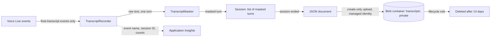

# Research: storing conversation transcripts safely

Status: research finished, design proposed, not built yet. Roadmap step 10
([02-roadmap.md](../planning/02-roadmap.md)). Research date: October 2026.

## 1. Summary and recommendation

**What we need.** One transcript per voice session (browser and phone), saved in a
private Azure Blob container. The challenge allows verification codes in the live
conversation, but they must not stay in stored records. Passwords, reset links and
tokens must never be stored. A caller can still *say* a secret, so we mask before
we store, and we say clearly that masking is not perfect.

**Recommendation (the simplest design we can defend):**

1. **Source of text.** Store only the two *final* transcript events from Voice Live:
   the caller's input transcription (`conversation.item.input_audio_transcription.completed`)
   and the agent's audio transcript (`response.audio_transcript.done`). Ignore all
   `*.delta` events, tool-call arguments, and raw event JSON.
2. **Masking.** Our own small, deterministic `TranscriptMasker` (regular
   expressions plus a number-word scanner). It masks every turn **in memory, the
   moment the text arrives**, for both the caller and the agent. Unmasked text is
   never kept in the session object, never logged, never written. We do **not** use
   Azure AI Language PII detection: it has no category for verification codes, its
   `Password` category is preview and probabilistic, and it adds a service, a cost
   and one more place where raw text goes.
3. **Storage.** One JSON document per session, a **block blob written once at the
   end of the session** with a "create only" condition (safe against duplicate end
   events). Blob name: `yyyy/MM/dd/<random-session-guid>.json`, no personal data.
   After a crash, the restart reconciliation writes a short "stub" transcript with
   `turnsLost: true` instead of the lost turns.
4. **Security configuration.** Private container, anonymous access disabled,
   Shared Key disabled (Entra ID only), minimum TLS 1.2, the app's managed identity
   gets **Storage Blob Data Contributor scoped to the container only**. Encryption
   at rest is always on (Microsoft-managed keys are enough).
5. **Retention.** A lifecycle rule deletes transcripts **14 days after creation**
   (one number, easy to lower to 7). **Blob soft delete, container soft delete and
   versioning are turned off**, because otherwise "deleted" transcripts are kept
   for the soft-delete period.
6. **Logs.** Application Insights gets nothing conversational: only event names,
   the session ID, states, error codes, counts and durations.

**Honest limits (short version):** the raw audio and raw text still pass through
Voice Live and its speech recognition; we cannot redact that. The masker
over-masks numbers on purpose and still misses secrets without a clear shape (for
example a password spoken without "my password is"). A crash loses the
in-progress transcript. Details in section 6.

## 2. Findings with sources

### 2.1 Which Voice Live events carry transcripts

Voice Live uses the same event model as the Azure OpenAI Realtime API, with
Azure extensions [1][2]. The .NET SDK `Azure.AI.VoiceLive` (version 1.2.0 at the
time of writing) maps every server event to a `SessionUpdate` subclass [3].
We compiled the sketch in section 5 against 1.2.0 to check the names.

| Side | Wire event | .NET class | Useful properties | Use it? |
| --- | --- | --- | --- | --- |
| Caller, final | `conversation.item.input_audio_transcription.completed` | `SessionUpdateConversationItemInputAudioTranscriptionCompleted` | `ItemId`, `Transcript` | **Yes** |
| Caller, partial | `conversation.item.input_audio_transcription.delta` | `SessionUpdateConversationItemInputAudioTranscriptionDelta` | `ItemId`, `Delta` | No |
| Caller, failed | `conversation.item.input_audio_transcription.failed` | `SessionUpdateConversationItemInputAudioTranscriptionFailed` | `ItemId`, error | Yes, as "transcription failed" (no text) |
| Caller turn order | `input_audio_buffer.committed` | `SessionUpdateInputAudioBufferCommitted` | `ItemId` | Yes, to reserve the turn slot in order |
| Agent, final | `response.audio_transcript.done` | `SessionUpdateResponseAudioTranscriptDone` | `ItemId`, `ResponseId`, `Transcript` | **Yes** |
| Agent, partial | `response.audio_transcript.delta` | `SessionUpdateResponseAudioTranscriptDelta` | `Delta` | No |
| Agent, text-only replies | `response.text.done` | `SessionUpdateResponseTextDone` | `Text` | Only if we enable text output |
| Tool call | `response.function_call_arguments.done` | `SessionUpdateResponseFunctionCallArgumentsDone` | `Name`, `Arguments` | **Never store `Arguments`** (it can contain the code) |

Important details from the documentation:

- Caller transcription **runs asynchronously**, so the `completed` event "can come
  before or after the response events" [2]. That is why we reserve the caller's
  turn slot on `input_audio_buffer.committed` and fill it later by `ItemId`.
- The caller transcript comes from a **separate speech recognition model**, so it
  "can diverge somewhat from the model's interpretation, and should be treated as
  a rough guide" [2][3]. A transcript is not proof of what the model understood.
- `response.audio_transcript.done` is "also emitted when a Response is
  interrupted, incomplete, or cancelled" [3]. After a barge-in, the stored agent
  text can contain words the caller never heard.
- Voice Live session `Metadata` key-value pairs "are also included in Foundry
  resource logs" [4]. Put only the opaque session ID there, never caller data.

### 2.2 How to turn on caller transcription

Set `input_audio_transcription` in `session.update` (in .NET:
`VoiceLiveSessionOptions.InputAudioTranscription`, type
`AudioInputTranscriptionOptions`, properties `Model`, `Language`, `PhraseList`,
`CustomSpeech`) [4][5]. Which models are allowed depends on the chat model [1]:

| Transcription model | Works with | Notes |
| --- | --- | --- |
| `azure-speech` | all non-multimodal models (for example `gpt-4.1`) and agents | "Automatically active with non-multimodal models"; supports phrase list and custom speech |
| `mai-transcribe` / `mai-transcribe-2` | `gpt-realtime`, `gpt-realtime-mini`, non-multimodal models, agents | preview |
| `whisper-1`, `gpt-4o-transcribe`, `gpt-4o-mini-transcribe`, `gpt-4o-transcribe-diarize` | `gpt-realtime`, `gpt-realtime-mini` only | support an optional `prompt` |

The older 2025-10-01 API reference says the setting is "null (off) by default"
for realtime models [2]; the current how-to page says `azure-speech` is active
automatically for non-multimodal models [1]. **Recommendation: always set it
explicitly**, so the behaviour does not depend on the chat model choice:

```csharp
// Cascaded model (for example gpt-4.1): Azure speech to text.
options.InputAudioTranscription =
    new AudioInputTranscriptionOptions(AudioInputTranscriptionOptionsModel.AzureSpeech)
    {
        Language = "en-US",
    };

// gpt-realtime / gpt-realtime-mini instead:
// new AudioInputTranscriptionOptions(AudioInputTranscriptionOptionsModel.Gpt4oTranscribe) { Language = "en" };
```

Note: the SDK documentation lists `mai-transcribe-1` while the service
documentation lists `mai-transcribe-2`; the model type converts from a string, so
any service value can be passed as text [5][6].

### 2.3 Masking options compared

**(a) Our own deterministic masking.** Rules we write and unit test: number runs
(digits *and* spoken words such as "zero four seven", "oh", "double seven", with
pauses and punctuation in between), password trigger phrases ("my password is
..."), links, long tokens, e-mail addresses. Runs in microseconds, no extra
service, no extra cost, fully explainable, easy to test. Weak against secrets
with no recognisable shape.

**(b) Azure AI Language PII detection** [7][8][9][10]:

- *Text PII* is synchronous and supports a `Password` category, but it is
  **preview** [8]. There is **no category for one-time or verification codes**.
- *Conversation PII* (built for call transcripts) has no `Password` category. It
  has `NumericIdentifier` ("case numbers, member numbers, ticket numbers ... product
  keys, serial numbers"), which *might* catch a code, but nothing promises that
  [9]. It is designed as an asynchronous, job-based API [7].
- Detection is machine learning with confidence scores, so it can miss entities
  and its results can change between model versions [10]. We found no
  documentation that it understands spoken digit words like "oh four seven".
- Redaction policies: `CharacterMask` (default), `EntityMask`, `NoMask`,
  `SyntheticReplacement` (newer preview API) [10].
- Cost: billed per text record (1,000 characters) with a free tier; see the
  pricing page [11]. Latency: one more network call per turn or per session.
- A Docker container exists (`mcr.microsoft.com/azure-cognitive-services/textanalytics/pii`,
  minimum 1 core and 2 GB, recommended 4 cores and 8 GB), but it still needs a
  billing connection to Azure and is one more thing to host [12].
- It sends the raw, unmasked text to one more service.

**(c) Both.** This is what a production system with **real** users should do:
deterministic rules for the secrets we know (codes, passwords, links), plus a PII
service for names, addresses and phone numbers. In this challenge all data is
synthetic and we never ask for personal data, so (c) adds cost and moving parts
without protecting anything real.

**Decision: (a) now; (c) listed as a production improvement.** Defensible because
the dangerous values (codes, passwords, tokens) are exactly the ones the PII
service does not reliably cover, and our rules are tested against them.

**Assistant side.** The agent may read the code back to confirm it ("I heard
0 4 7 1 9 2, is that right?"). The same masker runs on agent turns. A password or
link should never come from the agent (guardrails), but if the model misbehaves,
the masker still catches the usual shapes.

### 2.4 Blob Storage security facts

- **Anonymous access:** disable it at account level (`--allow-blob-public-access false`);
  containers are private by default [13].
- **Shared Key:** `--allow-shared-key-access false` makes the account reject
  account-key and account/service SAS requests (403); only Microsoft Entra ID
  (and user delegation SAS) works [14]. Owner/Contributor can still list the keys,
  but the keys no longer open data.
- **RBAC:** assign `Storage Blob Data Contributor`; the scope can be a single
  container [15]. Role changes can take up to 10 minutes to apply [15].
- **TLS:** Azure Storage supports TLS 1.2 and 1.3; the minimum you can enforce is
  TLS 1.2. Accounts created with the CLI do **not** set a minimum unless you pass
  `--min-tls-version TLS1_2` [16].
- **Encryption at rest:** always on, AES-256, cannot be disabled, Microsoft-managed
  keys by default, no extra cost [17].
- **Lifecycle management:** works for block and append blobs; can delete by
  `daysAfterCreationGreaterThan`; `prefixMatch` must start with the container
  name; a new or changed policy can take **up to 24 hours** to start, and runs are
  periodic, so deletion is not to-the-minute [18][19][20]. Delete actions are free.
- **Soft delete:** the portal turns blob soft delete on by default (7 days); the
  CLI does not [21]. With soft delete on, a lifecycle delete only *soft*-deletes
  the blob and it stays for the soft-delete period [18]; soft-deleted data is
  billed and can be restored by anyone with permission [22]. With soft delete on,
  every *overwrite* of a block blob also keeps a soft-deleted snapshot of the old
  content [22].

### 2.5 Logging facts

- The Azure SDK for .NET logs HTTP requests with sanitized headers and query
  values; **request/response body logging is off by default**
  (`IsLoggingContentEnabled = false`) [23]. We keep it off.
- Voice Live itself "does not store or retain customer data"; Microsoft support
  debug logging is opt-in per support ticket and removed after 30 days [24].

## 3. Proposed design

### 3.1 Data flow



The raw text exists only inside the incoming event object and for the duration
of one `Mask` call. Nothing else holds it.

### 3.2 Masking rules

Applied in this order to every caller and agent turn:

| # | Rule | Example in | Example out |
| --- | --- | --- | --- |
| 1 | Previous caller turn ended with a password phrase: mask the whole turn | `tiger lily` | `[PASSWORD]` |
| 2 | Links (`http(s)://`, `www.`, anything with `#token=`) | `open https://x.test/#token=abc` | `open [LINK]` |
| 3 | E-mail addresses | `jane@inbox.example.test` | `[EMAIL]` |
| 4 | Long tokens: 16+ characters mixing letters and digits | `Zm9vYmFyYmF6cXV4MTIz` | `[TOKEN]` |
| 5 | Password phrase (`password is`, `password's`, `password:`, `passcode was`, `password, it's` ...): mask everything after it in the turn. If nothing follows, flag "mask the next caller turn" | `my password is hunter2` | `my password is [PASSWORD]` |
| 6 | Number runs with **3 or more digits**: digits or number words (`zero`, `oh`, `one` ... `nine`, `ten` ... `ninety`, `hundred`, `double`, `triple`), joined across spaces, commas, dots, dashes, ellipses and fillers (`uh`, `um`) | `it's oh four seven, one nine two` | `it's [CODE]` |
| 7 | A turn made **only** of numbers and fillers, with 2+ digits (a code split by a pause) | `zero four` | `[CODE]` |

Why 3 digits: codes are 6 digits; 3 also catches half a code split over two
turns, and "I have 2 laptops" stays readable. Over-masking (times, years, "120
seconds") is the accepted, safe failure.

Each turn stores how many masks were applied (`maskCount`), so a reviewer can
see that masking happened without seeing the value.

### 3.3 When masking happens

- In memory, **per turn, as soon as the final transcript event arrives**, before
  the turn is added to the session.
- The only state between turns is one boolean (`maskNextUserTurn`), kept by the
  recorder, not by the masker. The masker stays a pure function and is easy to
  test.
- Nothing is written to disk, blob, log, or telemetry before masking. There is no
  "raw" fallback anywhere (no local file when the upload fails).

### 3.4 Document schema

```json
{
  "schemaVersion": 1,
  "sessionId": "5f0c2a9e-7d1b-4c3e-9a51-2b8f6d4e1c07",
  "channel": "browser",
  "startedAt": "2026-10-03T09:15:02Z",
  "endedAt": "2026-10-03T09:19:47Z",
  "endReason": "agent_completed",
  "ticketId": "tkt_8c1f",
  "outcome": "resolved",
  "turnsLost": false,
  "turns": [
    { "role": "agent",  "offsetMs": 400,   "maskedText": "Hi, I can help you reset your password. What is your username?", "maskCount": 0 },
    { "role": "caller", "offsetMs": 5200,  "maskedText": "It's jdoe.", "maskCount": 0 },
    { "role": "system", "offsetMs": 6100,  "maskedText": "start_recovery: awaiting_verification", "maskCount": 0 },
    { "role": "caller", "offsetMs": 31800, "maskedText": "The code is [CODE].", "maskCount": 1 },
    { "role": "agent",  "offsetMs": 33000, "maskedText": "I heard [CODE]. Is that right?", "maskCount": 1 }
  ]
}
```

Rules for the fields:

- `sessionId` is a random GUID created by our backend, not a caller ID, phone
  number, ACS call ID or recovery ID.
- `ticketId` and `outcome` come from the ticket service (opaque, not secrets).
- No `recovery_id`, `operation_id`, idempotency keys, reset receipts, tokens,
  phone numbers or IP addresses. (They are not passwords, but the transcript
  does not need them; the session store already has the correlation data.)
- `system` turns are fixed, safe strings written by our code from **backend
  results** (tool name + safe status), never from the model's tool arguments.
- `transcriptionFailed: true` on a caller turn means the speech recognition
  failed; `maskedText` is then empty.

### 3.5 Blob naming

`transcripts` container, blob name `yyyy/MM/dd/<sessionId>.json`, for example
`2026/10/03/5f0c2a9e-7d1b-4c3e-9a51-2b8f6d4e1c07.json`. The date prefix makes it
easy to browse; the GUID gives no information. No usernames, phone numbers,
ticket IDs or outcomes in names, metadata or blob index tags.

### 3.6 Write strategy

| Option | Crash or restart | Simplicity | Masking | Other notes |
| --- | --- | --- | --- | --- |
| **A. One block blob, written once at session end** | In-progress transcript is lost | Simplest: one upload, create-only condition makes duplicate end events harmless | Turns already masked | Recommended |
| B. Rewrite the whole block blob after each turn | Keeps everything up to the last turn | Simple, but many writes per session | Turns already masked, so each rewrite is safe | If soft delete were on, every rewrite keeps an old copy |
| C. Append blob, one JSON line per turn | Keeps everything up to the last turn | Harder: JSON Lines instead of one document, end-of-session data must go in a last line, a retried append can duplicate a line unless you use append-position conditions | Turns already masked | Lifecycle delete works for append blobs |

**Recommendation: A**, plus one small addition for restarts: the startup
reconciliation (roadmap step 11) writes a **stub** document for every session that
was still open, with `endReason: "process_restart"`, `turnsLost: true` and empty
`turns`. The session store and the ticket stay the source of truth; the
transcript is a diagnostic aid, not a record we depend on. If the assessment
shows that transcripts of crashed sessions are important, option B is a small
change (the content is already masked).

### 3.7 Storage configuration

Placeholders in angle brackets; real names never go into the repo.

```bash
# Storage account: no anonymous access, no Shared Key, TLS 1.2 minimum.
az storage account create \
  --name <storage-account> --resource-group <resource-group> --location <region> \
  --sku Standard_LRS --kind StorageV2 \
  --min-tls-version TLS1_2 \
  --allow-blob-public-access false \
  --allow-shared-key-access false \
  --https-only true

# No soft delete and no versioning: a delete must really delete.
az storage account blob-service-properties update \
  --account-name <storage-account> --resource-group <resource-group> \
  --enable-delete-retention false \
  --enable-container-delete-retention false \
  --enable-versioning false

# Private container. container-rm uses the management plane, so it works
# without Shared Key and without a data role for the person running it.
az storage container-rm create \
  --storage-account <storage-account> --resource-group <resource-group> \
  --name transcripts --public-access off

# The app's managed identity may read/write blobs in this container only.
az role assignment create \
  --role "Storage Blob Data Contributor" \
  --assignee-object-id <app-managed-identity-principal-id> \
  --assignee-principal-type ServicePrincipal \
  --scope "/subscriptions/<subscription-id>/resourceGroups/<resource-group>/providers/Microsoft.Storage/storageAccounts/<storage-account>/blobServices/default/containers/transcripts"
```

To read transcripts yourself (portal or CLI with `--auth-mode login`), give your
own account `Storage Blob Data Reader` on the same container scope, plus
`Reader` on the account for the portal [15].

Note: `Storage Blob Data Contributor` also allows read and delete. A custom
write-only role would be tighter, but is not worth the extra setup here.

### 3.8 Retention (lifecycle policy)

`transcripts-retention.json`:

```json
{
  "rules": [
    {
      "enabled": true,
      "name": "delete-transcripts-after-14-days",
      "type": "Lifecycle",
      "definition": {
        "filters": {
          "blobTypes": [ "blockBlob" ],
          "prefixMatch": [ "transcripts/" ]
        },
        "actions": {
          "baseBlob": {
            "delete": { "daysAfterCreationGreaterThan": 14 }
          }
        }
      }
    }
  ]
}
```

```bash
az storage account management-policy create \
  --account-name <storage-account> --resource-group <resource-group> \
  --policy @transcripts-retention.json
```

- The policy replaces any existing policy as a whole (no partial updates). If the
  session store later needs its own rule, add it to the same file.
- Why 14 days: it covers the assessment run and the feedback round before the
  walkthrough video. Lower it to 7 if that is enough.
- Real lifetime is "at least 14 days, usually up to about one extra day", because
  policy runs are periodic [18][20].

### 3.9 Soft delete: the trade-off

| | Soft delete on | Soft delete off (recommended) |
| --- | --- | --- |
| Accidental delete | Can be restored | Lost |
| Lifecycle delete | Blob is only soft-deleted, kept and billed for the retention period, restorable | Really deleted |
| Overwrites | Old content kept as soft-deleted snapshot | Gone |
| Fits "deleted after a short retention period"? | Only if we add the soft-delete days to the promise | Yes |

Transcripts are not a system of record, so losing one by mistake is acceptable;
keeping "deleted" data is not what we promise. If another part of the app later
needs soft delete, put transcripts in their **own** storage account rather than
turning it on for everything. (Blob soft delete does not affect Table storage, so
a Table-based session store is not affected by this choice.)

### 3.10 Application Insights and other logs

Allowed: event names (`transcript_saved`, `transcript_upload_failed`), session ID,
channel, state transitions, safe error codes, HTTP status codes, durations, turn
count, mask count.

Never: transcript text (masked or not), tool-call arguments, raw Voice Live event
JSON, request or response bodies, verification codes, tokens, links, the voice
page access code, inbox content.

Practical rules:

- Do not log `SessionUpdate` objects or `ToString()` of them; log the event type
  name only.
- Keep the Azure SDK's `IsLoggingContentEnabled` off and the `Azure.Core` log level
  at `Warning` in production [23].
- Exception messages must not contain conversation text; log exception type and
  safe code.
- Voice Live session `Metadata` holds only the session ID (it ends up in Foundry
  resource logs) [4].
- Do not enable App Service memory-dump collection: a dump could contain raw text
  that was in memory.

### 3.11 What we never store

- **Raw audio.** No call recording (ACS recording stays off), no audio buffers,
  no audio files. Only text.
- **Partial transcripts** (`*.delta` events).
- **Tool-call arguments** (they can contain the code) and raw tool results.
- **Reset links and tokens** (the backend never receives them; the masker catches
  them anyway if one appears in text).
- **Inbox content**, and anything from the mock inbox.
- **Passwords** (the browser form never talks to the voice side; spoken ones are
  masked).
- **Identifiers we do not need:** phone numbers / caller ID, IP addresses, ACS call
  IDs, recovery and operation IDs, receipts.

## 4. Code sketch and tests

Compiled and run against .NET 10, `Azure.AI.VoiceLive` 1.2.0,
`Azure.Storage.Blobs` 12.30.0, `Azure.Identity` 1.21.0 and xUnit 2.9 in a scratch
project: **37 tests pass**. This is a sketch for step 10, not final code.

### 4.1 `TranscriptMasker`

```csharp
using System.Text.RegularExpressions;

namespace PasswordReset.Transcripts;

/// <summary>Result of masking one transcript turn.</summary>
/// <param name="Text">The masked text. Safe to store.</param>
/// <param name="MaskCount">How many masks were applied.</param>
/// <param name="MaskNextUserTurn">
/// True when the turn ended right after "my password is": the secret probably
/// follows in the caller's next turn, so the caller of this method should mask
/// that whole turn.
/// </param>
public sealed record MaskResult(string Text, int MaskCount, bool MaskNextUserTurn);

/// <summary>
/// Deterministic masking of one transcript turn before it is stored.
/// It is a safety net, not a guarantee: it over-masks numbers on purpose and
/// cannot recognise a secret that has no recognisable shape or trigger phrase.
/// </summary>
public static partial class TranscriptMasker
{
    public const string CodeMask = "[CODE]";
    public const string PasswordMask = "[PASSWORD]";
    public const string LinkMask = "[LINK]";
    public const string EmailMask = "[EMAIL]";
    public const string TokenMask = "[TOKEN]";

    // A run of number words/digits with at least this many digits is masked.
    // Verification codes are 6 digits; 3 also catches half a code.
    public const int MinDigitsInRun = 3;

    public static MaskResult Mask(string? text, bool maskWholeTurn = false)
    {
        if (string.IsNullOrWhiteSpace(text))
            return new MaskResult(string.Empty, 0, false);

        // The previous turn ended with "my password is": hide everything.
        if (maskWholeTurn)
            return new MaskResult(PasswordMask, 1, false);

        int count = 0;
        string result = text;

        // Order matters: links and e-mails contain digits and dots.
        result = Replace(UrlRegex(), result, LinkMask, ref count);
        result = Replace(EmailRegex(), result, EmailMask, ref count);
        result = Replace(LongTokenRegex(), result, TokenMask, ref count);

        bool maskNextUserTurn = false;
        Match trigger = PasswordTriggerRegex().Match(result);
        if (trigger.Success)
        {
            int end = trigger.Index + trigger.Length;
            string rest = result[end..];
            if (HasContent(rest))
            {
                result = result[..end] + " " + PasswordMask;
                count++;
            }
            else
            {
                maskNextUserTurn = true;
            }
        }

        result = MaskNumberRuns(result, ref count);
        return new MaskResult(result, count, maskNextUserTurn);
    }

    private static string MaskNumberRuns(string text, ref int count)
    {
        var spans = new List<(int Start, int End)>();
        bool inRun = false;
        int runStart = 0, lastEnd = 0, lastDigitEnd = 0, digits = 0;
        int totalDigits = 0;
        bool sawOtherWord = false;

        void CloseRun()
        {
            if (inRun && digits >= MinDigitsInRun)
                spans.Add((runStart, lastDigitEnd));
            inRun = false;
        }

        foreach (Match m in WordOrNumberRegex().Matches(text))
        {
            int? d = DigitCount(m.Value);
            if (d is null)
                sawOtherWord = true;

            if (inRun && (d is null || !OnlySeparators(text, lastEnd, m.Index)))
                CloseRun();

            if (d is null)
                continue;

            if (!inRun)
            {
                if (d == 0)
                    continue; // a filler word cannot start a run
                inRun = true;
                runStart = m.Index;
                digits = 0;
            }

            digits += d.Value;
            totalDigits += d.Value;
            lastEnd = m.Index + m.Length;
            if (d > 0)
                lastDigitEnd = lastEnd;
        }
        CloseRun();

        // A turn made only of numbers (for example "zero four" said after a
        // pause) is masked completely, even when it has fewer digits.
        if (!sawOtherWord && totalDigits >= 2)
        {
            count++;
            return CodeMask;
        }

        for (int i = spans.Count - 1; i >= 0; i--)
        {
            var (start, end) = spans[i];
            text = text[..start] + CodeMask + text[end..];
            count++;
        }
        return text;
    }

    // null = not a number word (ends a run); 0 = filler (keeps a run going).
    private static int? DigitCount(string token)
    {
        if (char.IsDigit(token[0]))
            return token.Length;

        return token.ToLowerInvariant() switch
        {
            "zero" or "oh" or "o" or "one" or "two" or "three" or "four"
                or "five" or "six" or "seven" or "eight" or "nine" => 1,
            "ten" or "eleven" or "twelve" or "thirteen" or "fourteen" or "fifteen"
                or "sixteen" or "seventeen" or "eighteen" or "nineteen"
                or "twenty" or "thirty" or "forty" or "fifty" or "sixty"
                or "seventy" or "eighty" or "ninety" or "hundred" => 2,
            "thousand" => 3,
            "double" => 1, // "double seven" = 2 digits
            "triple" => 2,
            "uh" or "um" or "umm" or "er" or "erm" or "hmm" => 0,
            _ => null,
        };
    }

    private static bool OnlySeparators(string text, int from, int to)
    {
        for (int i = from; i < to; i++)
        {
            char c = text[i];
            if (!char.IsWhiteSpace(c) && ",.;:-–—…/".IndexOf(c) < 0)
                return false;
        }
        return true;
    }

    private static bool HasContent(string s) => s.Any(char.IsLetterOrDigit);

    private static string Replace(Regex regex, string input, string mask, ref int count)
    {
        int found = 0;
        string output = regex.Replace(input, _ => { found++; return mask; });
        count += found;
        return output;
    }

    [GeneratedRegex(@"\d+|[A-Za-z]+")]
    private static partial Regex WordOrNumberRegex();

    [GeneratedRegex(@"\b(?:https?://|www\.)\S+|\S*#token=\S*", RegexOptions.IgnoreCase)]
    private static partial Regex UrlRegex();

    [GeneratedRegex(@"[\w.+-]+@[\w-]+(?:\.[\w-]+)+")]
    private static partial Regex EmailRegex();

    // 16+ characters mixing letters and digits: looks like a token or key.
    [GeneratedRegex(@"\b(?=[A-Za-z0-9_-]*\d)(?=[A-Za-z0-9_-]*[A-Za-z])[A-Za-z0-9_-]{16,}\b")]
    private static partial Regex LongTokenRegex();

    // "password is", "password's", "password:", "passcode was", "password, it's" ...
    [GeneratedRegex(
        @"\b(?:pass\s?word|pass\s?code|pass\s?phrase)" +
        @"(?:['’]s\b|\s+(?:is|was|will\s+be|would\s+be|should\s+be)\b|\s*[:=]|[\s,.?!-]+(?:it['’]s|it\s+is)\b)",
        RegexOptions.IgnoreCase)]
    private static partial Regex PasswordTriggerRegex();
}
```

### 4.2 `TranscriptRecorder` (Voice Live events to masked turns)

```csharp
using System.Diagnostics;
using Azure.AI.VoiceLive;

namespace PasswordReset.Transcripts;

public sealed record TranscriptTurn(
    string Role,               // "caller" | "agent" | "system"
    long OffsetMs,             // milliseconds since session start
    string MaskedText,         // already masked; raw text is never stored
    int MaskCount,
    bool TranscriptionFailed = false);

/// <summary>
/// Collects masked turns for one session. Raw text is masked as soon as it
/// arrives, so the session never keeps unmasked text around.
/// </summary>
public sealed class TranscriptRecorder
{
    private readonly Stopwatch _clock = Stopwatch.StartNew();
    private readonly List<TranscriptTurn> _turns = new();
    // Caller turn slots, created in speaking order and filled when the
    // (asynchronous) transcription arrives.
    private readonly Dictionary<string, int> _slotByItemId = new();
    private bool _maskNextUserTurn;

    public IReadOnlyList<TranscriptTurn> Turns => _turns;

    public void Handle(SessionUpdate update)
    {
        switch (update)
        {
            case SessionUpdateInputAudioBufferCommitted committed:
                // Reserve the slot now so the order is right even if the
                // transcription arrives after the agent's answer.
                _slotByItemId[committed.ItemId] = _turns.Count;
                _turns.Add(new TranscriptTurn("caller", _clock.ElapsedMilliseconds, "", 0));
                break;

            case SessionUpdateConversationItemInputAudioTranscriptionCompleted done:
                FillUserTurn(done.ItemId, done.Transcript, failed: false);
                break;

            case SessionUpdateConversationItemInputAudioTranscriptionFailed failed:
                FillUserTurn(failed.ItemId, null, failed: true);
                break;

            case SessionUpdateResponseAudioTranscriptDone agent:
                MaskResult masked = TranscriptMasker.Mask(agent.Transcript);
                _turns.Add(new TranscriptTurn(
                    "agent", _clock.ElapsedMilliseconds, masked.Text, masked.MaskCount));
                break;

            // Deliberately ignored: *.delta events (partial text), and
            // SessionUpdateResponseFunctionCallArgumentsDone, whose arguments can
            // contain the verification code. Tool calls are recorded by the
            // backend as safe status lines (AddSystemNote), never raw arguments.
        }
    }

    /// <summary>Safe, fixed text written by our code, e.g. "verify_code: verification_failed".</summary>
    public void AddSystemNote(string safeText) =>
        _turns.Add(new TranscriptTurn("system", _clock.ElapsedMilliseconds, safeText, 0));

    private void FillUserTurn(string itemId, string? rawText, bool failed)
    {
        MaskResult masked = TranscriptMasker.Mask(rawText, _maskNextUserTurn);
        _maskNextUserTurn = masked.MaskNextUserTurn;

        var turn = new TranscriptTurn(
            "caller", _clock.ElapsedMilliseconds, masked.Text, masked.MaskCount, failed);

        if (_slotByItemId.Remove(itemId, out int index))
            _turns[index] = turn with { OffsetMs = _turns[index].OffsetMs };
        else
            _turns.Add(turn);
    }
}
```

The recorder belongs to the shared session, so the browser and phone channels
behave the same (CLAUDE.md: channels only transport audio).

### 4.3 `TranscriptStore` (upload with managed identity)

```csharp
using System.Text.Json;
using System.Text.Json.Serialization;
using Azure;
using Azure.Identity;
using Azure.Storage.Blobs;
using Azure.Storage.Blobs.Models;
using Microsoft.Extensions.Logging;

namespace PasswordReset.Transcripts;

public sealed record TranscriptDocument(
    int SchemaVersion,
    string SessionId,          // random GUID created by our backend
    string Channel,            // "browser" | "phone"
    DateTimeOffset StartedAt,
    DateTimeOffset EndedAt,
    string EndReason,          // "caller_hung_up" | "agent_completed" | "timeout" | "process_restart" | ...
    string? TicketId,          // opaque mock ticket ID, not a secret
    string? Outcome,           // ticket outcome: resolved | escalated | cancelled | pending
    bool TurnsLost,            // true when the process died before the session ended
    IReadOnlyList<TranscriptTurn> Turns);

/// <summary>Writes one masked transcript per session to a private Blob container.</summary>
public sealed class TranscriptStore
{
    private static readonly JsonSerializerOptions JsonOptions = new()
    {
        PropertyNamingPolicy = JsonNamingPolicy.CamelCase,
        DefaultIgnoreCondition = JsonIgnoreCondition.WhenWritingNull,
    };

    private readonly BlobContainerClient _container;
    private readonly ILogger<TranscriptStore> _logger;

    public TranscriptStore(BlobContainerClient container, ILogger<TranscriptStore> logger)
    {
        _container = container;
        _logger = logger;
    }

    // Container URL comes from configuration, never hard-coded:
    // https://<account>.blob.core.windows.net/transcripts
    public static BlobContainerClient CreateContainerClient(Uri containerUrl) =>
        new(containerUrl, new DefaultAzureCredential());

    /// <summary>
    /// Writes the transcript once. A second call for the same session (duplicate
    /// end event, retry after restart) does not overwrite the first one.
    /// </summary>
    public async Task SaveAsync(TranscriptDocument doc, CancellationToken ct)
    {
        // No personal data in the name: date + random session ID only.
        string blobName = $"{doc.StartedAt:yyyy/MM/dd}/{doc.SessionId}.json";
        BlobClient blob = _container.GetBlobClient(blobName);

        var options = new BlobUploadOptions
        {
            HttpHeaders = new BlobHttpHeaders { ContentType = "application/json" },
            Conditions = new BlobRequestConditions { IfNoneMatch = ETag.All }, // create only
        };

        try
        {
            await blob.UploadAsync(
                BinaryData.FromObjectAsJson(doc, JsonOptions), options, ct);
            _logger.LogInformation(
                "Transcript saved for session {SessionId} ({TurnCount} turns, {MaskCount} masks)",
                doc.SessionId, doc.Turns.Count, doc.Turns.Sum(t => t.MaskCount));
        }
        catch (RequestFailedException ex) when (ex.Status is 409 or 412)
        {
            // Already written earlier: nothing to do (idempotent).
            _logger.LogInformation("Transcript for session {SessionId} already exists", doc.SessionId);
        }
        catch (RequestFailedException ex)
        {
            // Log only the status code. Never log the document, never write it
            // to local disk as a fallback.
            _logger.LogWarning(
                "Transcript upload failed for session {SessionId} with status {Status}",
                doc.SessionId, ex.Status);
        }
    }
}
```

Notes:

- `DefaultAzureCredential` uses the App Service managed identity in Azure and the
  developer's `az login` locally. Microsoft suggests a specific credential (for
  example `ManagedIdentityCredential`) in production to avoid probing the whole
  chain; either is fine for this challenge.
- In the real app, register `BlobContainerClient` once (singleton) through
  dependency injection; the SDK client is thread-safe.
- The SDK retries transient failures itself; we add no retry loop.

### 4.4 xUnit tests

```csharp
using PasswordReset.Transcripts;

namespace PasswordReset.Tests;

public class TranscriptMaskerTests
{
    // --- Verification codes -------------------------------------------------

    [Theory]
    [InlineData("The code is 047192", "The code is [CODE]")]
    [InlineData("It's 047 192.", "It's [CODE].")]
    [InlineData("zero four seven one nine two", "[CODE]")]
    [InlineData("My code is zero four seven one nine two thanks", "My code is [CODE] thanks")]
    [InlineData("I think it's 0 4 7... 1 9 2", "I think it's [CODE]")]
    [InlineData("it is oh four seven, one nine two", "it is [CODE]")]
    [InlineData("um oh four seven", "[CODE]")]            // only numbers and fillers: whole turn
    [InlineData("so um oh four seven", "so um [CODE]")]
    [InlineData("zero four uh seven one nine two", "[CODE]")]
    [InlineData("double seven four one", "[CODE]")]
    [InlineData("forty-seven nineteen two", "[CODE]")]
    public void Masks_spoken_and_written_codes(string input, string expected)
    {
        MaskResult result = TranscriptMasker.Mask(input);

        Assert.Equal(expected, result.Text);
        Assert.True(result.MaskCount >= 1);
    }

    [Fact]
    public void Masks_a_turn_that_is_only_part_of_a_code()
    {
        // The caller paused, so the transcription split the code in two turns.
        Assert.Equal("[CODE]", TranscriptMasker.Mask("zero four").Text);
        Assert.Equal("[CODE]", TranscriptMasker.Mask("Seven one nine two.").Text);
    }

    [Fact]
    public void Masks_a_code_the_assistant_reads_back()
    {
        MaskResult result = TranscriptMasker.Mask(
            "I heard 0 4 7 1 9 2. Is that correct?");

        Assert.Equal("I heard [CODE]. Is that correct?", result.Text);
    }

    // --- False positives we want to avoid ----------------------------------

    [Theory]
    [InlineData("I have 2 laptops")]
    [InlineData("Oh, I see.")]
    [InlineData("Oh.")]
    [InlineData("One moment please")]
    [InlineData("I tried two times")]
    [InlineData("You have 1 attempt left.")]
    [InlineData("I forgot my password")]
    [InlineData("Can you help me reset my password")]
    public void Leaves_harmless_text_unchanged(string input)
    {
        MaskResult result = TranscriptMasker.Mask(input);

        Assert.Equal(input, result.Text);
        Assert.Equal(0, result.MaskCount);
        Assert.False(result.MaskNextUserTurn);
    }

    // --- Spoken passwords ---------------------------------------------------

    [Theory]
    [InlineData("my password is hunter2", "my password is [PASSWORD]")]
    [InlineData("My new password is Blue Sky 99!", "My new password is [PASSWORD]")]
    [InlineData("the password's tiger lily", "the password's [PASSWORD]")]
    [InlineData("password: correct horse", "password: [PASSWORD]")]
    [InlineData("my old password, it's summer2024", "my old password, it's [PASSWORD]")]
    [InlineData("My passcode was 1234", "My passcode was [PASSWORD]")]
    public void Masks_text_after_a_password_phrase(string input, string expected)
    {
        MaskResult result = TranscriptMasker.Mask(input);

        Assert.Equal(expected, result.Text);
        Assert.False(result.MaskNextUserTurn);
    }

    [Fact]
    public void Password_phrase_at_end_of_turn_masks_the_next_user_turn()
    {
        MaskResult first = TranscriptMasker.Mask("Okay, my password is");
        Assert.Equal("Okay, my password is", first.Text);
        Assert.True(first.MaskNextUserTurn);

        MaskResult next = TranscriptMasker.Mask("tiger lily", maskWholeTurn: true);
        Assert.Equal("[PASSWORD]", next.Text);
        Assert.Equal(1, next.MaskCount);
    }

    [Fact]
    public void Over_masks_rather_than_under_masks()
    {
        // Known, accepted over-masking: harmless words after a trigger phrase.
        MaskResult result = TranscriptMasker.Mask("My password is not working");

        Assert.Equal("My password is [PASSWORD]", result.Text);
    }

    // --- Links, tokens and e-mail -------------------------------------------

    [Theory]
    [InlineData("Open https://reset.example.test/#token=abc123XYZ now", "Open [LINK] now")]
    [InlineData("go to www.example.test/reset", "go to [LINK]")]
    [InlineData("token Zm9vYmFyYmF6cXV4MTIzNDU2", "token [TOKEN]")]
    [InlineData("send it to jane.doe@inbox.example.test", "send it to [EMAIL]")]
    public void Masks_links_tokens_and_email(string input, string expected)
    {
        Assert.Equal(expected, TranscriptMasker.Mask(input).Text);
    }

    // --- Edge cases ----------------------------------------------------------

    [Theory]
    [InlineData(null)]
    [InlineData("")]
    [InlineData("   ")]
    public void Empty_input_gives_empty_output(string? input)
    {
        MaskResult result = TranscriptMasker.Mask(input);

        Assert.Equal(string.Empty, result.Text);
        Assert.Equal(0, result.MaskCount);
    }

    [Fact]
    public void Several_codes_in_one_turn_are_all_masked()
    {
        MaskResult result = TranscriptMasker.Mask(
            "Was it 047192 or 047 193?");

        Assert.Equal("Was it [CODE] or [CODE]?", result.Text);
        Assert.Equal(2, result.MaskCount);
    }
}
```

Tests to add when the recorder is built: turn order when the caller's
transcription arrives after the agent's answer; `maskNextUserTurn` applies to the
next **caller** turn only; a failed transcription stores no text; a tool call
never puts its arguments into a turn; duplicate session-end events write once.

## 5. Limits to document honestly

1. **Upstream exposure cannot be undone.** Raw audio and raw text pass through
   Voice Live, its speech recognition and the language model. A spoken secret has
   already been processed there before we mask anything. Voice Live states it does
   not store customer data, but this is Microsoft's statement, not something we
   can verify [24].
2. **The masker misses things.** Examples: a password spoken without a trigger
   phrase ("it's tiger lily" after the agent asked something else); a spelled
   password ("h u n t e r"); recognition errors ("zero **for** seven" breaks the
   number run); a 1-digit fragment inside a sentence; alphanumeric codes (our
   mock issuer uses 6-digit numeric codes); languages other than English.
3. **The masker over-masks.** Times, years, counts with 3+ digits, and harmless
   words after "password is" are replaced. This makes transcripts a little less
   useful, and is the safe choice.
4. **Transcripts are approximate.** The caller text comes from a separate speech
   model and can differ from what the agent understood; agent text can include
   words that were cut off by a barge-in and never heard [2][3].
5. **Crash loses the open transcript.** By design (option A). Restart writes a
   stub with `turnsLost: true`. The session store and ticket remain the truth.
6. **Raw text is briefly in process memory** (the event object and one `Mask`
   call). We do not enable memory dumps.
7. **Deletion is not instant.** The lifecycle rule runs periodically, so blobs can
   live up to about a day longer than 14 days [18][20].
8. **Who can read transcripts:** the app identity and anyone given a blob data role
   on the container. They see masked text only.

## 6. Proposed CLAUDE.md rule 4 additions

- Transcripts store only final transcript events (caller input transcription
  completed, agent audio transcript done). Never deltas, raw event JSON, tool-call
  arguments, audio, links/tokens, or inbox content.
- Every turn (caller and agent) is masked by `TranscriptMasker` in memory as soon
  as it arrives; unmasked text is never kept, logged, or written, and there is no
  "raw" fallback when an upload fails.
- One JSON blob per session, written once at session end with a create-only
  condition; blob name is `yyyy/MM/dd/<random session GUID>.json`, with no personal
  data in names, metadata or tags. After a restart, write a stub with
  `turnsLost: true`.
- Storage account: anonymous access off, Shared Key off, minimum TLS 1.2; the
  app's managed identity has `Storage Blob Data Contributor` on the `transcripts`
  container only.
- A lifecycle rule deletes transcripts 14 days after creation; blob soft delete,
  container soft delete and versioning stay off so deleted means deleted.
- Logs and Application Insights get event names, session ID, states, error codes,
  counts and durations only. Azure SDK content logging stays off, and Voice Live
  session metadata holds only the session ID.
- Masking deliberately over-masks numbers; every leak or new secret shape found in
  testing gets a failing unit test before the fix.

## 7. Open points for the owner

- Confirm the retention number (14 days proposed, 7 possible).
- The chat model choice (realtime vs cascaded) decides the transcription model
  (`gpt-4o-transcribe` vs `azure-speech`); set it explicitly either way.
- If the session store uses **blobs** (not Table storage) and needs soft delete,
  put transcripts in a separate storage account.
- The guardrails plan should decide whether the agent reads the code back. The
  masker handles it either way.

## 8. Sources

1. How to use the Voice Live API (transcription models table, `azure-speech` default) — https://learn.microsoft.com/en-us/azure/ai-services/speech-service/voice-live-how-to
2. Voice Live API reference 2025-10-01 (transcription events, fields, "rough guide") — https://learn.microsoft.com/en-us/azure/ai-services/speech-service/voice-live-api-reference-2025-10-01
3. `Azure.AI.VoiceLive` namespace (.NET event classes) — https://learn.microsoft.com/dotnet/api/azure.ai.voicelive
4. `VoiceLiveSessionOptions` (InputAudioTranscription, Metadata in Foundry logs) — https://learn.microsoft.com/dotnet/api/azure.ai.voicelive.voicelivesessionoptions
5. `AudioInputTranscriptionOptions` — https://learn.microsoft.com/dotnet/api/azure.ai.voicelive.audioinputtranscriptionoptions
6. `AudioInputTranscriptionOptionsModel` — https://learn.microsoft.com/dotnet/api/azure.ai.voicelive.audioinputtranscriptionoptionsmodel
7. PII detection overview (text vs conversation vs document) — https://learn.microsoft.com/en-us/azure/ai-services/language-service/personally-identifiable-information/overview
8. Text PII entity categories (Password is preview) — https://learn.microsoft.com/en-us/azure/ai-services/language-service/personally-identifiable-information/concepts/entity-categories
9. Conversation PII entity categories (NumericIdentifier, no Password) — https://learn.microsoft.com/en-us/azure/ai-services/language-service/personally-identifiable-information/concepts/conversations-entity-categories
10. Detect and redact PII in text (redaction policies, confidence threshold) — https://learn.microsoft.com/en-us/azure/ai-services/language-service/personally-identifiable-information/how-to/redact-text-pii
11. Azure Language pricing — https://azure.microsoft.com/pricing/details/language/
12. PII detection containers — https://learn.microsoft.com/en-us/azure/ai-services/language-service/personally-identifiable-information/how-to/use-containers
13. Configure anonymous read access for containers and blobs — https://learn.microsoft.com/en-us/azure/storage/blobs/anonymous-read-access-configure
14. Prevent authorization with Shared Key — https://learn.microsoft.com/en-us/azure/storage/common/shared-key-authorization-prevent
15. Assign an Azure role for blob data access — https://learn.microsoft.com/en-us/azure/storage/blobs/assign-azure-role-data-access
16. Enforce a minimum TLS version — https://learn.microsoft.com/en-us/azure/storage/common/transport-layer-security-configure-minimum-version
17. Azure Storage encryption for data at rest — https://learn.microsoft.com/en-us/azure/storage/common/storage-service-encryption
18. Lifecycle management overview (24 hours, soft delete interaction) — https://learn.microsoft.com/en-us/azure/storage/blobs/lifecycle-management-overview
19. Lifecycle management policy structure (filters, run conditions) — https://learn.microsoft.com/en-us/azure/storage/blobs/lifecycle-management-policy-structure
20. Configure a lifecycle management policy (CLI command) — https://learn.microsoft.com/en-us/azure/storage/blobs/lifecycle-management-policy-configure
21. Enable soft delete for blobs (portal default on, CLI default off) — https://learn.microsoft.com/en-us/azure/storage/blobs/soft-delete-blob-enable
22. Soft delete for blobs (billing, overwrites, restore) — https://learn.microsoft.com/en-us/azure/storage/blobs/soft-delete-blob-overview
23. Logging with the Azure SDK for .NET (content logging off by default) — https://learn.microsoft.com/en-us/dotnet/azure/sdk/logging
24. Data, privacy, and security for Voice Live — https://learn.microsoft.com/en-us/azure/foundry/responsible-ai/speech-service/voice-live/data-privacy-security
