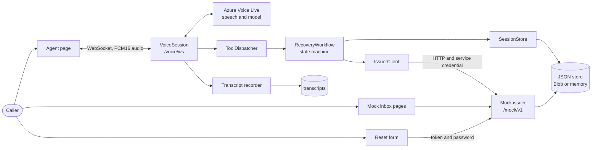
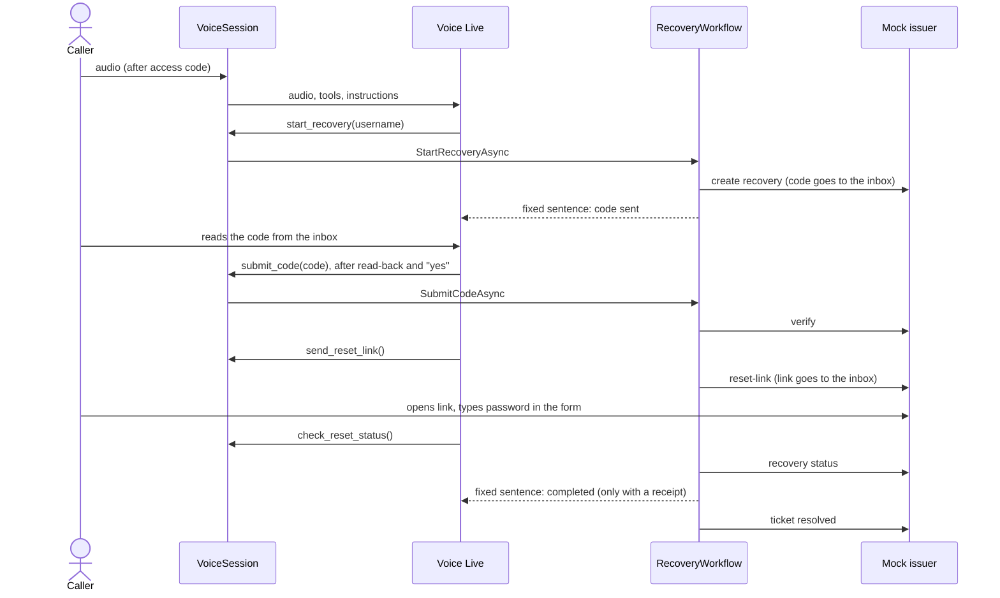
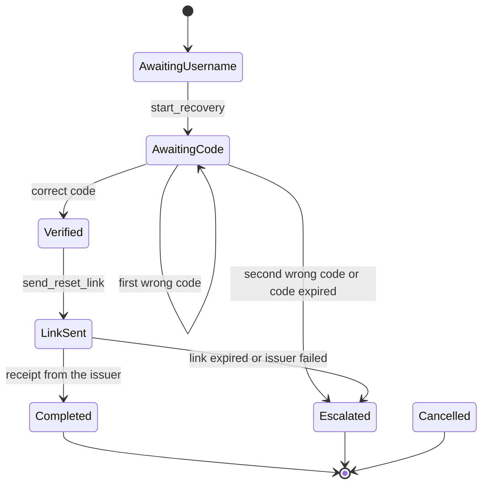

# T16 Documentation Implementation Plan

> **For agentic workers:** REQUIRED SUB-SKILL: Use superpowers:subagent-driven-development (recommended) or superpowers:executing-plans to implement this plan task-by-task. Steps use checkbox (`- [ ]`) syntax for tracking.

**Goal:** Two short, plain documents about the agent: `SETUP.md` (build, deploy, run, configuration names, trust boundaries, limitations) and `architecture.md` (components, call flow, state machine, guardrails as built, decisions).

**Architecture:** Both files are drafted below from the shared contracts. **This task runs last**: Task 1 compares every fact with the real code first, and the drafts are corrected wherever the code differs. Docs describe what exists, never plans.

**Tech Stack:** Markdown, Mermaid (renders on GitHub).

**Rules (CLAUDE.md rule 5):** no secrets, tenant or subscription IDs, phone numbers or real configuration values; never name the interviewer; nothing about the hiring process, submission or meetings; plain language; short.

**Files:**
- Create: `solution/docs/SETUP.md`
- Create: `solution/docs/architecture.md`

---

### Task 1: Check the facts against the code (no edits yet)

- [ ] **Step 1: Run these from `solution/` and note differences from the drafts**

```bash
grep -rn "Map\(Get\|Post\|Group\)\|MapRazorPages\|MapHealth\|WebSockets" src --include=*.cs   # routes and pages
grep -rn "class .*Options" src --include=*.cs                                                 # configuration classes and keys
grep -n "enum RecoveryState" -A 10 -r src --include=*.cs                                      # states
grep -rn "start_recovery" src --include=*.cs                                                  # tool names
dotnet test --project tests/VoiceReset.Tests                                                   # test count for the docs
```

- [ ] **Step 2: Confirm these facts and correct the drafts where they differ**

| Fact used in the drafts | Confirm in |
|---|---|
| Configuration names (table in SETUP.md) | options classes and `scripts/setup-azure.ps1` |
| States and which tool moves which state; terminal states | `RecoveryWorkflow` |
| Tool names and that no tool takes IDs | `ToolDefinitions` |
| Phone channel status (default text: not built) | whether any ACS code exists |

---

### Task 2: `solution/docs/SETUP.md`

- [ ] **Step 1: Create the file** (adjust to Task 1 findings)

````markdown
# Setup

How to build, deploy and run the password reset agent. All commands run from the
`solution/` folder.

## Prerequisites

- .NET SDK 10 (`global.json` pins 10.0.302; newer feature bands are accepted)
- Azure CLI (`az`), PowerShell 5.1 or 7, git
- An Azure subscription where you can create resources and role assignments
- For a voice call from your own machine: `az login` (the app uses
  `DefaultAzureCredential`) and the Voice Live endpoint (see Configuration)

## Build and test

```powershell
dotnet build VoiceReset.slnx -c Release
dotnet test --project tests/VoiceReset.Tests
```

The tests use a fake clock and an in-memory store; they need no Azure resources.

## Run locally

```powershell
dotnet run --project src/VoiceReset
```

`appsettings.Development.json` holds obviously fake values, and state is kept in
memory (no Blob Storage). The mock issuer and inbox run inside the same app. To
talk to the agent locally, set `VoiceLive__Endpoint` (environment variable or
`dotnet user-secrets`) to your AI Services endpoint.

## Azure setup

```powershell
az login
./scripts/setup-azure.ps1 -SubscriptionId <subscription-id> -Suffix <short-unique-text>
```

The script creates, in resource group `rg-voicereset` (Sweden Central by default):

| Resource | Purpose |
|---|---|
| AI Services (Foundry) account | Voice Live (speech and model) |
| Storage account, containers `state` and `transcripts` | Session and mock state, call transcripts |
| App Service plan B1 Linux, web app (.NET 10) | The app; WebSockets, Always On, HTTPS only |
| Log Analytics workspace, Application Insights | API telemetry |

The web app gets a system-assigned managed identity with the roles `Cognitive
Services User`, `Azure AI User` (Voice Live) and `Storage Blob Data Contributor`.
There are no keys for Voice Live or storage. The script also generates the access
code, the service credential and the demo inbox passwords and stores them only in
the web app settings. Read the access code with:

```powershell
az webapp config appsettings list -g rg-voicereset -n app-voicereset-<suffix> --query "[?name=='Access__Code'].value" -o tsv
```

## Configuration

Set as app settings in Azure (nested keys use `__`). Values are never in the repository.

| Name | Purpose |
|---|---|
| `Access__Code` | Code that opens the agent page |
| `VoiceLive__Endpoint`, `VoiceLive__Model`, `VoiceLive__Voice` | Voice Live resource, model, voice |
| `Storage__BlobEndpoint` | Blob endpoint; empty means in-memory state and no transcripts |
| `Issuer__BaseUrl`, `Issuer__ServiceCredential` | Where the agent calls the issuer, and its credential |
| `Mock__ServiceCredential`, `Mock__ResetBaseUrl`, `Mock__Users__<i>__*` | The mock issuer: same credential, reset page URL, demo accounts |
| `Limits__MaxCallSeconds` | Maximum call length (default 600) |
| `APPLICATIONINSIGHTS_CONNECTION_STRING` | Enables telemetry export when set |

## Deploy

```powershell
./scripts/deploy.ps1 -Suffix <suffix>
```

It checks that the working tree is clean, runs the tests, publishes, zips, deploys,
and waits until `/health` reports the commit that was deployed.

## Verify

`https://<app>.azurewebsites.net/health` returns `{"status":"ok","commit":"<sha>"}`.
The commit must equal `git rev-parse HEAD`.

## The three pages

- **Agent page `/`**: enter the access code, allow the microphone, start the call and
  say you forgot your password. Give the demo username; the agent reads nothing
  secret aloud.
- **Mock inbox `/mock/inbox`**: sign in as the demo user (username and inbox password
  from the app settings). The verification code and the reset link arrive here, like
  a separate recovery mailbox.
- **Reset form `/reset/`**: open the link from the inbox and type the new password.
  The password goes only to the reset API, never to the agent.

## Trust boundaries

| Boundary | What crosses | Protection |
|---|---|---|
| Caller to agent page | Audio | Access code gate before the voice WebSocket opens |
| Model to backend | Tool calls | State machine decides; tools take no IDs or free text; the session comes from the connection |
| Backend to mock issuer | HTTP calls | Service credential; it cannot read codes, tokens, links, inbox or passwords |
| Inbox to caller | Code and link | Separate inbox login; the agent never sees or says the link |
| Caller to reset form | Token, new password | Token in the URL fragment, removed from the address bar; HTTPS; not logged; not sent to the model |
| App to Azure | Voice Live, Blob | Managed identity, no keys |

## Known limitations

- **Phone channel:** not built. Phone numbers through Azure Communication Services
  are not available to new tenants, so the browser page is the only channel. The
  audio channel is an interface, so a phone channel could be added without touching
  the call logic.
- **One instance:** a live call is held in memory. After a restart, open sessions
  are checked on startup and given an honest ticket outcome, but the call itself ends.
- **The mock issuer runs in the same app** and shares its storage. It is called over
  HTTP with a credential, as an external system would be.
- **Secrets** are in app settings (encrypted at rest), not in Key Vault. The AI
  Services keys are not disabled.
- **Transcripts** are a debug aid: digit runs, links and text after "password is"
  are masked, but masking is best effort.
- English only; no outbound calls; no live human transfer.

## Cleanup

```powershell
az group delete --name rg-voicereset --yes
```

Deleted AI Services accounts keep their name for a while (soft delete); purge the
account or use a new suffix before running setup again.
````

---

### Task 3: `solution/docs/architecture.md`

- [ ] **Step 1: Create the file** (adjust to Task 1 findings; keep the diagrams in sync with the code)

````markdown
# Architecture

One ASP.NET Core app (.NET 10) with three pages. A caller talks to a voice agent in
the browser; the agent resets a password only after a code from a separate recovery
inbox has been verified.

## Components



- **VoiceSession**: one call. Talks to Voice Live, runs tools, applies the call
  time limit. It is the same for every channel (`IAudioChannel`).
- **RecoveryWorkflow**: the only place that decides. Holds the state of a call.
- **Mock issuer, inbox, reset API**: small, in the same app under `/mock`. It owns
  codes, tokens, expiry, attempts, policy, receipts and tickets.
- **JSON store**: sessions and mock state as JSON documents in Blob Storage
  (in memory for local runs and tests).

## Call flow



## State machine



`request_human`, `cancel_reset` and a dropped call are accepted in every state that is
not final; they end in `Escalated` or `Cancelled`. Every tool call in a wrong state
gets a fixed refusal sentence, whatever the model says.

## Guardrails as built

| Guardrail | Where it lives |
|---|---|
| Only the password reset; honest escalation, cancel, status | System prompt, plus the tool set: nothing else can be done |
| The backend decides, the model proposes | `RecoveryWorkflow` refuses tools in the wrong state |
| Narrow tools, no IDs or free text | `ToolDefinitions`: only `username` and `code`; session from the connection |
| Truth comes from the backend | `ToolResult.Say` from `Phrases`; success only with an issuer receipt |
| Caller claims are never proof | Only the code from the inbox verifies; the issuer counts attempts and expiry |
| No passwords asked or repeated; links and tokens never spoken | Prompt; password only in the reset form; the agent never receives the link |
| Same words for every username | One sentence for known and unknown names; the issuer returns decoy recoveries |
| Read back and wait for "yes" before submitting | Prompt and tool description; two wrong codes end the recovery |
| Filtered or failed model answers get a fixed line | `VoiceSession` |
| Maximum call duration | `Limits:MaxCallSeconds` ends the call politely |
| Transcripts and logs | `TranscriptMasker`; logs hold IDs, states, status codes, durations only |
| Browser hardening | `SecurityHeaders` (CSP, no-referrer, no-store on reset and inbox), `textContent` only |

## Decisions and trade-offs

- **Tools in our code, not a Foundry Agent.** Voice Live runs in model mode and
  calls tools that we execute. This keeps the state machine, the exact sentences and
  the session binding in code we can unit test, and the model cannot reach anything
  except through it. A Foundry Agent would give hosted tools and threads, but the
  decisions would live outside our tested code and the per-call binding would be harder
  to enforce. The price is that we write the tool loop and the prompt ourselves.
- **The mock issuer is a real HTTP boundary** inside the same app. The agent uses
  it like an external system (service credential, no access to secrets). The price
  is a shared process and storage.
- **JSON documents in Blob Storage** instead of a database: few records, easy to
  read. One instance, and one lock around the mock's operations.
- **Managed identity** for Voice Live and Storage; other secrets in app settings.
  No Key Vault or infrastructure-as-code to keep the setup small.
- **Static pages with vanilla JavaScript**: no build step, easy to review, and the
  strict content security policy works without exceptions.
- **Channels only carry audio.** The browser channel exists; a phone channel would
  implement the same interface.

## Deliberately simple

No database, queue, cache, Key Vault, Bicep, front-end framework, mocking library or
UI tests in the repository. One app, one instance, JSON files, a few focused tests
on the rules that matter (verification limits, expiry, state transitions, masking,
tickets).
````

---

### Task 4: Check and commit

- [ ] **Step 1: Forbidden content**

```bash
grep -rniE "interview|hiring|candidate|submission|recruit|assess|reviewer|meeting" docs/SETUP.md docs/architecture.md
grep -rnE "[0-9a-f]{8}-[0-9a-f]{4}-[0-9a-f]{4}|\+1[0-9]{10}|InstrumentationKey|AccountKey|Bearer [A-Za-z0-9]" docs/SETUP.md docs/architecture.md
```
Expected: no output from either.

- [ ] **Step 2: Mermaid and links.** Open both files in a Markdown preview that renders Mermaid (VS Code preview or GitHub after pushing a branch). The three diagrams must render. Every file path, command and setting name in the text must exist (Task 1 table).

- [ ] **Step 3: Commit** (after one read as a stranger: remove anything not true of the code today)

```bash
git add solution/docs
git commit -m "docs: add setup guide and architecture"
```

## Questions

1. Phone channel: the draft says it is not built and that ACS numbers are unavailable to new tenants. If a number is obtained and the channel is built, update the Known limitations bullet and add the channel to the diagram.
2. Test count and a "what the tests cover" line are left generic; fill in the real number from Task 1.

## Additions to contracts

- Doc file names: `solution/docs/SETUP.md`, `solution/docs/architecture.md`. Other tasks must not add further documents.
- Facts T16 depends on (any task that changes them should say so in its commit message): page URLs, configuration names, tool names, `RecoveryState` values, limits, cookie names, header set.
