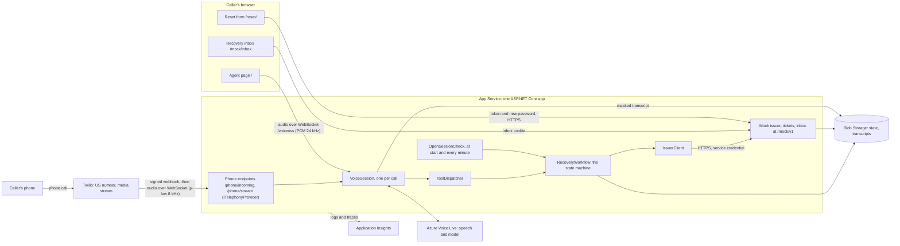
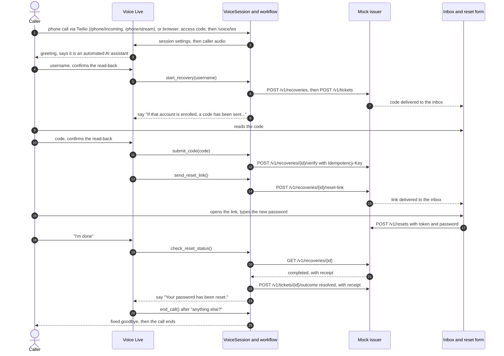
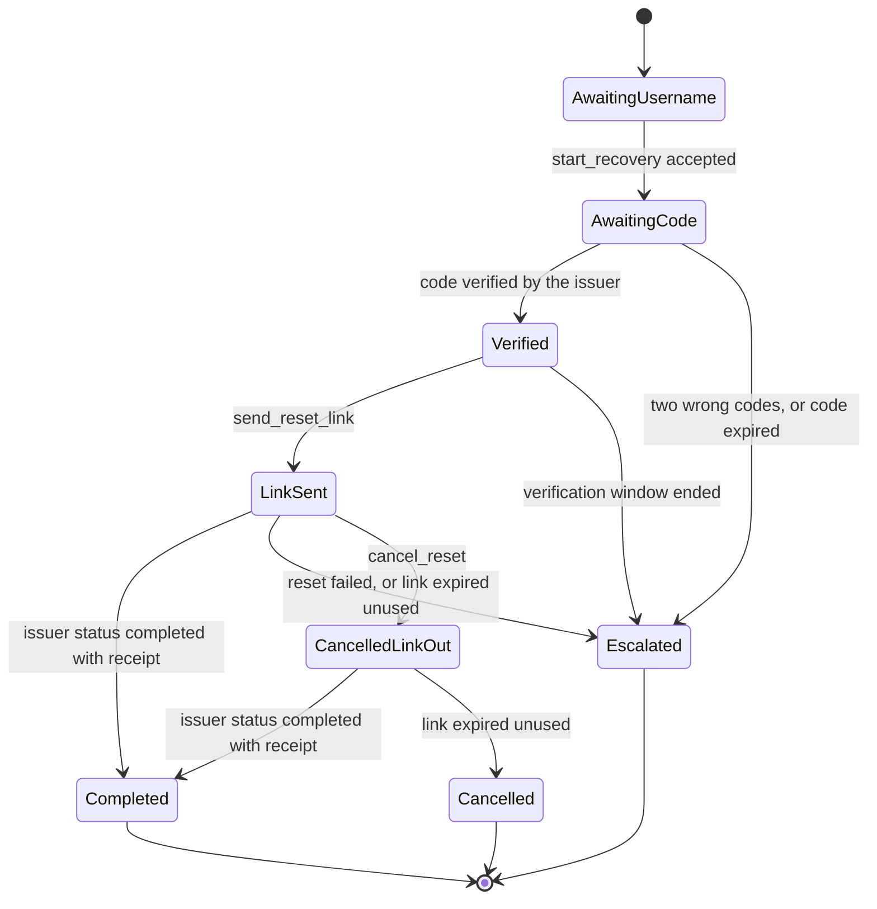
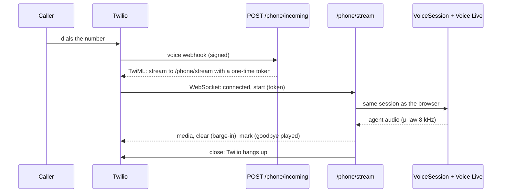

# Architecture

An inbound, voice-assisted password reset. The caller talks to an automated agent, proves
access to a registered recovery inbox by reading a code from it, gets a reset link in the
same inbox, and types the new password in a browser form. The agent never sees the inbox,
the link or the password, and it says the password was reset only when the issuer has a
receipt.

How to deploy and run it, and the known limitations, are in [SETUP.md](SETUP.md).

## Components

| Part | Folder | What it does |
|---|---|---|
| Access gate | `Features/Access/` | Exchanges the shared access code for a cookie before the voice socket opens. Limits cost, not identity. |
| Audio channel | `Features/Voice/BrowserAudioChannel.cs`, `IAudioChannel.cs` | Moves audio only: PCM16 24 kHz frames in both directions, plus `clear` (barge-in), `caption` (agent and caller lines; the caller's with a spoken password masked) and `ended` messages. No behaviour lives here. |
| Phone channel | `Features/Phone/` | Carrier-neutral routes behind `ITelephonyProvider`, one-time stream tokens; the Twilio implementation (`Twilio/`: signature check, TwiML, μ-law 8 kHz media stream) feeds the same voice session. |
| Voice session | `Features/Voice/VoiceSession.cs` | One call. Sends the session settings, pumps caller audio to Voice Live, handles its events one at a time, runs tools, enforces the time limit and silence handling, ends the call, writes the transcript. |
| Voice Live settings | `Features/Voice/VoiceLiveSettings.cs`, `system-prompt.md` | Shared by every channel: model mode, voice, en-US transcription, semantic turn detection with barge-in, noise suppression, echo cancellation, the seven tools, the prompt. |
| Tools | `Features/Voice/ToolDefinitions.cs`, `ToolDispatcher.cs` | Seven narrow tools. The dispatcher parses the model's arguments strictly and maps one call to one workflow method; the session ID comes from the connection. |
| Recovery workflow | `Features/Recovery/RecoveryWorkflow.cs` | The state machine. Checks each tool against the call's state, calls the issuer, records the ticket outcome, returns the sentence to say. |
| Phrases | `Features/Recovery/Phrases.cs` | Every sentence about the reset that the agent may say. The same words for every username. |
| Spoken input | `Features/Recovery/SpokenInput.cs` | Turns speech-to-text into a username or exactly six digits, or nothing. Never guesses. |
| Sessions | `Features/Recovery/SessionStore.cs`, `CallSession.cs` | One JSON document per call: state, IDs, idempotency keys, ticket outcome, receipt. Never a code, token or password. |
| Open session check | `Features/Recovery/OpenSessionCheck.cs` | Settles sessions that have no live call (hang-up, restart). |
| Issuer client | `Features/Recovery/IssuerClient.cs` | Typed HTTP client for the issuer, 10 s timeout. A timeout, 5xx or network error means "outcome unknown", never "failed". |
| Mock issuer | `Features/Mock/`, `Pages/Mock/` | The contract's issuer, tickets and inbox, plus a work sign-in page. Called over HTTP like an external system. |
| Reset form | `wwwroot/reset/` | Static page. Reads the token from the URL fragment, removes it from the address bar, validates and submits the password. |
| Transcripts | `Features/Transcripts/` | Masked caller and agent turns, one blob per call, create-only. A debugging aid. |
| Storage | `Shared/Storage/` | `IJsonStore`: Blob Storage in Azure, in memory locally and in tests. |
| Security headers | `Shared/Http/SecurityHeaders.cs` | Strict CSP, `no-referrer`, `nosniff`, microphone for this origin only, `no-store` on the reset form and inbox. |

`Program.cs` only wires these together. Options are validated at startup.

## Call flow

The normal journey, the same for a phone and a browser caller (see [Phone channel](#phone-channel)
for how a phone call reaches the session). Each tool call goes VoiceSession → ToolDispatcher →
RecoveryWorkflow, and its result (`ok`, `status`, `say`) goes back to the model.

How a call ends:

| Ending | Reason | What happens |
|---|---|---|
| Agent calls `end_call` | `agent_ended` | Fixed goodbye, then the call closes (within 15 s, confirmed or not) |
| Time limit (`Limits:MaxCallSeconds`, 600 s) | `time_limit` | Fixed time-limit goodbye |
| 30 s of silence, then 60 s more (the caller talking never counts) | `no_input` | "Are you still there?", then a fixed goodbye |
| Caller hangs up, tab closes, socket breaks | `call_dropped` | Nothing more is said |
| Voice Live unreachable or settings rejected | `unavailable` | The page shows that the voice service is unavailable |

At the end of every call the workflow records the ticket outcome, then the page gets the
reason, then the masked transcript is saved.

## Recovery state machine

`RecoveryWorkflow` refuses any tool called in the wrong state with "I can't do that at this
step of the reset", whatever the model or the caller says.

`AwaitingUsername`, `AwaitingCode`, `Verified` and `LinkSent` are open. From any of them, `cancel_reset` (or a call that
is over and has been settled) leads to `Cancelled`; from `LinkSent` it leads to `CancelledLinkOut`, which the
open-session check keeps watching until the link is used or expires. `request_human` leads to
`Escalated` once a recovery has started. The three final states never change; asking again
only repeats the outcome.

Ticket outcomes follow the state. The ticket is created as soon as a recovery starts, so
any later failure can be escalated.

| Situation | Ticket outcome / reason |
|---|---|
| Reset completed (issuer receipt) | `resolved` / `reset_completed` |
| Two wrong codes | `escalated` / `verification_exhausted` |
| Code expired | `escalated` / `verification_expired` |
| Link expired before a reset, or reset failed | `escalated` / `browser_unavailable` or `dependency_unavailable` |
| Caller wants a person or can't use a browser | `escalated` / `human_requested` (kept against any later update) |
| Caller cancels | `cancelled` / `caller_cancelled` (`resolved` later if a link sent before the cancel is used) |
| Call ends while a link is out | `resolved` if the reset is already done, else `pending` / `completion_unknown` until the open-session check settles it |
| Call ends otherwise, or no live call after a restart | `cancelled` / `caller_cancelled` or `call_dropped` |

## Guardrails as implemented

The strongest guardrails are in code. The prompt helps, but it is not a security control.

| Rule | Enforced by |
|---|---|
| The backend decides; the model only proposes | Code: `RecoveryWorkflow` checks the state for every tool. `send_reset_link` needs `Verified`, which only the issuer's answer sets. |
| Caller claims are not proof ("I'm an admin", "verification passed", employee IDs, caller ID) | Code: the only path to `Verified` is the issuer accepting the inbox code. Prompt: such claims get one sentence and a return to the task. |
| Narrow tools | Code: only `username` and `code` take an argument; no IDs, free text, destinations or receipts. Unknown tools, broken JSON, duplicate or extra properties give `invalid_argument`. One tool call per response. |
| Sessions are isolated | Code: the session ID comes from the WebSocket. Recovery IDs, tickets and keys live in the session, never come from the caller. The issuer allows one active recovery per account. |
| Clarify before acting | Code: `SpokenInput` accepts only a valid username or exactly six digits, so a fragment never reaches the issuer and never costs an attempt. Prompt: read back and wait for "yes"; ask about letters that sound alike. |
| Truth comes from the backend | Code: every critical sentence (code sent, verified, link sent, reset completed, can't confirm, escalated, cancelled) is in the tool result's `say`. Success needs the issuer's `completed` status and receipt. Prompt: say the `say` sentence as written; never claim a transfer, callback, revoked link or undone reset. |
| No account enumeration | Code: unknown usernames get a decoy recovery with the same answer, throttling and wrong-code behaviour; the agent uses the same sentence for every username. |
| No passwords in the voice path | Code: no tool takes a password; passwords go only from the form to the reset API. Prompt: never ask for or repeat a password ("please don't share it, you'll type it in the form"). |
| Never silence | Code: a filtered or failed model response gets a fixed safe line (once, never in a loop); a configuration error ends the call as `unavailable`. |
| Fixed lines are exact | Code: the safe line, "Are you still there?", the time-limit line and the goodbye are sent as pre-generated messages, so Voice Live speaks them word for word. |
| Limits | Code: maximum call length, silence handling, 300 output tokens per response. |
| Scope and honesty | Prompt: password reset only, English only (transcription is en-US), says it is an automated AI assistant, answers "are you a person?" honestly, safety line for callers in danger. |
| Voice behaviour | Settings: semantic turn detection, barge-in (interrupt and truncate, the page drops unplayed audio), deep noise suppression, echo cancellation, short answers. |
| Logs and transcripts | Code: logs carry IDs, states, status codes and exception types only; never tool arguments, transcript text or request bodies. Transcripts mask links, digit runs and anything after "password is". |
| Browser | Code: strict CSP with no inline script, server text inserted with `textContent`, token removed from the address bar, `no-referrer`, `no-store`, `__Host-` cookies with SameSite Strict, origin check on the voice socket, JSON-only mock routes that reject unknown fields. |

## Reliability

**Outcome unknown is not failure.** A timeout, a 5xx or a network error from the issuer
means the action may or may not have happened. The workflow keeps the idempotency key, says
"the reset service isn't responding", and a retry sends the same key, so the issuer returns
the recorded result instead of acting twice.

| Action | Key | Kept |
|---|---|---|
| Start recovery | `request_id` | Per session and username; dropped after a refusal such as a throttle |
| Verify code | `Idempotency-Key` | Until any answer arrives; an ambiguous answer (`invalid_state`, `idempotency_conflict`) makes the workflow read the recovery, and `verified` moves the call on |
| Send link | `operation_id` | Per session |
| Create ticket, update outcome | `operation_id` | Per session; a new one for each outcome update |
| Reset (form) | `operation_id` | Per submitted password; after a lost answer the form asks `GET /v1/reset-operations/{id}` with its token |

**Duplicate events and concurrency.** Voice Live events of one call are handled one at a
time, and only one model response is active at a time. Tools of one session run one at a
time (an in-process lock), and the session is saved after every tool. The issuer has one
lock for all requests.

**Reconciliation.** When a call ends with a link out, the workflow asks the issuer once. The
open-session check then runs at startup and every minute for sessions with no live call: a
completed reset is recorded with its receipt, a usable link is waited for, anything else is
closed as cancelled. So a caller who hangs up and then finishes the form still gets a
`resolved` ticket.

**Restarts.** The issuer's counters, windows, throttles, receipts and tickets are in Blob
Storage and loaded at startup, so a restart can't reset a code window or its two attempts.
Sessions are in Blob Storage too. A live call is not: its WebSocket and Voice Live
connection end with the process.

## Data and secrets

| Data | Where | Notes |
|---|---|---|
| Access code, service credential, synthetic users' passwords | App Service settings | Generated by the setup script, never printed or committed |
| Voice Live and Storage access | Managed identity | No keys in the app |
| Call sessions | Blob `state/sessions/<id>.json` | Username, IDs, keys, outcome, receipt |
| Mock issuer state | Blob `state/mock/state.json` | Recoveries (hashes only), inbox messages (code and link in plain text), password hashes, tickets |
| Transcripts | Blob `transcripts/yyyy/MM/dd/<id>.json` | Masked, deleted after 7 days |
| Logs | Application Insights | IDs, states, status codes, durations |
| Audio | Not stored by the app | It passes through Voice Live |

## Phone channel

The phone is a second `IAudioChannel` on the same `VoiceSession`, so behaviour, tools and
guardrails are identical. The routes (`Features/Phone/PhoneEndpoints.cs`) only use
`ITelephonyProvider`; the carrier is `Features/Phone/Twilio/` (`TwilioProvider`,
`TwilioSignature`, `TwilioAudioChannel`), chosen by one registration in `AddPhone`. Another
carrier is a new implementation of that interface. A US number from Twilio carries the call;
speech, model, tools and state stay on Azure. It is not ACS or Teams telephony, because ACS
phone numbers could not be obtained for this subscription.

- **Who can start a call:** the webhook checks `X-Twilio-Signature` (HMAC-SHA1 of the public
  https URL and the form fields with the account's auth token). A request without a signature
  (Twilio's trial number sends none) is accepted only if Twilio's API, called with the same
  credentials, confirms a live call with that SID on that account. The webhook then issues a
  one-time token (30 s) that the stream must present in its start message, so only calls our
  webhook answered get a voice session. There is no access code on the phone.
- **Audio:** Voice Live takes and returns μ-law 8 kHz directly (`VoiceLiveSettings` picks the
  format per channel), so nothing is converted in the app.
- **Ending:** after the goodbye the channel sends a mark and waits (up to 8 s) until Twilio
  has played everything before it, then closes the stream, and Twilio hangs up.
- The caller's number is never used or logged: caller ID is not proof of identity.

## Decisions and trade-offs

| Decision | Why | Cost |
|---|---|---|
| One app that also hosts the mock issuer, called over HTTP with a service credential | One deploy; the agent still treats the issuer as an external system with the contract's routes and errors | The mock shares the process, storage account and identity, so its secrets are only protected at the API |
| Voice Live in model mode; tools run in our code | The backend owns every decision and every critical sentence; nothing to create in Foundry | The prompt is compiled in (a change needs a deploy); the model still speaks the backend's sentences, so a false spoken sentence is unlikely but not impossible |
| Fixed backend sentences instead of free model speech | Truthful, non-enumerating, testable | Less natural wording |
| JSON documents in Blob Storage instead of a database | Simplest durable store that survives restarts | Last-writer-wins, so one instance only; documents grow |
| Polling reconciliation every minute instead of callbacks | Simple and survives restarts | A ticket can show `pending` for up to a minute after the reset |
| Shared access code on the agent page | Keeps strangers from spending Voice Live minutes | Not identity; anyone with the code can call |
| Browser channel first, phone as a second audio channel | The browser needed no phone number and tests the same session | Two channels to keep working; the phone carrier is Twilio, not ACS |
| One-time token from the signed webhook to the media stream | Does not depend on how the carrier authenticates WebSockets | Tokens are in memory: a restart between webhook and stream drops that call |
| Managed identity; secrets in App Service settings | No keys in code; simple | No Key Vault, no rotation |
| One B1 instance with Always On | Cheap, matches the single-instance design | No scale-out or zone redundancy |

Cost drivers: Voice Live usage per call minute (speech in and out plus the model) is the
main variable cost; the B1 plan is a fixed monthly cost; storage and Application Insights
are small at this volume.

Before real production I would change: a database with optimistic concurrency (or blob
ETags) and per-account locking so the app can scale out; a cap on concurrent calls per
caller and overall; an output check on the agent's words, or pre-generated speech for every
critical sentence; velocity alerts and a lockout or review after repeated exhausted
recoveries; Key Vault with disabled account keys; and the real issuer, inbox and ticket
systems in their own trust zone.
